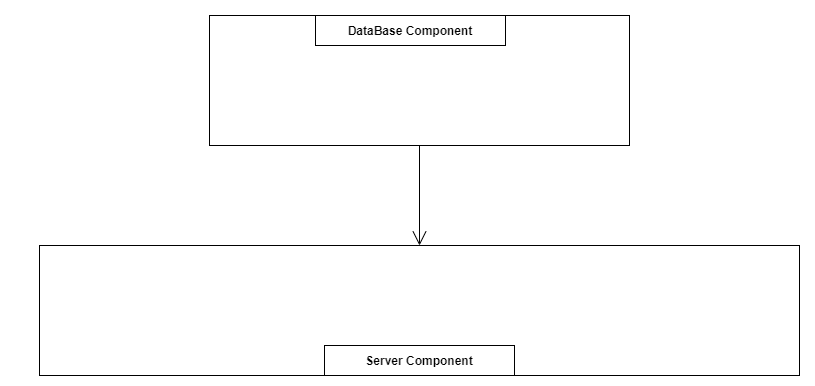

# Clean Architecture - Robert C. Martin

2021/03/11

로버트 C. 마틴은 진정한 소프트웨어 개발의 장인인 것 같다. 
소프트웨어 아키텍처에 대한 공부를 하려고 읽은 책인데, 그뿐만 아니라 **현재 소프트웨어 개발의 트렌드와, 소프트웨어를 바라보는 시각 또한 배울 수 있었다.**
객체지향, 함수형 언어, 의존성 등등 ... **그저 input을 넣어 output을 얻기 위한 코딩을 하는 게 아닌, 올바른 소프트웨어를 만들기 위한 고민을 하는 법을 배운 좋은 책이다.**

 
 ## 1. 구조적, 객체지향, 함수형 패러다임의 진정한 의미
    * 구조적 프로그래밍 = 제어흐름의 직접적 변환에 대한 규칙 (GOTO 금지)
    * 객체지향 프로그래밍 = 제어흐름의 간접적인 전환에 대한 규칙(의존성의 방향 변경의 자유)
    * 함수형 프로그래밍 = 할당문에 대한 규칙(state 금지)

### 구조적 프로그래밍
* Dijkstra는 기존 프로그래밍에 사용하던 문법 중에서 **GOTO문을 없애고 sequence, branch, loop 제어만 있다면 프로그램이 완벽하게 작동함을 수학적으로 증명 가능함을 보임**
* GOTO문이 java의 break나 function call과 다른 점: **GOTO는 원하는 주소 어디든 갈 수 있음 - 그 주소에 뭐가있을지 아무도 모르기 때문에 GOTO가 들어가면 100% 완벽한 증명이 불가능함.**
* 이를 통해 프로그램이 제대로 동작함을 수학적으로 증명할 수 있게 되었지만 그 과정은 너무도 복잡했고, 이제는 수학적인 증명으로 프로그램의 올바름을 입증하는 게 옳다고 믿는 사람은 아무도 없음.

### 함수형 프로그래밍
* **state가 만악의 근원** - 모든 Bug는 State에서 온다. 따라서 state를 없앤다.
* 한 번 만든 객체는 무조건 immutable - 항상 새로운 객체가 된다.
* 이것은 마치 **수학 함수와도 같음** 
   * y=f(x) 라는 수학 함수가 있을 때 **그 어떤 f함수를 통과시키더라도 함수가 끝난 뒤 x는 여전히 함수 호출 전 x와 완전 같다.**
   * 마찬가지로 함수형 프로그래밍에서 어떤 변수 x가 어떤 함수 g를 통과하는 g(x)가 수행된다 해도 **g가 끝난 후 x는 여전히 호출 전 x 그대로일 것임이 보장됨.**
* 물론 state가 없이 만들 수 있는 프로그램은 거의 없다 - 대신 **state를 변경시키는 장소를 프로그램 전체가 아니라 atom이라는 아주 잘 정의된 곳에 보관하여 효과적으로 state 변화를 제어한다**
  * 이를 통해 state 변경을 굉장히 조심히 해야 하는 concurrency issue, transaction issue등을 효과적으로 control할 수 있다.

### 객체지향 프로그래밍
* 아직 현재 프로그래밍의 메인 패러다임은 객체지향 프로그래밍 - **왜 그렇게 강력한 것일까?**
  
#### 객체지향 패러다임이란 무엇인가?
밥 마틴의 소프트웨어에 대한 이해가 얼마나 깊은지를 느낄 수 있던 절이었다.

객체지향 패러다임이 무엇인가 물으면 대부분 사람들은 객체지향의 다음과 같은 원칙들을 나열한다:

        1. Encapsulation
        2. Inheritance
        3. Polymorphism

그런데 **정말 이러한 원칙들이 객체지향 패러다임 이전엔 아예 없었을까?**

##### 1. Encapsulation
* OO언어는 분명히 데이터와 함수를 쉽고 효과적으로 캡슐화하여 구성된 집단을 확실하게 구분짓는 방법을 제공하긴 한다.
* **하지만 이러한 개념은 객체지향 언어가 아닌 C언어의 프로그래밍에서도 쉽게 구현할 수 있다:**

```c
// point.h
struct Point;
struct Point* makePoint(double x, double y);
double distance (struct Point *p1, struct Point *p2);


// point.c
#include "point.h"
#include <stdlib.h>
#include <math.h>

struct Point {
   double x, y;
};

struct Point* makePoint(double x, double y) {
   struct Point* p = malloc(sizeof(struct Point));
   p->x = x;
   p->y = y;
   return p;
}

double distance(struct Point* p1, struct Point* p2) {
   double dx = p1->x - p2->x;
   double dy = p1->y - p2->y;

   return sqrt(dx*dx + dy*dy);
}

int doubleX(struct Point* p1) {
   return 2 * p1->x;
}
```

* 이 라이브러리의 사용자들에게는 모두 points.h의 인터페이스만 공개될 것이고, 그렇다면 **Point의 member 나 point.h에 없는 method에 대해 절대 알 수 없다 (위 예제에서는 doubleX)**
* 이것이 정의 그대로 완벽한 캡슐화이다.. **사실 C 언어의 이러한 방법은 객체지향 언어보다 오히려 훨씬 더 완벽한 캡슐화를 제공한다.**
   * public/protected/private등의 접근 키워드들도 사실 객체지향의 불완전한 캡슐화를 보조하는 역할 정도에 지나지 않는다 
   * Python 같은 객체지향 언어들은 **오히려 캡슐화를 강제하지 않기도 한다. (python은 member를 완벽하게 private/protected 시키는 방법 x)**
##### 2. Inheritance
* 상속만큼은 OO가 이전에 없던 "기능"을 구현함
* 이는 사실이나 상속의 "아이디어"는 하나의 유효 볌위로 묶어서 재정의 하는 일
* 이러한 "아이디어"는 이미 C 프로그래머들은 널리 사용하고 있었음
* 위의 point.c/h 에 추가로 아래와 같은 코드도 추가했다고 생각해보자:
  
```c
// namedPoint.h
struct NamedPoint;
struct Point* makeNamedPoint(double x, double y, char* name);
void setName(struct NamedPoint *np, char* name);
char* getName(struct NamedPoint* np);


// namedPoint.c
#include "namedPoint.h"
#include <stdlib.h>

struct NamedPoint {
   double x, y;
   char* name;
};

struct NamedPoint* makeNamedPoint(double x, double y, char* name) {
   struct Point* p = malloc(sizeof(struct Point));
   p->x = x;
   p->y = y;
   p->name = name;
   return p;
}

void setName(struct NamedPoint *np, char* name) {
   np->name = name;
}

char* getName(struct NamedPoint *np) {
   return np->name;
}


// main.c
#include "point.h"
#include "namedPoint.h"
#include <stdio.h>

int main(int ac, char** av) {
   struct NamedPoint* origin = makeNamedPoint(0.0, 0.0, "origin");
   struct NamedPoint* upperRight = makeNamedPoint(1.0, 1.0, "upperRight");

   // 여기 주목!!!
   printf("distance=%f\n", 
      distance(
         (struct Point*) origin,
         (struct Point*) upperRight
      )
   );
}
```

* 이러면 main.c 에서 **NamedPoint structure가 마치 Point 로 부터 파생된 것처럼 동작함을 알 수 있음**
    * 선언된 첫 두 변수 순서가 Point의 모든 변수 순서와 똑같기 때문에 가능한 일.
* 이것은 트릭이 아니라 실제 많이 사용하던 방식이고, 실제로 C++은 상속을 이 기능을 통해 구현함.
* 따라서 OO는 **상속이라는 "아이디어"를 만들진 못했지만, 대신 훨씬 더 "편리한" 방식으로 제공했다는 걸 알 수 있음.**

##### 3. Polymorphism
* 다형성마저도 이미 C에서 있었던 개념이다:

```c 
#include <stdio.h>

void copy() {
   int c;
   while ((c=getchar()) != EOF)
      pubchar(c);
}

struct FILE {
   void (*open)
}

```

* getchar(), putchar()는 각각 **STDIN, STDOUT을 활용하여 text를 읽고 쓴다. STDIN, STDOUT은 어떤 구체적인 장치도 아니므로, 다형적인 method다**
* STDIN, STDOUT은 장치마다 구현이 있고, 아래 file.h의 open, close, read, write, seek를 구현해야 한다. 이러한 구현에 대한 예는 file.c에 있다:

```c
//file.h
struct FILE {
   void (*open)(char* name, int mode);
   void (*close)();
   int (*read)();
   void (*write)(char);
   void (*seek)(long index, int mode);
}


//file.c
#include "file.h"

void open(char* name, int mode) {/*...*/}
void close() {/*...*/}
int read() {int c; /*...*/}
void write(char c) {/*...*/}
void seek(long index, int mode) {/*...*/}

struct FILE console = {open, close, read, write, seek};

// 사용하는 다른 소스파일
extern struct FILE* STDIN;

int getchar() {
   return STDIN->read();
}
```

* **결국 다형성이란 새로운 것이 아니고 함수 포인터를 좀 더 안전하고 편리하게 사용할 수 있게 만든 것이다.**
* **함수 포인터를 사용하는 C의 방법은 굉장히 위험했고, 모든 위험 부담이 프로그래머에게 얹어졌다**
   * 모든 함수 호출 관례를 프로그래머들이 알고 있어야됨
   * 함수 포인터로 인한 버그는 찾아내기 엄청 어렵고 복잡해서 없애기 힘들다.
* 따라서 대부분 C 프로그래머들은 이러한 함수 포인터를 이용한 다형성을 기피했는데, **OO는 다형성을 굉장히 안전하게 규칙화하여 널리 쓰일 수 있도록 만들었다.**
* 이러한 다형성 지원을 통해 "제어를 간접적으로 전환하는 규칙을 부과"
   * ex) 아래와 같은 코드가 있다고 하자(java pseudocode):
``` java
abstract class A { 
   abstract void f(); 
};

class B extends A { 
   @override
   void f() { 
      System.out.println("Hello World");
   }
}

// impl 은 A다!!!!
A impl = new B; 
// 그런데 impl의 f()를 호출하면 "직접적인" A.f()의 주소가 아니라 시스템으로 인해 "간접적으로" B.f()의 주소로 옮겨진다!
impl.f()
```
   
   * 맨 마지막 줄에서 **impl은 A 타입이므로 직접적 제어로는 A의 f()가 호출이 되어야 한다.**
   * 그런데 다형성으로 인해 프로그래밍 언어는 이 f가 추상클래스이므로 프로그래머가 원하는 건 실제 이를 구현한 B의 f()임을 안다.
   * **따라서 A 타입의 impl의 f()의 주소를 호출했는데 이를 시스템이 B.f()의 주소로 제어 흐름을 이동시켜 준다.**
   * 따라서 프로그래머가 "직접" B.f()를 호출할 필요 없이 그 상위 클래스로 정의된 "A impl"의 "A.f()"를 호출하면 시스템이 "간접적으로" "impl의 f()가 구현된" B.f()의 주소로 이동한다.


## 2. 그러면 대체 뭐가 객체지향 패러다임인가?
* 이쯤 되면 알겠지만 **객체지향은 뭔가 "새로운 기능"을 구현한 게 아니라, 다형성/상속 등의 기능을 훨씬 더 "사용하기 안전하고 편리하게 하여" 다형적인 programming이 실용화될 수 있게한 것이다.**
* 그러면 대체 이 다형적인 프로그래밍을 가능하게 해서 얻는 이득이 뭘까? 이게 뭐가 그렇게 좋은가?

     "다형성을 이용해 전체 시스템의 모든 소스 코드 의존성에 대한 절대적인 제어 권한을 얻을 수 있다".

* 한마디로 **클래스 다이어그램의 모든 의존성의 방향을 내 마음대로 할 수 있다.**

예시로 아래와 같은 코드를 보자:

```java
/*
 * DataBase.java
 */

public class DataBase {
    private MainServer server;

    public DataBase(MainServer server) {
       this.server = server;
    }

    public String getData(String queryString) {
       return server.getData(queryString);
    }
}


/*
 *  MainServer.java
 */
public class MainServer {
    public String getData(String queryString) {
        return "dataOf: " + queryString;
    }
}


/*
 * Main.java
 */
public class Main {
    public static void main(String[] args) {
        MainServer mainServer = new MainServer();
        DataBaseImpl dataBase = new DataBase(mainServer);

        System.out.println(dataBase.getData("exampleQueryString"));
    }
}
```


이러한 코드를 만들었을 때 MainServer와 DataBase 사이 의존성은 아래처럼 된다:


따라서 **DataBase가 MainServer에 의존하고 있기 때문에 MainServer가 바뀌게 되면 DataBase도 바꿔야 할 가능성이 크다**
   * MainServer의 getData를 makeData로 바꾸면 DataBase의 server.getData도 server.makeData로 바꿔야 한다.
   * 그런데 반대로 DataBase의 getData가 makeData로 이름이 바뀌어도 MainServer쪽은 바꿔줄 게 하나도 없다.

그런데 이러한 의존 관계는 객체지향 프로그래밍에서 절대적인게 아니고 **우리가 원하면 언제든지 의존성을 반대로 바꿔줄 수 있다:**

```java
/*
 * DataBase.java
 */

public class DataBase {
    public String getData(String queryString) {
       return "dataOf: " + queryString;
    }
}


/*
 *  MainServer.java
 */
public class MainServer {
    private DataBase dataBase;

    public MainServer(DataBase dataBase) {
        this.dataBase = dataBase;
    }

    public String getData(String queryString) {
        return dataBase.getData(queryString);
    }
}


/*
 * Main.java
 */
public class Main {
    public static void main(String[] args) {
        DataBase dataBase = new DataBase();
        MainServer mainServer = new MainServer(dataBase);

        System.out.println(mainServer.getData("exampleQueryString"));
    }
}
```

* 이렇게 되면 아까랑 반대로 **DataBase가 바뀌게 되면 MainServer쪽이 바뀔 가능성이 크다.**
  


   * DataBase의 getData를 makeData로 바꿔도 MainServer에선 아무것도 할 필요가 없다.
   * 그런데 반대로 MainServer의 getData가 makeData로 바뀌면 DataBase의 server.getData 를 server.makeData로 바꿔줘야 한다.

### 의존성 역전
* 그런데 여기서 또 다른 고민이 있다. 만약 MainServer와 DataBase가 서로 많이 바뀌어서 둘 중 어떤 방향도 만족스럽지 못할 때는 어떻게 할까?
* 이럴 때 객체지향에서는 **쉽게 바뀌지 않는 interface를 사이에 넣어서 의존성을 역전시켜주는 방법을 사용할 수 있다.**

위의 코드에 DataBase에 대한 interface인 DataBaseInterface를 만들어 아래처럼 바꾼다:

```java
/*
 *  DataBaseInterface.java
 */
public interface DataBaseInterface {
    abstract public String getData(String queryString);
}


/*
 *  DataBase.java
 */
public class DataBase implements DataBaseInterface {
    public String getData(String queryString) {
       return "dataOf: " + queryString;
    }
}


/*
 * MainServer.java
 */
public class MainServer {
    private DataBaseInterface dataBase;

    public MainServer(DataBaseInterface dataBase) {
        this.dataBase = dataBase;
    }

    public String getData(String queryString) {
        return dataBase.getData(queryString);
    }
}


/*
 * Main.java
 */
public class Main {
    public static void main(String[] args) {
        DataBaseInterface dataBase = new DataBase();
        MainServer mainServer = new MainServer(dataBase);

        System.out.println(mainServer.getData("exampleQueryString"));
    }
}
```
  
이렇게 코드를 바꾸면 아래와 같은 의존성 구조가 나오게 된다:


이 의존성 구조와 DataBase 인터페이스가 없었을 때의 DataBaseImpl의 의존성 구조를 보면 **둘의 방향이 서로 반대인것을 알 수 있다:**


이러한 설계 테크닉을 "의존성 역전"이라고 부른다.

이 의존성 역전이 왜 중요할까?

1) 기존 두 객체 사이 의존성을 아예 없앰.
   * 의존성 역전을 하기 전엔 DataBase, MainServer 둘 중 하나가 무조건 다른 쪽에 의존해야 됐다. 즉, **한쪽은 다른 쪽의 변화에 취약할 수 밖에 없었다.**
   * 그런데 둘 사이에 Interface를 만들어 둘 다 이 Interface에 의존하게 함으로써 **의지하는 쪽의 의존성마저 역전해버렸고, 이를 통해 두 쪽 다 서로에게 의존할 필요가 없게 되었다.**
   * 둘은 서로의 변화에 의존하지 않고, 대신 둘 다 DataBase interface에 의존한다. 하지만 스펙이 잘 정의되어있다면 interface가 바뀔 일은 거의 없으므로 이게 기존 두 설계보다 훨씬 좋은 방법이다.

2) 컴포넌트 사이 의존성도 제어 가능.
   * 패키지, dll 등의 컴포넌트 사이 의존성도 이 방법을 통해 제어할 수 있다.
   * 보통 설계를 할 땐 **한 컴포넌트의 모든 객체에서 다른 컴포넌트로의 객체로의 의존성은 모두 같은 방향을 향하길 바란다:**
   * 그래야만 한 쪽 컴포넌트에 변경 사항이 생길 때, 자신에 의존하는 컴포넌트를 알고 있으므로 그 쪽 컴포넌트의 객체들만 확인하면 되어 변경의 제어가 잘 된다.
  
아까 예제에서 DataBase Component와 Server Component가 크게 있고, 아래처럼 DataBase쪽 객체들이 모두 Server쪽 객체에 의존하도록 설계했다고 가정하자:



그런데 위의 두 번째 의존성처럼 MainServer, DataBase의 코드가 짜여져있었고, 아래처럼 DataBase와 Server 컴포넌트의 객체가 여러개 있고
MainServer같은 객체도 여러개라면 아래 그림처럼 **DataBase Component의 나머지 객체들은 Server 객체에 의존하는데, MainServer같은 객체들만 반대로 DataBase 객체에 의존할 것이다:**


맨 첫 번째와 두 번째 예제처럼 완전 설계를 바꿔서 의존성 화살표를 바꿔버릴 수도 있지만, 그렇게 하게 되면 MainServer가 여러개면 하나하나 다 바꿔줘야 하는데, 의존성 방향을 아예 바꿔버리면 고치는 양이 꽤 많아 매우 오래걸린다.

이럴 때 **세 번째 예제처럼 DataBaseInterface를 만들어 의존성을 역전시키고, DataBaseInterface를 Server Component안에 넣으면 아래처럼 효율적으로 컴포넌트 의존성을 지키도록 수정할 수 있다:**


* 좋은 객체지향 설계는 이렇게 의존성의 방향을 반전/역전 등 자유자재로 조정해서 **변경 가능성이 많은 객체가 변경 가능성이 적은 객체에 의존하도록 설계하여 코드변화를 최소화 시키는 것이 핵심이다.**


아래의 예시의 작은 박스는 각각 class를 나타내고, 숫자는 그 클래스가 바뀔 확률을 나타낸다. 즉 높을수록 자주 바뀌는 클래스이다:


이런 설계도가 주어졌을 때 객체지향 프로그래밍에 숙달된 아키텍트라면 **객체지향의 의존성 변경 방법을 사용하여 변경 가능성이 높은 객체가 낮은 객체에 의존하도록 모든 의존성 방향을 아래처럼 바꿔준다:**


여기서 또 다른 팁을 얻을 수 있는데 **컴포넌트는 항상 비슷한 변경 가능성을 가진 객체들 끼리 묶어야 한다.**
   * 위 그림에서 만약 한 컴포넌트에 변경성이 1인 객체와 21인 객체가 같이 있었다면 **다른 컴포넌트의 10정도의 변경성인 객체는 1에 의존하고, 21이 의존하게 만들어야 하니 컴포넌트 의존성 방향이 깨지게 된다.**
   * 비슷한 변경성을 가진 객체가 같은 컴포넌트가 되어야 항상 같은 방향으로 의존성 설계를 할 수 있다.


## 3. Clean Architecture
Clean Architecture 자체는 별 거 없다. **위에서 설명한 원리들을 일반적인 소프트웨어에 적용해서 만든 패턴 같은 것이다.**

* **소프트웨어는 크게 엔티티, 유스케이스, 인터페이스 어댑터, 프레임워크와 드라이버로 분류되고, 이들을 아래처럼 설계해야 한다:**


* 원 안으로 들어갈수록 변경 가능성이 적어지고, 따라서 **의존성은 항상 원 밖에서 원 안으로 향해야 한다.**
* 엔티티: 핵심 업무 규칙의 캡슐화. 데이터 구조 또는 핵심 연산 메서드가 섞인 클래스
* 유스케이스: 애플리케이션에 특화된 업무 규칙 - 엔티티로 들어오고 나가는 데이터 흐름 조정하여 유스케이스 목적 달성
* 인터페이스 어댑터: 외부의 데이터베이스등의 세부사항들로부터 데이터를 받아 **유스케이스와 엔티티가 가장 편리한 형식으로 데이터를 가공해 전달.**
* 프레임워크와 드라이버: 세부사항들 **웹, 데이터베이스, 프레임워크는 모두 세부사항이다. 소프트웨어 안에서는 이 세부 사항에 대해 그 어떤 것도 가정하지 않고 유연한 플러그인 API 방식으로 세부사항을 handle해야 한다.**


## 마지막으로 드는 생각들
Architecture나 소프트웨어 패러다임에 대한 개념들이 훨씬 더 인상적이었고, Clean Architecture그 자체는 앞의 원칙들을 적용하니 당연한 얘기들이라 크게 깨달음을 얻진 않았다. 소프트웨어 설계 경험이 좀 쌓이고 보면 다른 생각이 들 지도 모르겠다.
