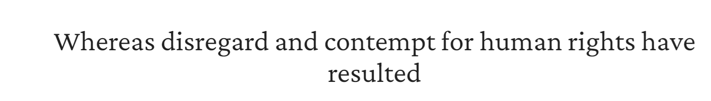
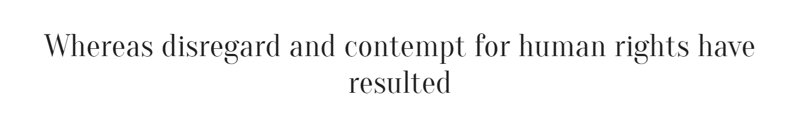
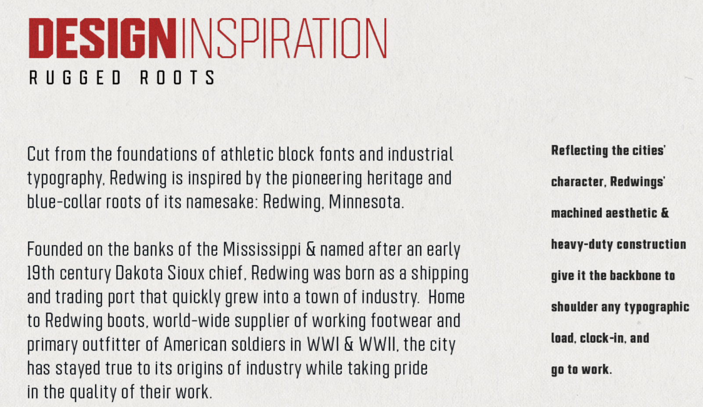
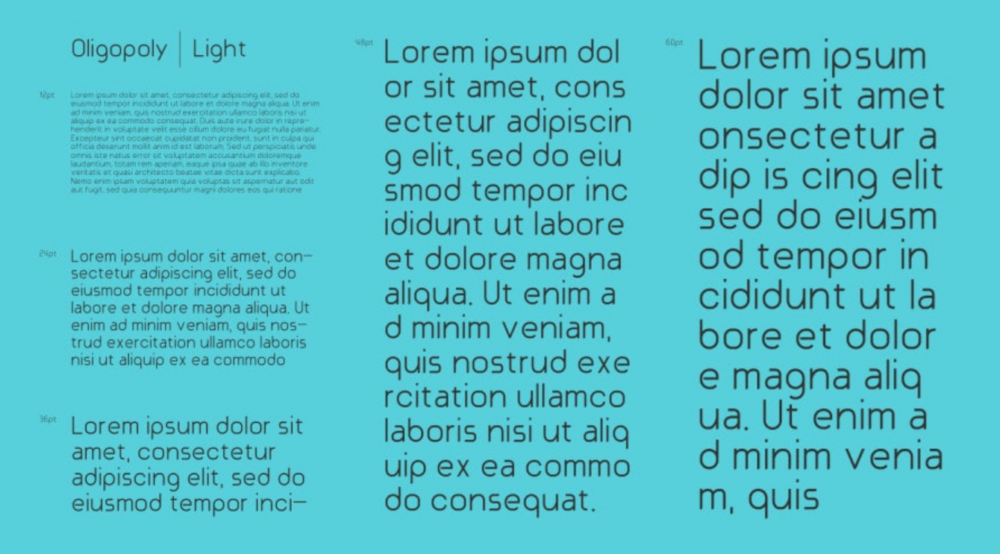
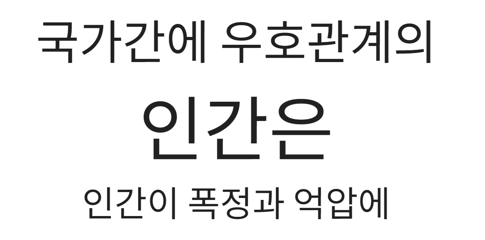

Some fonts that I've loved using and are commercial free license.

# English Fonts

1) [CabinetGrotesk](https://www.fontshare.com/fonts/cabinet-grotesk)

2) [Crimson Pro](https://fonts.google.com/specimen/Crimson+Pro)

3) [Oranienbaum](https://fonts.google.com/specimen/Oranienbaum)

\

4) [Redwing](https://www.jeremynelsondesign.com/case-studies/redwing-athletic-sports-font-family)

5) [Oligopoly](https://www.dafontfree.io/oligopoly-font-family/)

# Korean Fonts
[Noto Sans KR](https://fonts.google.com/noto/specimen/Noto+Sans+KR) is just the best.

