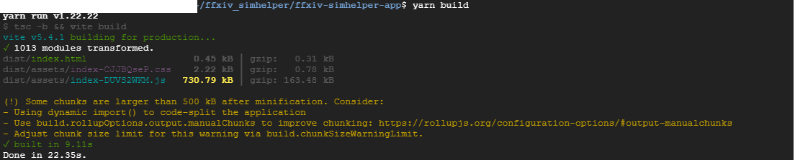
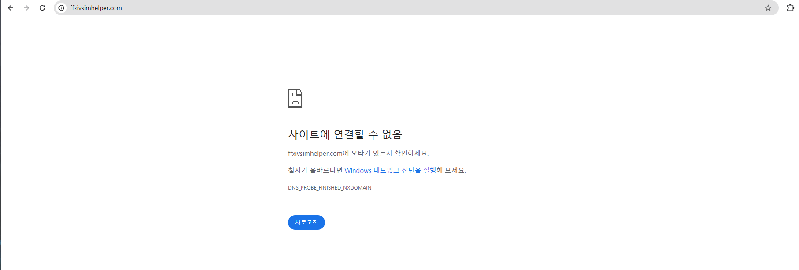
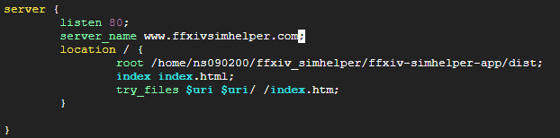
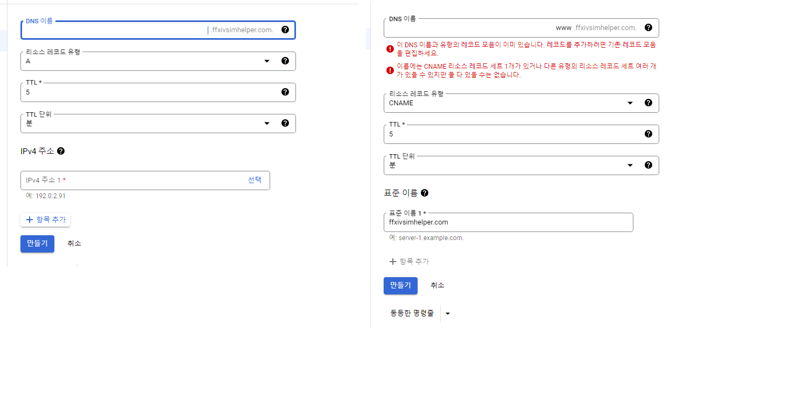
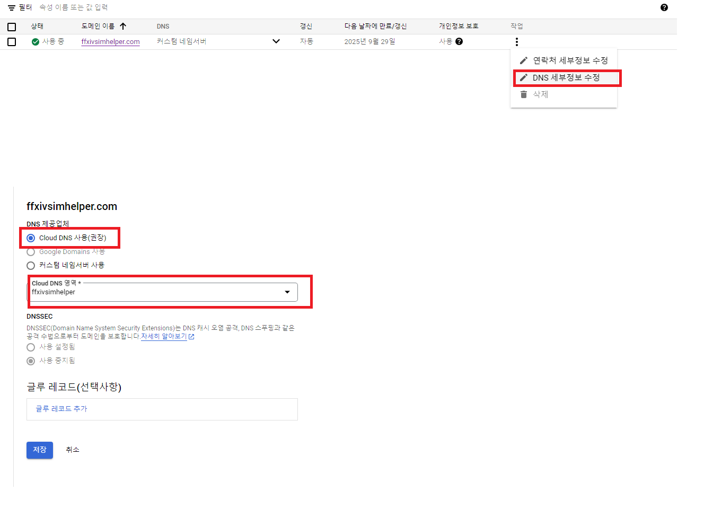

# 1. Install node, npm and yarn
* node.js installation: https://nodejs.org/en/download/package-manager

```shell
# installs fnm (Fast Node Manager)
curl -fsSL https://fnm.vercel.app/install | bash

# activate fnm
source ~/.bashrc

# download and install Node.js
fnm use --install-if-missing 20
# verifies the right Node.js version is in the environment
node -v # should print `v20.17.0`
# verifies the right npm version is in the environment
npm -v # should print `10.8.2`
```

However it isn't installing because it's missing unzip.


* Manually installed unzip and it works well now.


---


---


* Install yarn from npm

```shell
npm install --global yarn
```

## 2. Install Dependencies And Build My Project

```shell
yarn install
yarn build
```



configured nginx by steps in [nginx configuration](./nginx.md)

## 3. Map Comput Engine to Domain
nginx server started, but still the domain isn't getting mapped



try adding server_name



still doesn't work..

But access via my external IP is working well. Seems like the domain isn't attached to my engine's IP

following https://cloud.google.com/dns/docs/tutorials/create-domain-tutorial?hl=ko, I created A and CNAME domain settings




Now we update our name server in Google Cloud Domains

