## 1. install rust 1.72.0

* https://www.rust-lang.org/tools/install introduces how to install rust in linux. Use the introduced command:

```shell
curl --proto '=https' --tlsv1.2 -sSf https://sh.rustup.rs | sh
```

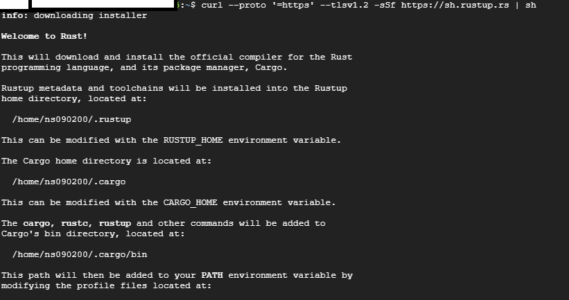

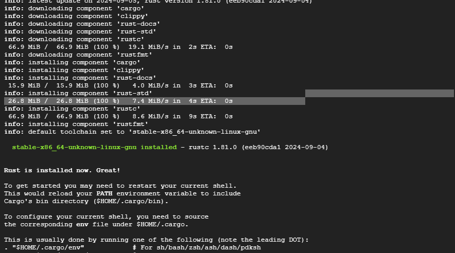

## 2. install git
* https://git-scm.com/book/ko/v2/%EC%8B%9C%EC%9E%91%ED%95%98%EA%B8%B0-Git-%EC%84%A4%EC%B9%98 explains how to install git in linux

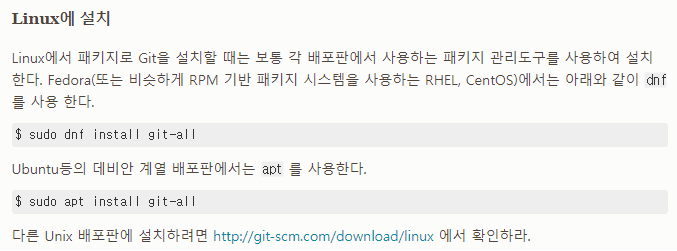

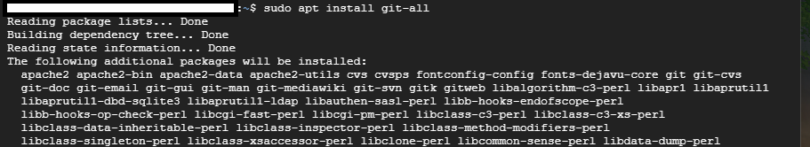


## 3. Clone project Repository
* My repository is a private one, and it says I can't authorize by password.

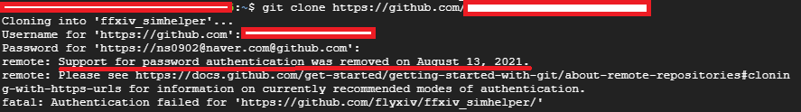

* https://docs.github.com/en/authentication/keeping-your-account-and-data-secure/managing-your-personal-access-tokens shows how to use personal access tokens:

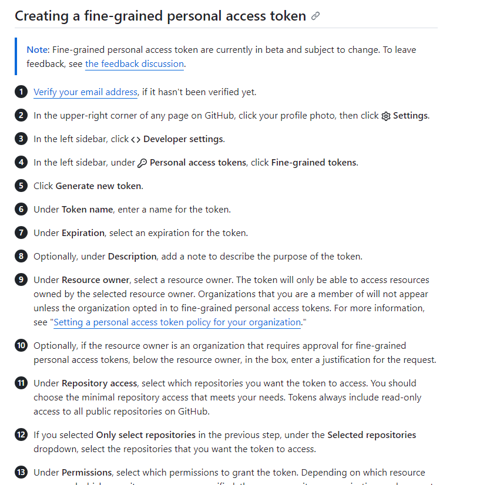

* go to profile settings

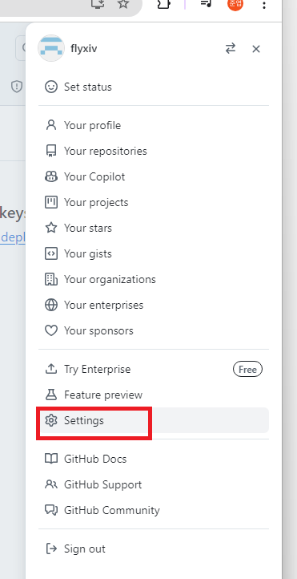

* developer settings - fine-grained tokens

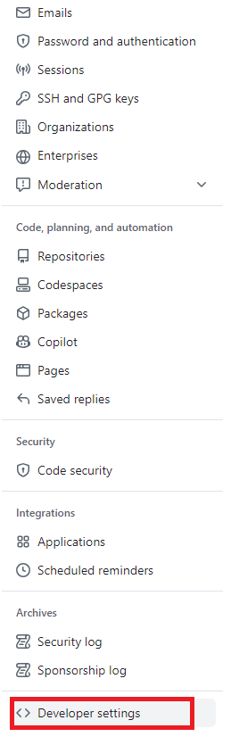

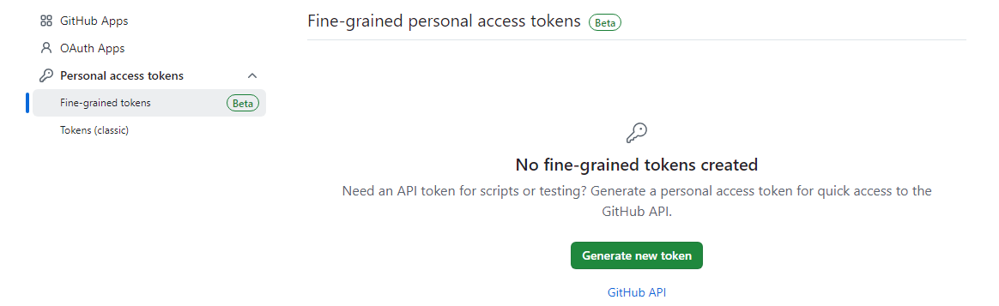

* give name and permissions -> create token

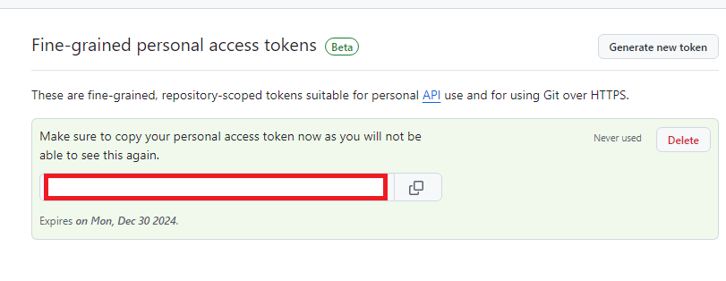

* copy key

doesn't work... gives 403 error. I'll try using Github CLI
turns out there wasn't enough permission assigned. Gave all possible permissions and it clones well now

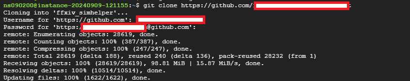


## 4. Build Rust backend
* cargo build

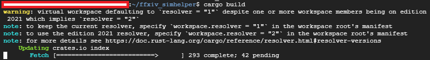