## 1. install rust 1.72.0

* https://www.rust-lang.org/tools/install introduces how to install rust in linux. Use the introduced command:

```shell
curl --proto '=https' --tlsv1.2 -sSf https://sh.rustup.rs | sh
```


## 2. install git
* https://git-scm.com/book/ko/v2/%EC%8B%9C%EC%9E%91%ED%95%98%EA%B8%B0-Git-%EC%84%A4%EC%B9%98 explains how to install git in linux


## 3. Clone project Repository
* My repository is a private one, and it says I can't authorize by password.


* https://docs.github.com/en/authentication/keeping-your-account-and-data-secure/managing-your-personal-access-tokens shows how to use personal access tokens:


* go to profile settings


* developer settings - fine-grained tokens


* give name and permissions -> create token


* copy key

doesn't work... gives 403 error. I'll try using Github CLI
turns out there wasn't enough permission assigned. Gave all possible permissions and it clones well now


## 4. Build Rust backend
* cargo build


* build gives following error

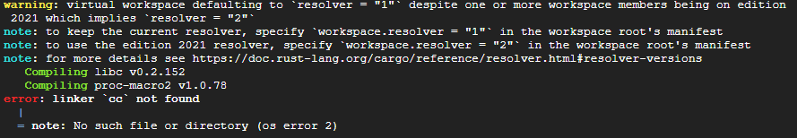

* solved by downloading cmake

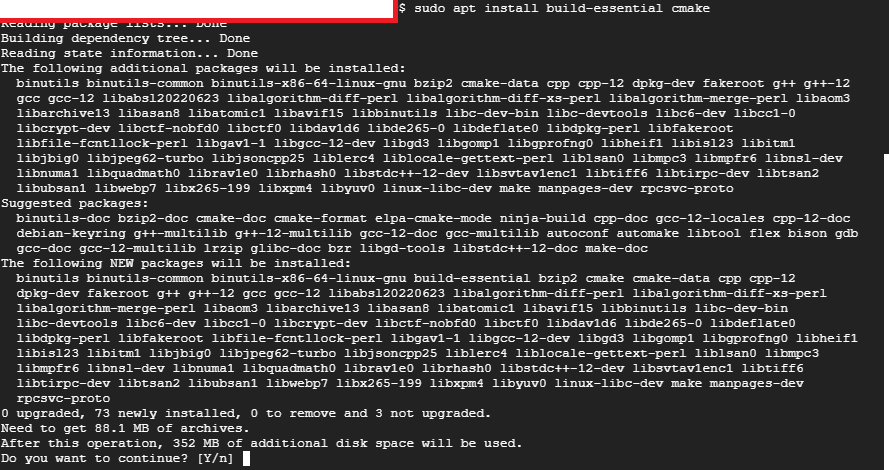


## 5. Extend Storage Disk 
* When building, the compiler raised an error. Reading the error statement carefully, it was a **no space left on device error**
* Google Compute Engine gave me 10GB storage, and 91% was used already. Needed to add more storage.

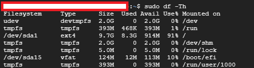

* Go to Google Compute Engine -> storage -> disk and click on your instance name link.

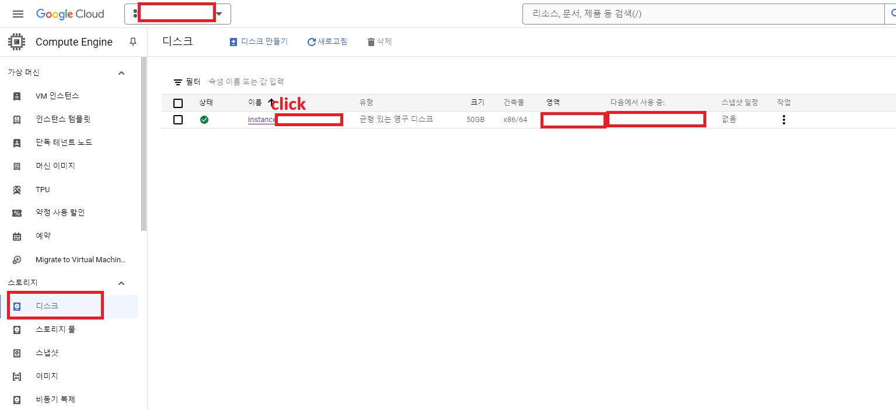

* click "edit"

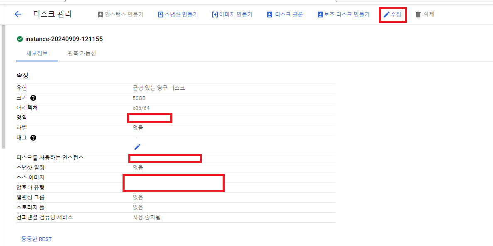

* change disk size and save

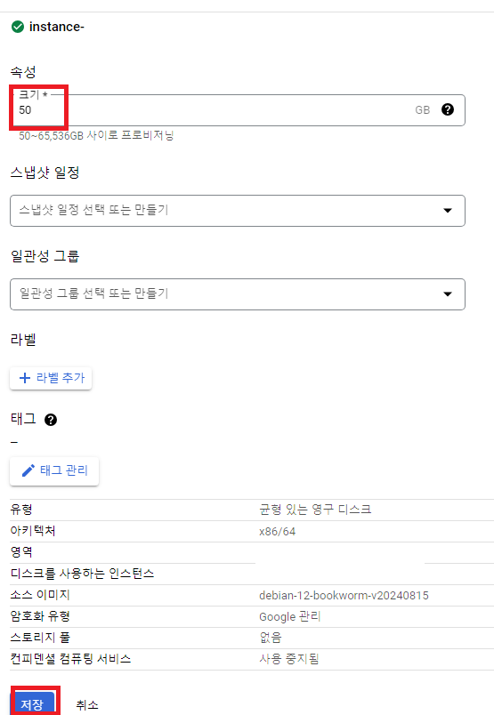


* now we follow the guide from https://cloud.google.com/compute/docs/disks/resize-persistent-disk?hl=ko&_gl=1*v3tpta*_ga*MjE0MTI2ODczNS4xNzI1NDYwNzUz*_ga_WH2QY8WWF5*MTcyNzg1MzE3My4xMy4xLjE3Mjc4NTQyODEuNTkuMC4w to allocate the disk to the device.

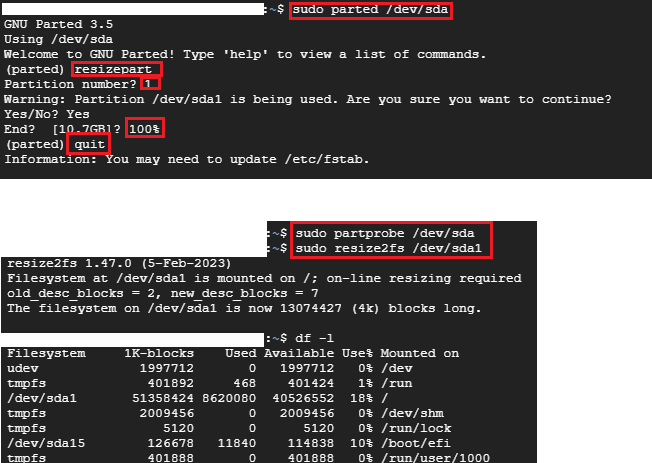


## 6. Assign Firewall for External IP
* In Google Cloud Console, select "Create VPC Network"

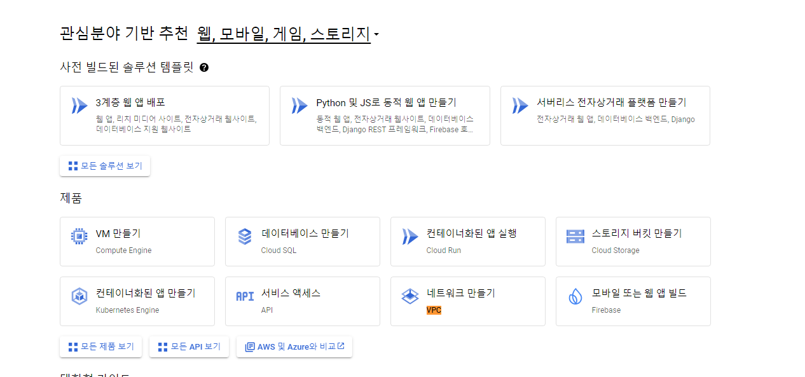

* Select "firewall" in VPC Network Menu

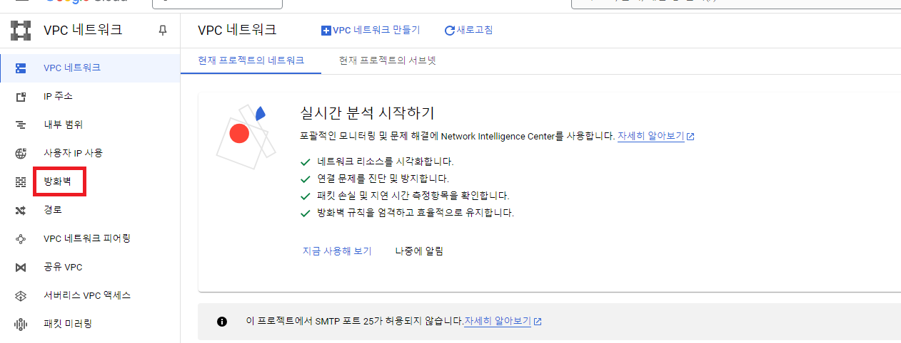

* create Firewall Rule

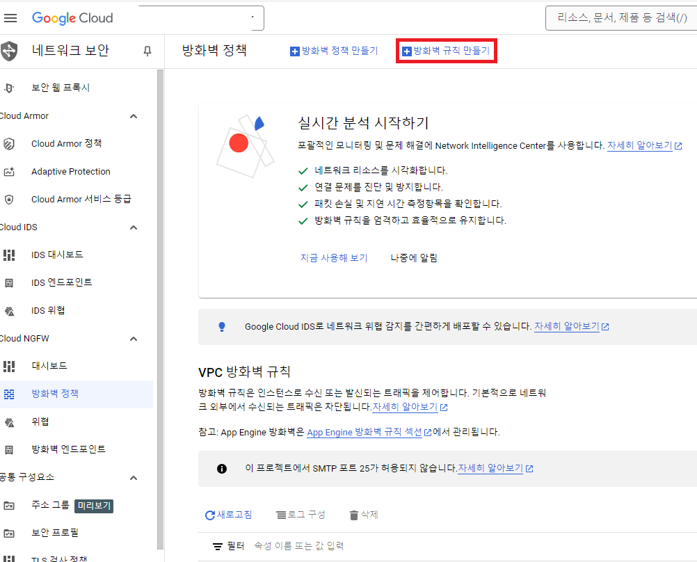

* allow access for the ports I want to use

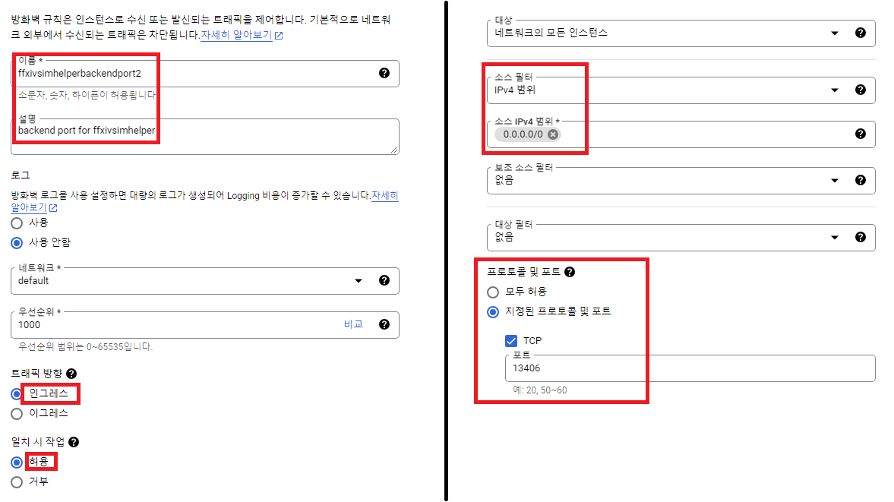

## 7. Test Request
I opened my backend server at port 13406

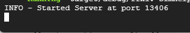

I requested to the machine's external IP from my local machine in HTTP and it works well:

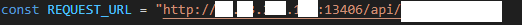

