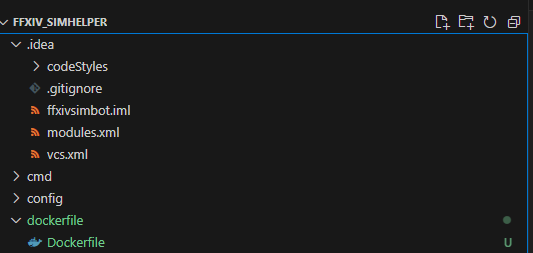
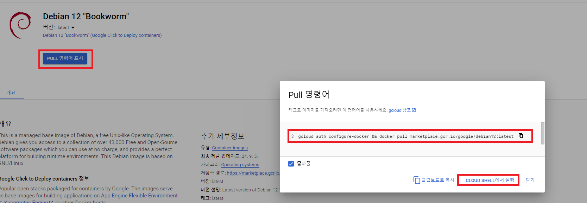
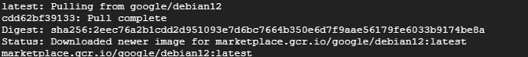

To make the server scale, we need to create a Dockerfile that will install all the needed configurations.

# 1. Create dockerfile directory and a Dockerfile
I also installed the docker plugin that VS Code recommended

# 2. FROM - Configure container's base image 
* https://cloud.google.com/software-supply-chain-security/docs/base-images?hl=ko shows base images that can be used in Google Cloud
* I clicked Debian 12 Marketplace -> executed pull command in shell

