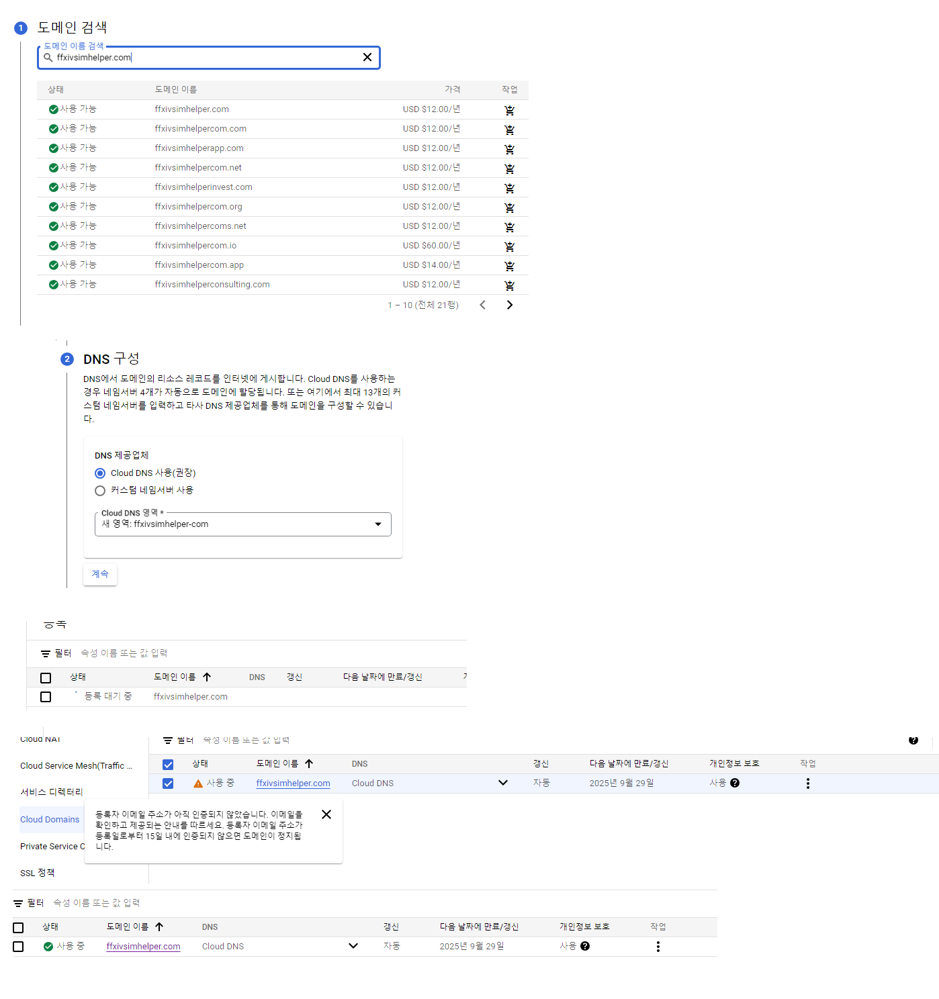

# Creating Google Cloud Backend Server

## 1. Creating and Connecting to a Virtual Server Machine

1. Created account with Google Account

2. Create a new project and go to the console.

3. Start the beginner's guide on creating a web server.

4. Go to VM Instance Page and click on "Create Instance"

5. Create a machine that matches the computing power you want. Allow HTTP and HTTPS traffic.

6. When the status is ready, click on the SSH button to connect to the machine.

7. The terminal for the virtual machine will open.

## 2. Set a Fixed IP Address
1. Go to the external IP Address in the vm instance menu

## 2-1. Acquire Domain
* Go to google cloud domains 
* Rent domain there.

* Add Standard - > resource type A + ip v4 to our instance

Now my VM and server is set.

