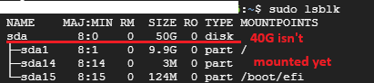

# What is a sda?

* It's like C:, D:, E: drive in Windows; in linux they will be labeled by numbers like sda1/sda2/sda3...

# lsblk
* Shows block devices, **including ones that haven't been mounted yet**




# Parted Console
* command for managing disk partition in linux

```shell
sudo parted /dev/sda
```

## Disk partition?
* Partitions physical disk into logical partitions that the user wants.
* One disk can be separated into many partitions.


## parted - resizepart
```shell
(parted) resizepart 1 2GiB
```

* 1: the minor number of the resizing partition (for the example it is 1, so it is resizing sda1)
* 2: size of the partition(you can give size unit like GiB, TiB, MiB or use default MiB)

# partprobe
* After changing disk partition by parted or fdisk, we have to update the partition changes to the OS

```shell
sudo partprobe /dev/sda
```


# resizetofs

```shell
sudo resizetofs /dev/sda1
```