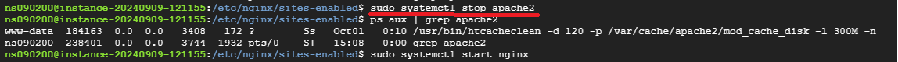

# What is nginx?
* Most widely used web server
* Faster, lighter and scalable than other web servers like Apache


## Characteristics
1) Performance: event-driven asynchronous architecture - performant even in heavy traffic
2) Load Balancing and security


## How to Configure

### 1. install nginx(linux)

```shell
sudo apt-get install nginx
```

### 2. make a new config in /etc/nginx/sites-available
* just remove default. Gives me errors even if I rename it.


---


### 3. create symbolic link in sites-enabled


```
sudo ln -s /etc/nginx/sites-available/ffxiv-simhelper.conf /etc/nginx/sites-enabled/ffxiv-simhelper.conf
```

### 4. Test React Connection

```
sudo nginx -t
```


### 5. Restart nginx gives error

```
sudo systemctl stop nginx
sudo systemctl start nginx
```


port is already in use - seems like apache2 is running.


apache2 seems like apache web server. Stopping apache web server and restarting nginx does the trick.



