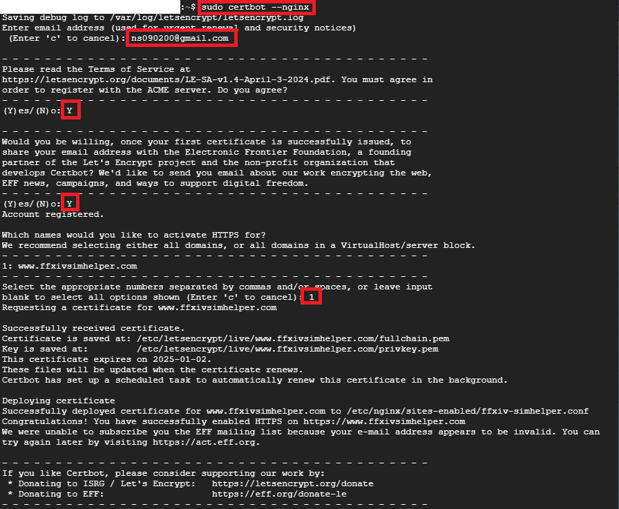
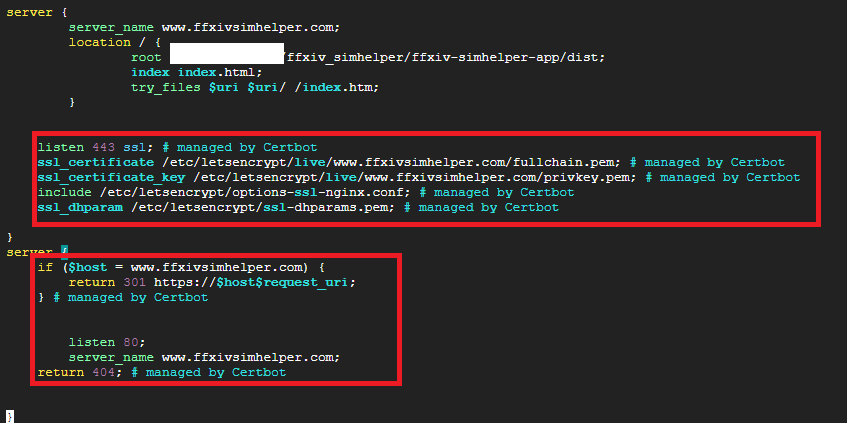

Now our homepage can be accessed by http:// , but we can't access through https:// yet. Time to configure ssl


# 1. Install Certbot
```shell
sudo apt-get install certbot python3-certbot-nginx 
```

# 2. Obtain certificate
```shell
sudo certbot --nginx
```




After the script was done, it auto generated SSL related code in my nginx config file:

