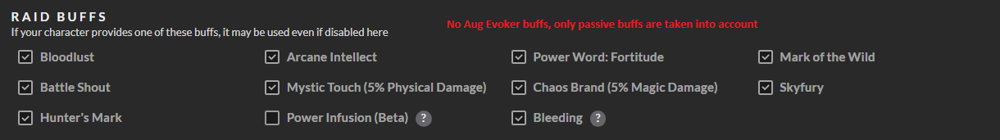
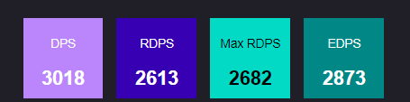
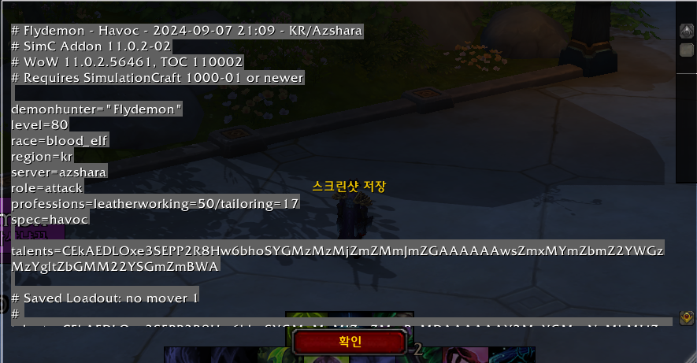
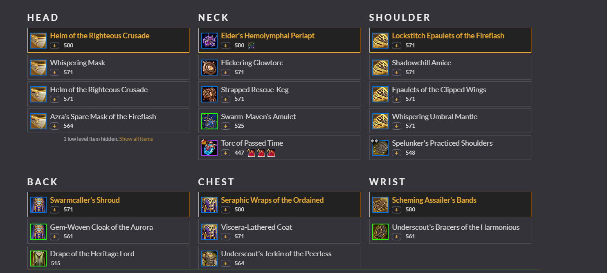
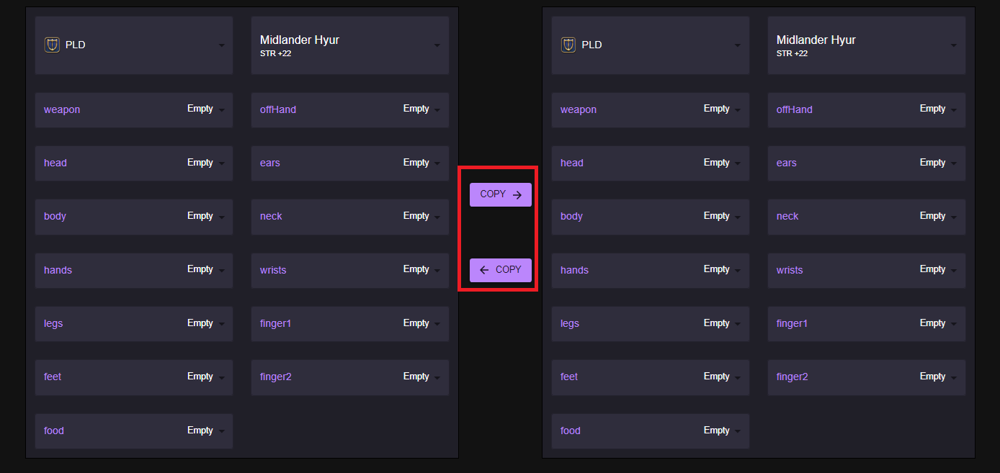

# 1. Sites Referenced for Fundamental FFXIV Theory 
* Most of the damage calculation theories are based off of the wonderful studies of the website: [allagan studies](https://www.akhmorning.com/allagan-studies/)
* The calculation of main stat impact relied on [etro](https://etro.gg) calculations.
* Also, raid-related DPS(such as RDPS and ADPS) is more important than individual DPS in FFXIV. So the [fflogs](https://www.fflogs.com) formulas for raid-related dps calculation was used.

# 2. Main Stat/Sub Stat Ladder 
* The formulas in [FFXIV Stat Theory](../ffxivtheory) are used.

# 3. Main Challenges of FFXIV Simulation Helper 
## 3-1. FFXIV's Characteristics 1: Raid-Based Simulation
Other games such as WOW and POE have DPS simulators, but they are all from games **games that focus on individual DPS.**
  * WOW's raids are 20-men, but there is almost no buffs that impact other player's DPS except the passive buffs, so their damage simulation are done on one character. 
  * Augmentation Evoker(similar to FFXIV's DNC) came out, but WOW simulations don't support this job's DPS, and also don't take into account Augmentation Evoker's buffs in other job's simulations.



However, the main concept of FFXIV's combat is to **align my cooldowns to my raid's buffs to maximize our DPS output**, meaning that FFXIV's DPS can never be simulated in an individual manner.


This means that FFXIV Simulation Bot needs to be **8 times faster than other game's simulation tools,** since we're putting in that much more players inside a single simulation, making the performance optimization very challenging.
To address this challenge, **the simulation part is programmed in Rust, which is a very optimizable language like C++. As a result, FFXIV Simulation Bot has a faster simulation speed than other simulation tools despite it calculating more players per simulation.**

Simulation Tools | Simulations per minute |
--|--
FFXIV Simhelper | 32000 |
Raidbot(WOW) | 16000 |


## 3-2. FFXIV's Characteristics 2: Varius DPS Metrics
1. In FFXIV, there is no limit in the number of raid clears a player can do in a week. This repetitive aspect of FFXIV, **99 percentile DPS metrics are as important as the expected DPS(=median**
2. Also, because of the raid-buff heavy nature of FFXIV raids, there are many raid-related DPS metric such as rDPS, nDPS.

To meet the game's needs, FFXIV Simhelper calculates various DPS metrics inside its simulation, and record high-end values as well as median DPS performance:




## 3-3. FFXIV's Characteristics 3: Limited number of oGCDs between GCD
WOW doesn't have a long oGCD delay, making the oGCD selection an isolated, individual problem - we simply check each skill and use them if they are available since there is no limit in the number of skills they can weave in.
   * In programming, this is called **an O(n) problem, which means the number of calculations is proportional to the number of skills(=n)**


However, FFXIV has a significant delay to every oGCD, making it a more challenging problem programming-wise:
1) You need to calculate **how many oGCD is going to fit after every GCD.** It can be 1 or 2 depending on the skill's delay and cast time(also can be 3 now, thanks to PCT and VPR)
2) In the usual case of two oGCDs between GCDs, you have to **choose the best pair of oGCD skills out of all the possible options.**
   * In programming, this is called **Multiple-criteria Decision Making Problem, and it is an O(n^2) problem, meaning that the number of calculation is proportional to the square of the number of skills(=n)**


There's more calculation needed for FFXIV's skill selection problem, making the performance optimization even more challenging. 
Machine Learning is a popular way of solving these kinds of problems, but huge volumes of FFXIV Machine Learning datasets must be collected before making ML possible. For now, we use an optimized tuned priority system for our skill choices. 

## 3-4. UI, UX 
WOW's simulation tools can quickly configure character's equipments by using the simulationcraft addon:

1. If you enter /simc in chat, it creates a string recording your job, race, currently equipped items, and items in the inventory. 



2. Paste this string to the site and you can start simulating with the list of items you have in your inventory.




FFXIV Simulation Bot doesn't have this kind of addon, and also even needs to get party member's inputs to make the simulation possible.

To solve these inconveniences, many UI/UX features have been added to the Application:

### Save ItemSets
Save features help the user go back to their favorite/recently simulated Item configurations:

1. Save Most Recent Simulation Input: FFXIV Simulation Bot saves the most recently requested itemset for later use.

2. Loadouts: Every simulation has a loadout where important/frequently used Items Sets can be bookmarked:


### Easy Party Member Configuration
It's hard to configure your own itemsets. It's almost impossible to ask the user to configure 8 members!
FFXIV Simulation Bot **only requests for the party member's jobs and their ilvl** For better usability, 


The tool uses special algorithms to give each party members an appropriate item set of that item level and starts the simulation.

#### Party Equipment Assignment Explanation
There are internal gearsets for each job in different ilvls(all of the gearsets have same GCD). For the highest ilvl, the gearset is one of the known BIS for the job.

* If there is a gearset for the selected ilvl(for now: 710 720 730): Party member's stat is set by the internal gearset.
* If therer isn't a gearset for the selected ilvl(ex) 715, 725, 730): The result is given by interpolating two known ilvl gearsets (ex) use the average of 710 720 gearsets to estimate 715's damage performance)


### Copy Loadout
"Gear Compare" compares two different item sets, doubling the number of configuration. To make it easier, **there are buttons that copy one item set to the other item set so that the common parts get configured only once.**




# 4. Future Tasks 
## 4-1. Machine Learning Based oGCD Selection 
As explained above, Multiple-criteria Decision Making problems are better solved using Machine Learning.
However, there are two challenges that makes this difficult:

1) Dataset Pipeline: There is no FFXIV combat related dataset as of now. We need to create one, which I'm planning to do for my next project.
2) Short Re-train Periods: FFXIV rebalances their classes every patch, making the skill priority of jobs change. This means we have to re-train all our Machine Learning model, and there is going to be one model for every 23 job in the game.


## 4-2. Downtime/Burst Time Configuration 
1. FFXIV raids usually have downtimes where the boss cannot be attacked.
   * Make downtime intervals configurable for more realistic simulations.
```
ex) Simulate a 6min encounter with downtimes in (4m, 4m30s), (5m7s, 5m 15s)
```

2. The burst can be delayed because of kill times or raid-specific limitations (downtimes in Burst Window, save cooldown for the next phase, etc)
   * Make burst times configurable to handle these kinds of situations. 
```
ex) Simuate a 6min encounter with burst times at (0m, 2m30s, 5m)
```