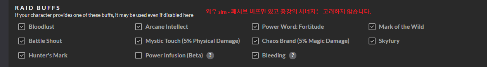
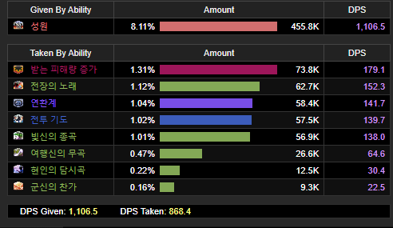
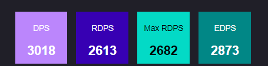
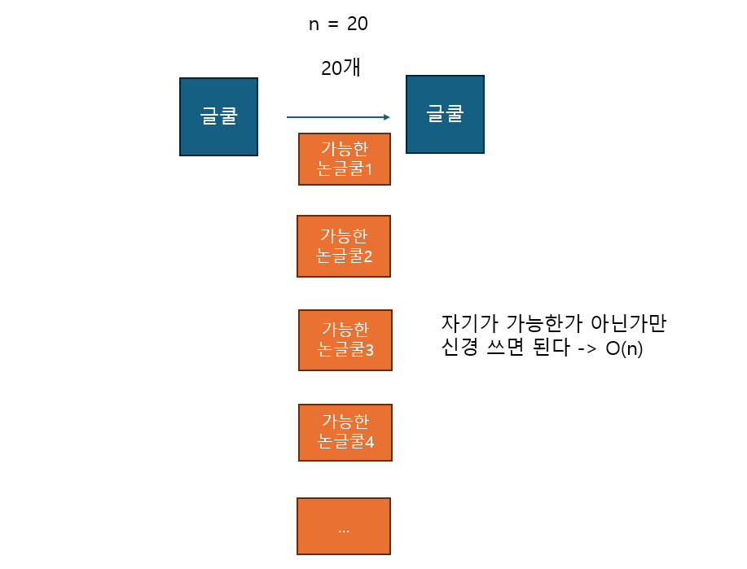
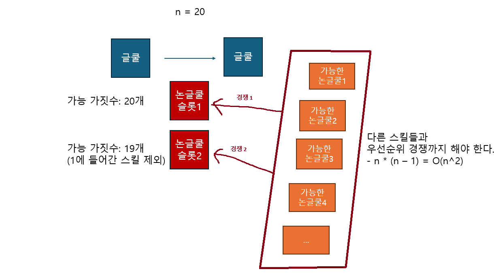
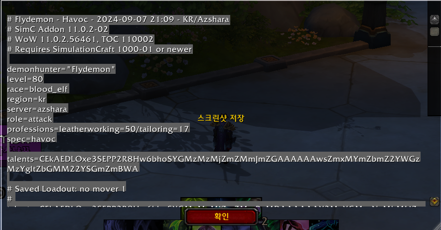
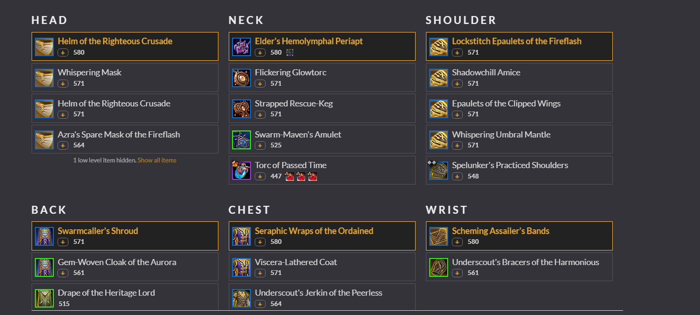
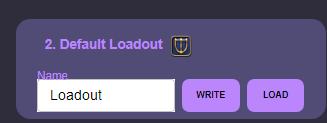
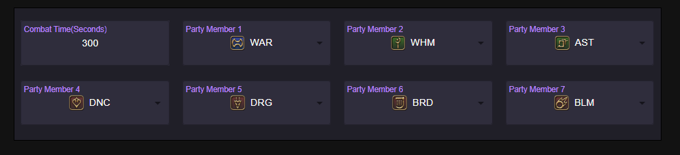
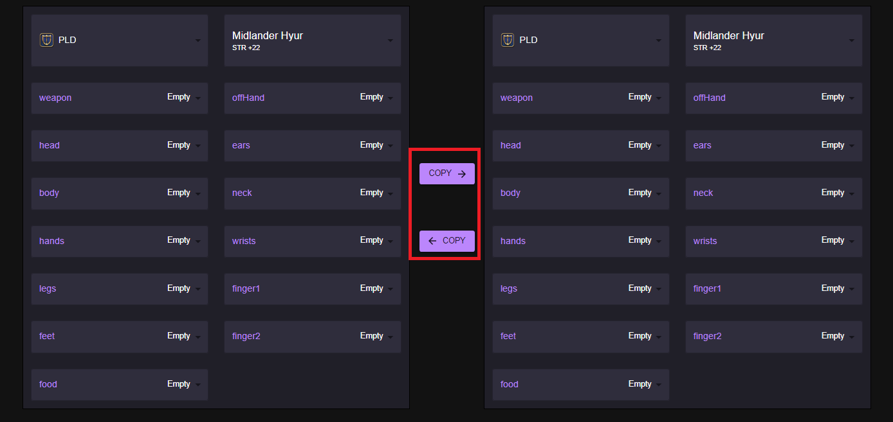

# 1. 기본 이론적 배경 참고 사이트들
* 데미지 계산에 대한 대부분 이론은 [allagan studies](https://www.akhmorning.com/allagan-studies/)에서 연구한 자료들 바탕으로 만듭니다.
* 다만 allagan study의 주스탯 관련 설명이 조금 부족해서 그런 부분은 [etro](https://etro.gg)의 스탯 계단을 많이 참고했습니다.
* 또한 현재 파판은 개인 DPS가 아닌 Raid 기반 DPS 기준으로 넘어간 추세라 그쪽 연산은 [fflogs](https://www.fflogs.com)의 문서들을 참고했습니다.

# 2. 스탯별 계단, 주스텟 계산식
* [FFXIV 이론](../ffxivtheory) 문서를 참고하시면 됩니다.

# 3. FFXIV Simbot의 핵심 문제해결 기술
## 3-1. FFXIV의 특수성1 - 공대 단위 시뮬레이션
여태 Simulation 계산기가 있던 Wow(Raidbots), 던파, POE등은 모두 **개인 기반 DPS가 중요한 게임이라는 점에서 파판14와 다릅니다.**
  * WOW는 20인 공대지만 다른 플레이어에게 영향을 주는 스킬이 거의 없어서 시뮬레이션을 원하는 캐릭터 하나만 돌리면 됩니다.
  * 현재 증강 기원사라는 파판의 무희와 비슷한 클래스가 나오긴 했지만, 시뮬레이션은 이 증강 기원사를 지원하지도 않으며 계속 개인 DPS시뮬레이션 방식을 유지하고 있습니다.



하지만 파판은 **공대원들의 버프에 내 쿨기를 맞춰 시너지를 극대화하는 게 DPS 최적화의 핵심이 게임이라 절대로 이렇게 계산할 수 없습니다.** 결국 
파판 시뮬레이션은 **나 혼자가 아닌, 내 파티 8명을 한 번에 돌려야 유의미한 계산값이 나오게 됩니다.**



이로 인해 FFXIV Simulation Bot은 다른 RPG들의 시뮬레이션 프로그램에 비해 최소 8배는 빨라야 같은 속도가 나오게 되어 최적화 요구치가 매우 높습니다.

이를 해결하기 위해 **javascript보다 훨씬 다루기 까다롭지만 더 최적화 가능성이 높은 Rust 프로그래밍 언어로 시뮬레이션을 구현했고, 이로 인해 파티 단위 시뮬레이션임에도 다른 시뮬레이션보다 훨씬 빠른 속도를 자랑합니다.**

시뮬레이션 앱 | 분당 시뮬레이션 |
--|--
FFXIV Simbot | 32000 |
Raidbot(WOW) | 16000 |


## 3-2. FFXIV의 특수성2 - 다양한 DPS 지표
1. 파판은 와우와 다르게 레이드를 무한정으로 돌 수 있기 때문에 **평균적인 퍼포먼스뿐만 아니라 고점에 대한 비교도 중요합니다.**
2. 뿐만 아니라 공대 단위 퍼포먼스가 중요하기 때문에 rDPS, nDPS등 여러가지 DPS 지표가 필요합니다.

FFXIV Simbot은 파판의 이러한 다양한 요구에 부응하기 위해 자주 사용하는 여러 지표를 계산하고, 중간값 뿐만 아니라 상위 99% 고점에 대한 지표도 함께 제공합니다:




## 3-3. FFXIV의 특수성3 - 글쿨 사이 한정된 논글쿨
WOW는 논글쿨기의 딜레이가 없는 수준이라 쿨이 오는대로 논글쿨을 배치해주면 됩니다 - 매 글쿨마다 스킬들을 한 번씩 돌면서 사용 가능한 스킬이 있는지 확인합니다
   * 이는 프로그래밍 관점에서 **O(n) 문제, 즉 스킬 개수 n에 비례하는 계산시간을 가진다고 합니다.**




하지만 파판은 논글쿨의 딜레이가 유의미하여 여러가지 프로그래밍 관점에서 해석하기 어려운 문제들이 있습니다
1) 이번 글쿨 사이엔 논글쿨이 몇개가 들어가는지 계산해야 합니다.
2) 논글쿨은 일반적인 경우 2개밖에 못 쓰기 때문에, 가능한 스킬들 중 **가장 좋은 결과를 내는 스킬 두 개를 선별해야 합니다.**
   * 이는 프로그래밍 관점에서 **다중 기준 의사 결정 문제라고 하고, O(n^2) 문제, 즉 n의 제곱에 비례하는 계산시간을 가진다고 합니다.**



이로 인해 파판의 시뮬레이션은 어떤 스킬을 사용할 지 결정할 때 훨씬 더 효율적인 해결 방법을 요구합니다. 
이러한 문제는 요즘 유행하는 Machine Learning에 최적인 문제이긴 하지만, 이는 이후 과제이고 일단은 자체 튜닝한 시스템을 사용합니다. 

## 3-4. UI, 사용자 편의성 
애드온에 개방적인 WOW는 simc라는 애드온을 통해 빠르게 자기 inventory에 있는 아이템들을 시뮬레이션 사이트로 가져올 수 있습니다.

1. /simc 를 채팅으로 치면 현재 내 인벤토리 상황/내 종족/내 레벨 같은 핵심 정보가 복사됩니다:



2. 이걸 사이트에 붙여넣으면 바로 내 현재 보유장비들이 시뮬레이션 가능하도록 나옵니다:




이와 다르게 파판은 이러한 애드온이 없을 뿐만 아니라, 파티 기반 시뮬레이션이기 때문에 파티원의 상태까지 입력을 해야 합니다.

이러한 불편함을 완화하기 위해 여러가지 편의 기능들을 넣어놨습니다:


### 장비셋 저장 기능
유저가 한 번만 입력하면 다시 모든 과정을 반복할 필요 없게 여러 저장장치들을 만들어놨습니다.

1. 가장 최근 입력 저장: 시뮬레이션을 하면 바로 그 입력값들을 저장해서 다시 그 simulation을 하려할 때 가장 최근으로 저장된 입력값을 보존해줍니다:

2. Loadout 저장 기능: 시뮬레이션마다 장기저장하고 쓸 수 있는 loadout을 만들어서 자주 사용하는 장비셋을 빠르게 로딩하도록 했습니다:




### 파티원 설정기능 간략화
자신의 장비셋 하나 설정하기도 힘든데 8명을 모두 설정하게 하는 건 편의성이 너무 떨어집니다. 더 나은 편의성을 위해 **파티원들의 직업과 대략적인 ilvl만 입력하도록 합니다.**



내부 알고리즘으로 알아서 파티원들에게 해당 레벨에 적합한 장비셋을 주고 시뮬레이션합니다.

### 장비셋 복사
Gear Compare는 두 개의 장비셋을 비교하는 거라 설정할 게 두 배가 됩니다. 이를 더 편하게 하기 위해 **한 쪽 장비셋을 반대쪽에 복사할 수 있도록 했습니다.**




# 4. 이후 과제들
## 4-1. Machine Learing 기반으로 논글쿨 선택
위에서 설명한 것 처럼 현대 프로그래밍에서 다중 기준 의사 결정 문제는 Machine Learning으로 해결하는 게 트렌드이고, 현재 FFXIV Simbot의 문제와도 잘 맞습니다.
하지만 이렇게 하기 위해선 두 가지 어려운 점이 있습니다:

1) 정답셋 구축: 아직 제대로된 FFXIV 관련 전투데이터셋은 없습니다. 직접 파이프라인을 만들기 위해 계획중입니다. 
2) 학습 주기가 매우 짧다: 파판은 20개가 넘는 직업이 매 패치 밸런스가 이뤄지므로 우선순위가 바뀔 수 있습니다 - 그러면 패치마다 20개가 넘는 모델을 재학습해야 합니다다


## 4-2. 쉬는 구간, 버스트 타임 설정
1. 파판 레이드들은 "운동회"라고 불리는 레이드 중간 보스가 공격불가가 되는 구간이 생깁니다(이걸 RPG용어로 다운타임이라고 합니다).
   * 더 유연한 시뮬레이션을 위해 이러한 다운타임도 고려하도록 합니다.
```
ex) 6분 레이드일 때, 쉬는 구간을 (4분, 4분30초), (5분 7초, 5분 15초) 등으로 설정
```

2. 클리어 타임에 따라 버스트 타이밍이 밀릴 수도 있습니다.
   * 이를 반영하기 위해 버스트 타이밍으로 수동으로 입력받을 수 있게합니다 
```
(6분 레이드일 때, 버스트 시작 시간을 [0분, 2분30초, 5분으로 설정])
```