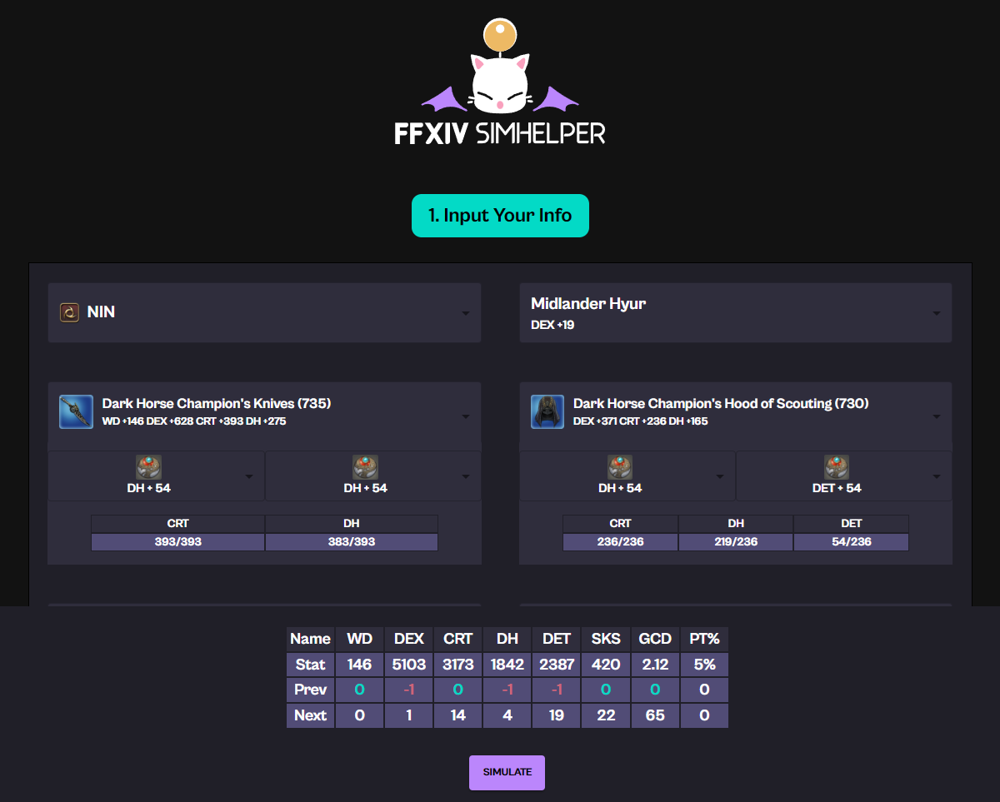
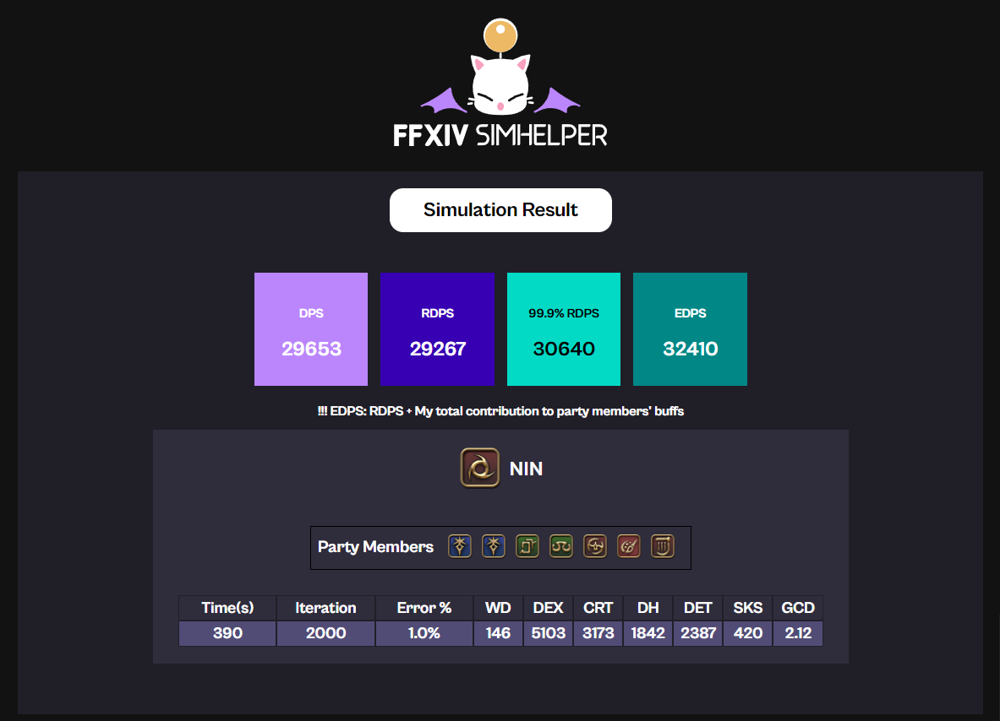

# FFXIV SimHelper 
Official documentation of FFXIV SimHelper, a computer simulation application for FFXIV Party Combat.

## In-Depth, Multi-Purpose DPS Simulation for FFXIV

Input your equipment/materia/food to the application to get detailed analysis of the expected DPS for that gearset.
분석하고 싶은 장비셋/마테리아를 입력하시면 컴퓨터가 수 천번 시뮬레이션을 통해 다방면으로 DPS를 분석해줍니다.

---

## Download
install and run "run.exe"

* FFXIV Simhelper 7.0 Patch [(EN)](https://drive.google.com/file/d/19nHTrQXAHmWoJjH6okTSERIv9PfOrNye/view?usp=drive_link) [(KR)](https://drive.google.com/file/d/1JtIxpzxOowesAlNuUguhSaJdTrdHdwuX/view?usp=drive_link)

## Guide Documents
* Introduction - Why FFXIV Simbot? [(EN)]() [(KR)]()
* User Guide [(EN)]() [(KR)](../../download/FFXIV_SIMHELPER_사용설명서.pptx)
* In-depth Explanation [(EN)](./indepthen.html) [(KR)](./indepthkr.html)

## Creators
Fly Xiv/Fly Ninetynine@Aegis (ns090200@gmail.com) - Main Development

Essnah (essnah@naver.com) - Product Management

Kkoo Eat@Aegis - Design and Logo

