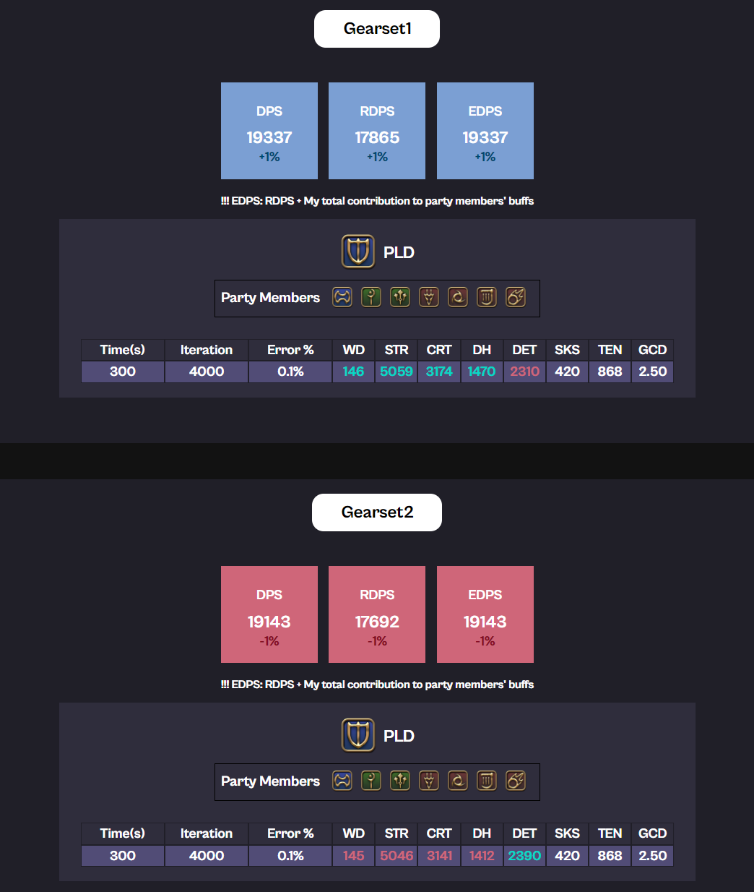

# FFXIV SimHelper 
Official documentation of FFXIV SimHelper, a computer simulation application for FFXIV Party Combat.

## Download
install and **run "run.exe"**

* FFXIV Simhelper 7.0 Patch(Window 64bit) [(EN)](https://drive.google.com/file/d/1sVeRRjvGhcCSqGSIMDMSxSnyRmOLo6aI/view?usp=drive_link) [(KR)](https://drive.google.com/file/d/1YfAIbvyAO145tY0b8GgsGYH9B3Mn10oi/view?usp=drive_link)

---
* When the file runs, it asks for permission to run the simulation engine. **It's safe!!! Please don't worry and allow permission**

# In-Depth, Multi-Purpose DPS Simulation for FFXIV

Input your equipment/materia/food to the application to get detailed analysis of the expected DPS for that gearset.

분석하고 싶은 장비셋/마테리아를 입력하시면 컴퓨터가 수 천번 시뮬레이션을 통해 다방면으로 DPS를 분석해줍니다.

---

### 1. DPS analysis for the input gearset(입력한 장비셋에 대한 DPS 분석)
   * EDPS: RDPS + My contribution to other party member's buffs 

---

---

---

---

### 2. DPS Comparison Between 2 Different Gearsets(두 장비셋의 DPS 비교)

---

## 3. Find Party Composition that Maximizes Your RDPS(시너지 점수를 극대화해주는 조합 찾기)

---

---

## 4. Find Best Substat Materia for Current Gearset(현재 스탯에 가장 기대값 높은 부스탯 찾기)

## Guide Documents
* Introduction - Why FFXIV Simbot? [(EN)]() [(KR)]()
* User Guide [(EN)]() [(KR)](../../download/FFXIV_SIMHELPER_사용설명서.pptx)
* In-depth Explanation [(EN)](./indepthen.html) [(KR)](./indepthkr.html)

## Creators
Fly Xiv/Fly Ninetynine@Aegis (ns090200@gmail.com) - Main Development

Essnah (essnah@naver.com) - Product Management

Kkoo Eat@Aegis - Design and Logo

