# FFXIV SimHelper 
Official documentation of FFXIV SimHelper, a computer simulation application for FFXIV Party Combat.

## Download
* App Installation (Windows 64) - [https://github.com/flyxiv/ffxiv_simhelper_public/releases](https://github.com/flyxiv/ffxiv_simhelper_public/releases)
* Go to the **"latest" release and download "ffxiv-simhelper-app-Setup-{version}.exe"**

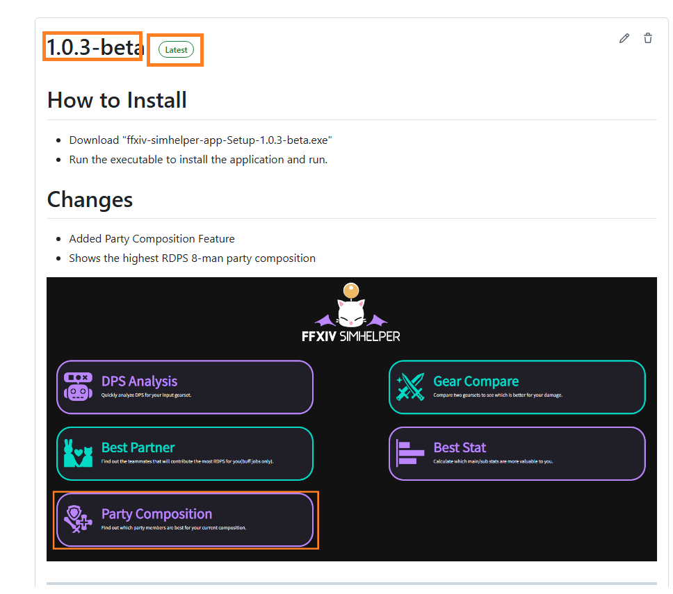

* Click on the setup file. After the installation finishes, you can find it on your application list

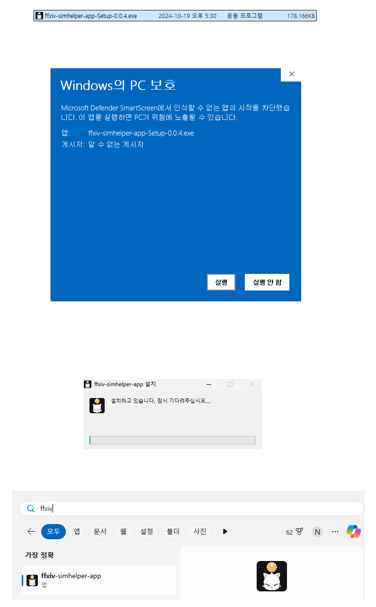

# In-Depth, Multi-Purpose DPS Simulation for FFXIV

Input your equipment and other party settings to the application to get detailed analysis of the expected DPS for that gearset.

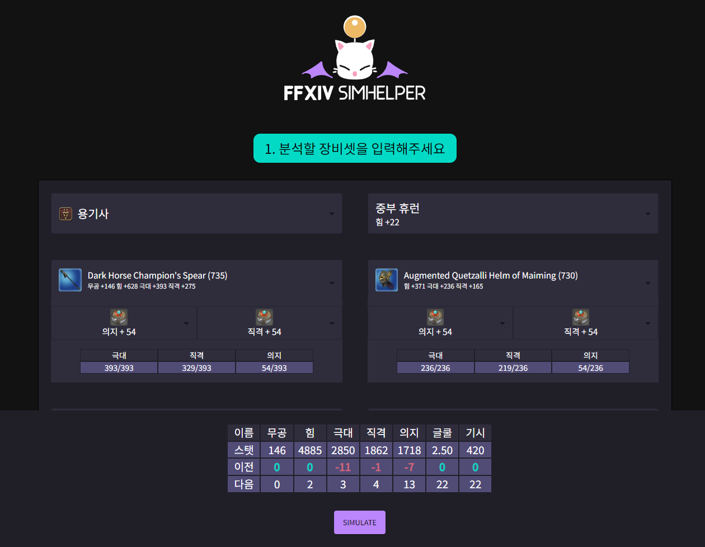

---

### 1. DPS analysis for the input gearset

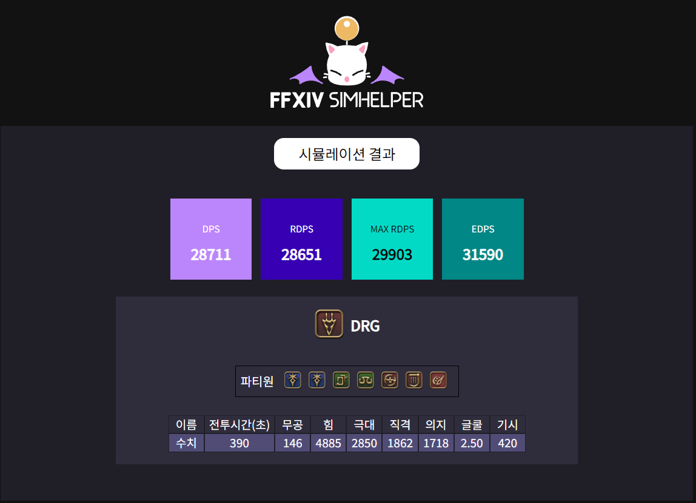

---

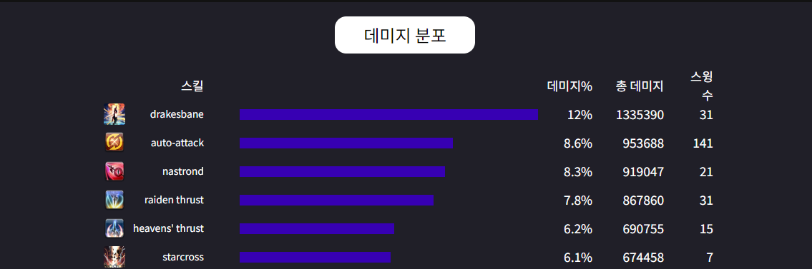

---

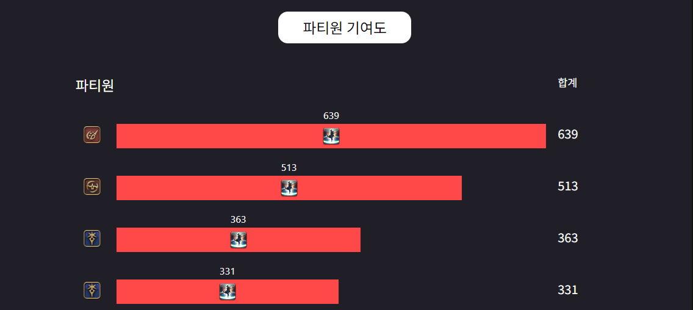

---

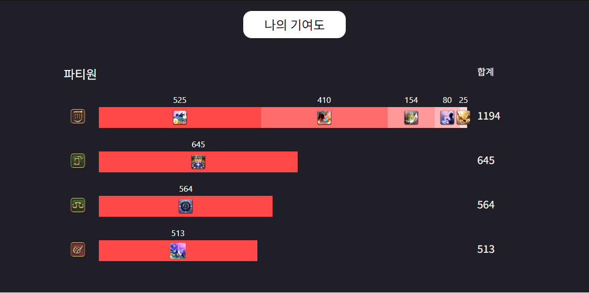

---

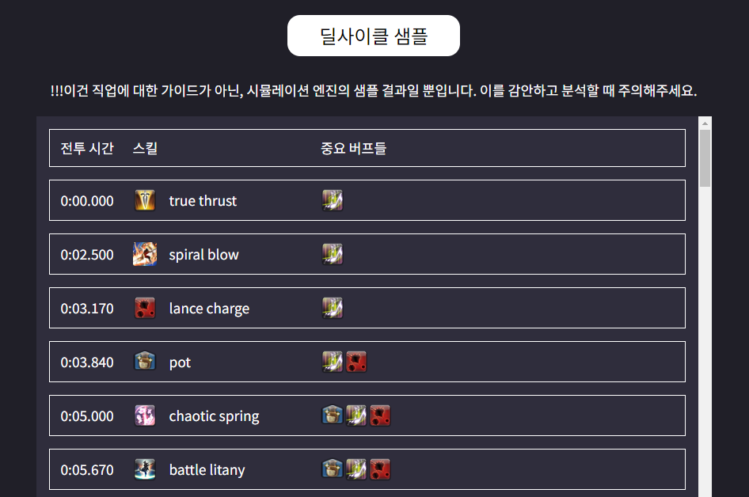

### 2. DPS Comparison Between 2 Different Gearsets

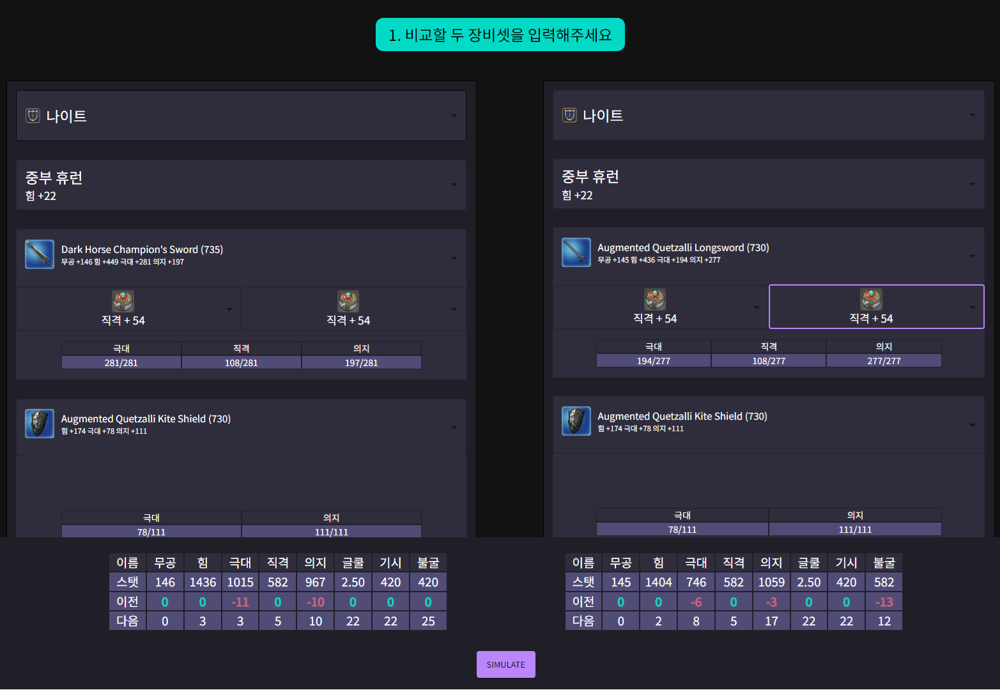

---

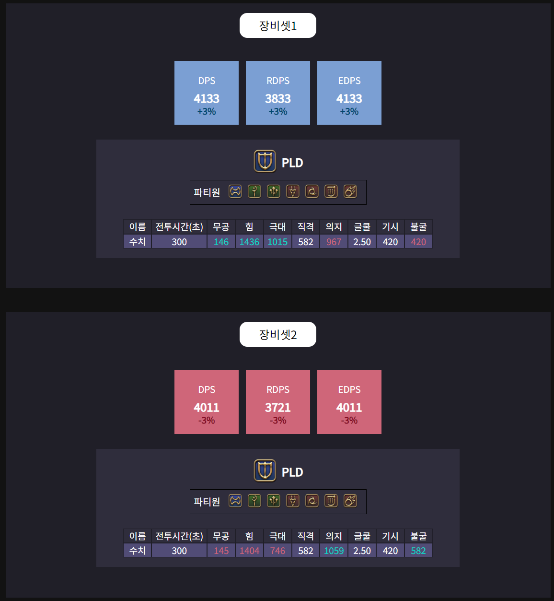

## 3. Find Party Composition that Maximizes Your RDPS
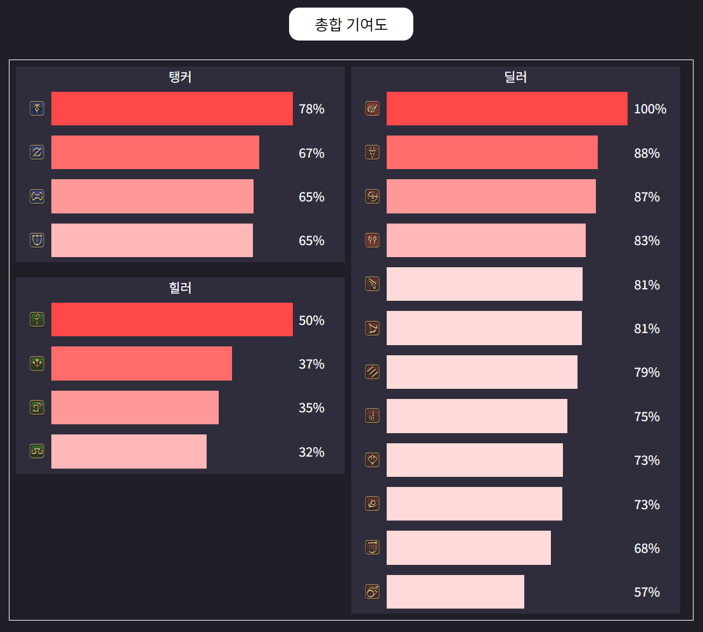

---

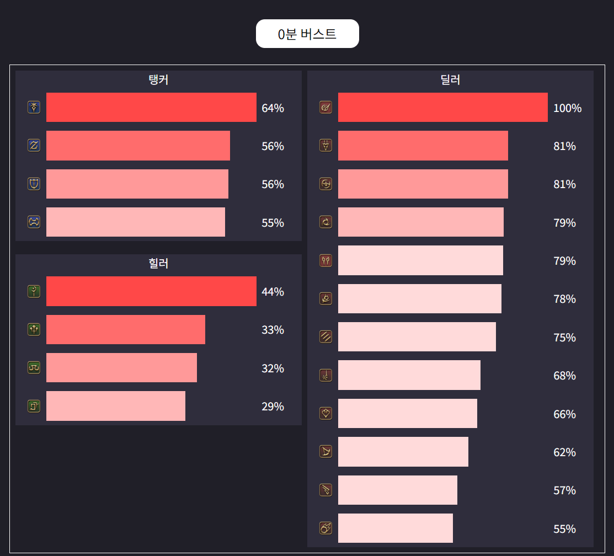

---

## 4. Find Best Substat Materia for Current Gearset
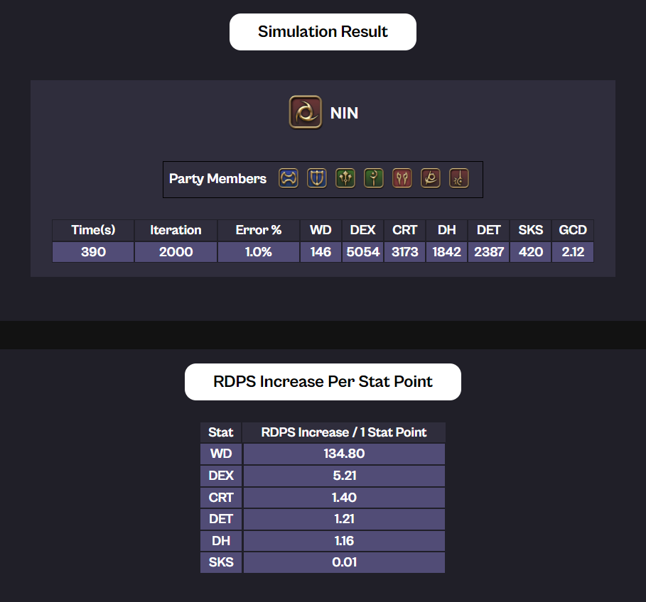

## Guide Documents
* [User Guide](./userguideen.html) 
* [In-depth Explanation](./indepthen.html)

## Contacts for Bug Reports/Suggestions 
* [Official github issue repository](https://github.com/flyxiv/ffxiv_simhelper_issues/issues)
* You can create an issue for your report here, or you can contact our email/discord in the next section. 

## Creators
Fly Xiv/Fly Ninetynine@Aegis (ns090200@gmail.com) - Main Development

Essnah (essnah@naver.com) - Product QA, Marketing 

Kkoo Eat@Aegis - Design and Logo

