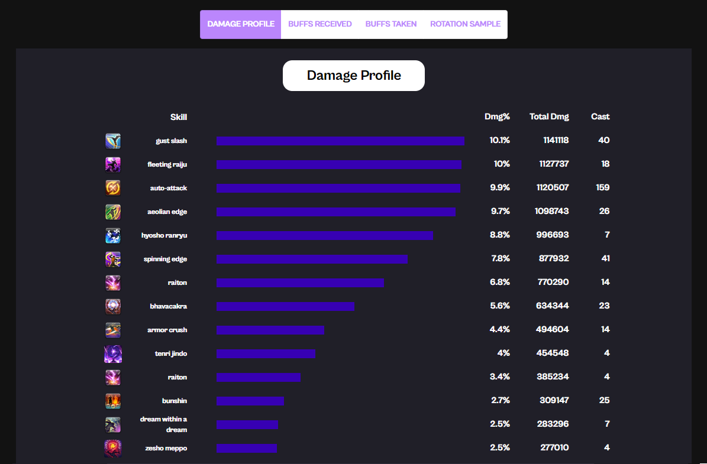
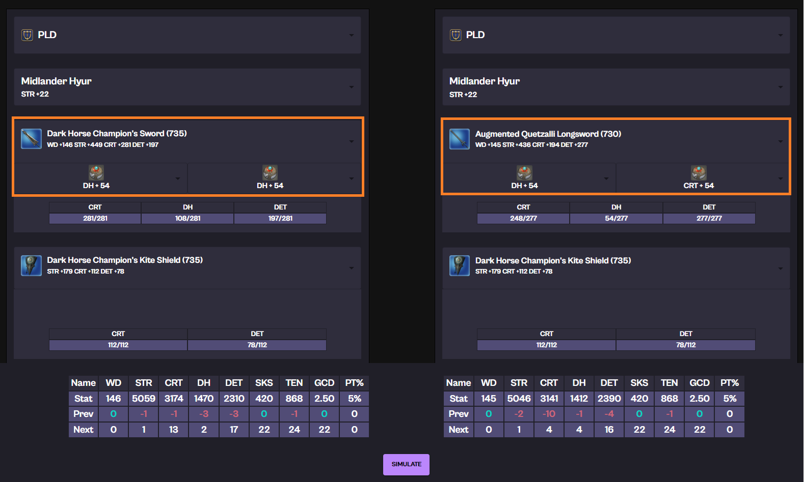

# FFXIV SimHelper 
Official documentation of FFXIV SimHelper, a computer simulation application for FFXIV Party Combat.

## Download
install and **run "ffxiv-simhelper-app.exe"**

* [FFXIV Simhelper 7.0 Patch(Window 64bit)](http://naver.me/GgWzg68d)

# In-Depth, Multi-Purpose DPS Simulation for FFXIV

Input your equipment and other party settings to the application to get detailed analysis of the expected DPS for that gearset.

---

### 1. DPS analysis for the input gearset

---

---

---

---

### 2. DPS Comparison Between 2 Different Gearsets

---

## 3. Find Party Composition that Maximizes Your RDPS

---

---

## 4. Find Best Substat Materia for Current Gearset

## Guide Documents
* [Beginner's Guide(For those who's almost never used a FFXIV tool before)](../../download/FFXIV_SIMHELPER_사용설명서.pptx)
* [User Guide]() 
* [FAQ]()
* In-depth Explanation [(EN)](./indepthen.html)

## Contacts for Bug Reports/Suggestions 
* [Official github issue repository](https://github.com/flyxiv/ffxiv_simhelper_issues/issues)
* You can create an issue for your report here, or you can contact our email/discord in the next section. 

## Creators
Fly Xiv/Fly Ninetynine@Aegis (ns090200@gmail.com) - Main Development

Essnah (essnah@naver.com) - Product QA, Marketing 

Kkoo Eat@Aegis - Design and Logo

