# 0. Brief Introduction of FFXIV SimHelper 

FFXIV SimHelper was originally built as a tool for our Static(One & Done) to quickly find out meta jobs and learn them. I later decided to make it public and fixed the UI to make it more accessible.

Given its history, the tool focuses on the following needs our static had:

* Individual Job Guide: **provite multi-layer data for Players with Entry/Intermediate Understanding of the Job to help them improve quickly.** 

* Compare Jobs of the Same Role(Tank/Healer/Melee/...): **Quickly experiment which jobs in the needed role fit the best for our team.**

* Compare "Very Similar" Gearsets "in Our Current Party Composition": in the Gear Farming Stage(Savage week 1-4)/and after Farm 

I'm sure these needs our static had will have a lot in common with the needs of other players in the FFXIV community who enjoy high-level combat content. However, one important thing must be said before we begin our user guide: 

**The tool is focused more on making the beginner/intermediate players better than making the already "advanced" level players "perfect"**
   * After experiencing end game content of various MMORPGS, one thing was clear to me: **the complexity of FFXIV's speedrun-level endgame combat is unmatched, since raidbuffs make the perfect DPS rotation a group effort instead of an individual one.** 
   * To handle such complex DPS rotation, advance Machine Learning/AI technology such as Reinforced Learning must be used, but this is marked as a task for future, since the amount of work it takes to create a Data Pipeline and train AI models is beyond what one individual programmer can do( much help is appreciated!!! ns090200@gmail.com) 
   * Because of this, the tool focuses on making a rotation that is **"good enough" - which make gear comparision results within 0.1%-0.2%p difference trustworthy.** 

This doesn't mean that advanced-level users won't find anything worthy from this tool. The tool will provide you calculations results for curiosities you would have had for FFXIV Combat, giving you various insights of its system.

# User Guide 1. Beginner-level: Learn Your Job Quickly using FFXIV SimHelper(ACT needed)

When you finish leveling job, **you will have a gearset way inferior to the well-known BIS/Optimal Gearsets guide sites like The Balance Provide.**

This huge difference in gear makes it difficult to directly compare your performance with other players. You could do the target dummy trial, but **that also provides you with only the binary pass/fail "result" of your performance, not the "process" on how to improve it.** 

**FFXIV SimHelper can help you in these situations: it will tell you the appropriate DPS for your current gearset, and provide you with various data that will help you achieve that DPS.**

## Target Dummy Simulation

1) Click on "Quick Sim"

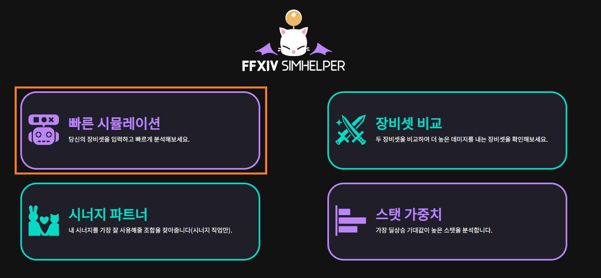

2) In-game, open your equipment tab and check your current gearset. (!!! To make your practice as effective as possible, for jobs that have an optimal GCD range such as Monk make sure you set your GCD is inside that range.") 

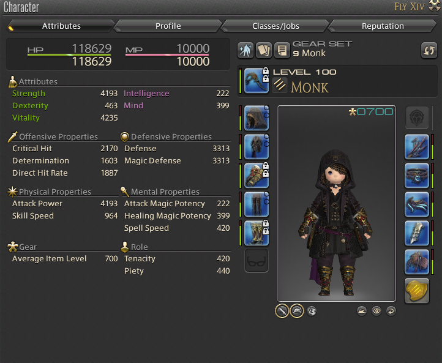

3) 내가 입고 있는 장비/마테리아 및 추가 설정을 앱에 입력해준 뒤, **파티원을 모두 없애줍니다(파티 주스탯 보너스 및 시너지 효과 없애기 위해)**

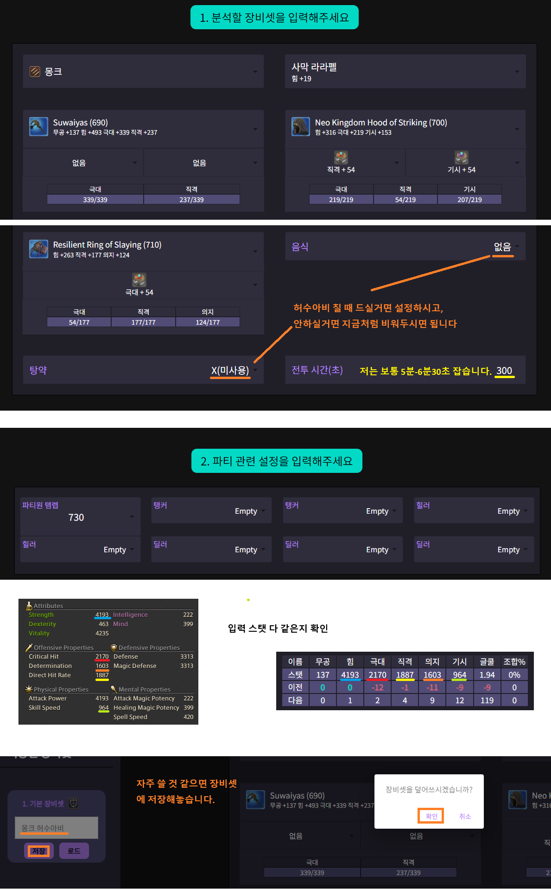

4) ACT로 설정한 시간만큼 허수아비를 친 걸 기록한 뒤 시뮬레이션 결과랑 비교해봅니다. **파판 딜사이클은 편차가 좀 있어서 1-2% 정도 차이는 크게 신경 안쓰셔도 됩니다.**

5) 원하는 만큼 DPS가 나오지 않으면 ACT의 데미지 로그를 비교하여 크게 잘못된 부분이 있나 확인합니다. 실제 게임에서는 핑차이 및 프레임 차이로 인해 글쿨이 조금씩 밀리게 되어서 콤보 스킬 시전 수가 시뮬레이션과 조금 차이나는 건 문제가 아닐 수 있습니다.

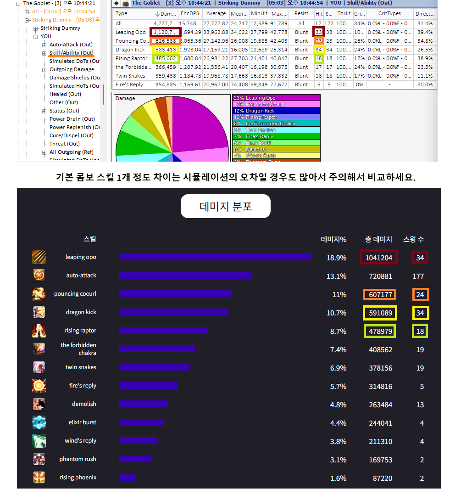

6) 사이클에 대해 헷갈리는 부분이 있으면 딜사이클 샘플을 참고하셔도 좋습니다:

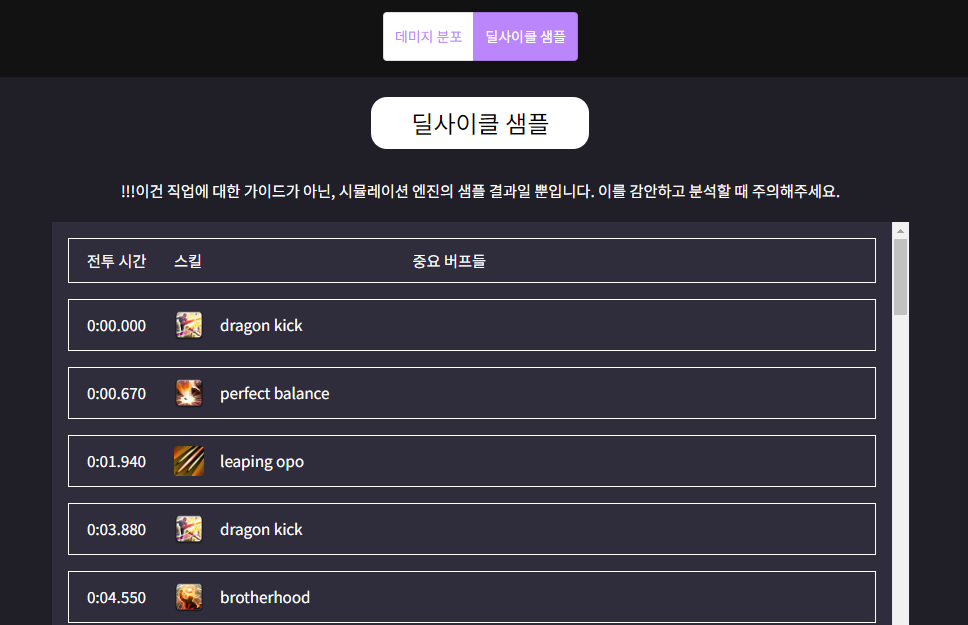

# 사용 가이드 2. 중급 유저: 레이드 트라이/클리어 후 비교
* 트라이나 초기 주차에는 모두 아이템 상태가 달라 다른 플레이어와 1:1로 비교하기가 힘듭니다. 그럴 때 SimHelper를 사용해 내 대략적인 퍼포먼스를 점검할 수 있습니다.

* ex) 10분짜리 2층 로그

## 내 FFLogs 로그 점검

1) 앱의 "빠른 시뮬레이션"을 시작합니다.

2) 허수아비 시뮬레이션처럼 내 장비 옵션들을 앱에 입력하고, 로그의 파티원 조합과 대략적인 아이템레벨을 입력하고 시뮬레이션을 진행합니다.

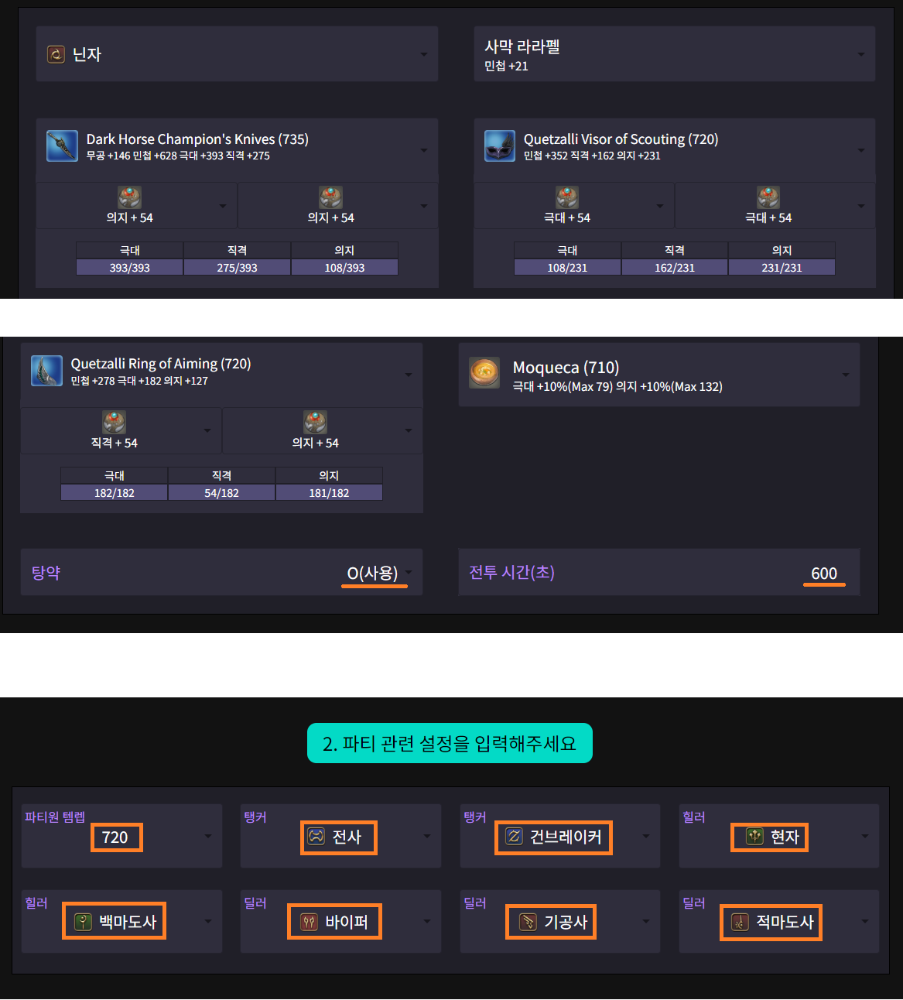

3) 시뮬레이션 DPS와 내 로그의 DPS를 비교해봅니다.

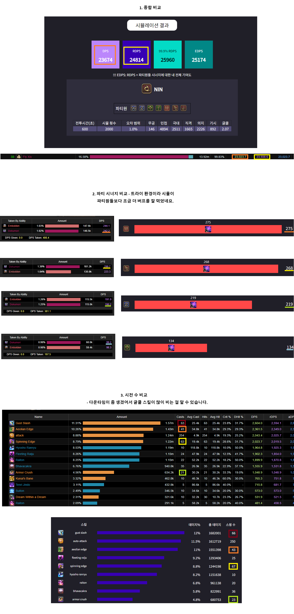

* !!! 시뮬레이션 사이클은 가장 정석적인 사이클로 운영하기 때문에 **클타임에 따른 세밀한 최적화까지는 신경는 수는 없습니다**. 위 로그에서 뇌둔이 22개인 것은 10분 버스트가 안 올걸 알고 미리 9:20/9:40 뇌둔을 미리 써서 그런 것이고, 시뮬레이션은 일반적인 사이클처럼 버스트에 쓰기 위해 풀링하기 때문에 차이가 나는 것입니다.

# 사용 가이드 3. 장비 세팅 최적화

파밍이 완료된 시점에는 모두 비슷한 장비를 하고 있지만, **영식 초기 주차처럼 파밍을 해나가는 단계에서는 모든 캐릭터가 운에 따라 서로 다른 수준의 장비를 마련하게 됩니다.**
이럴 때 "일반적인 상황이 아닌 현재 내 상황"에서 최선의 세팅을 구하기 위해 SimHelper를 사용합니다.

## 시나리오
영식 2주차라 **석판 900개가 모였는데, 상의 석판을 먼저 살 지 하의 석판을 먼저 살 지 고민입니다.**

1) "장비셋 비교"로 갑니다.

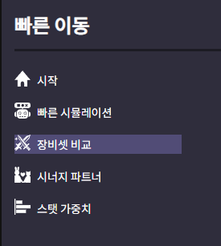

2) 상의를 샀을 때의 세팅과 하의를 샀을 때의 세팅 + 파티원 조합을 입력하여 시뮬레이션 합니다.

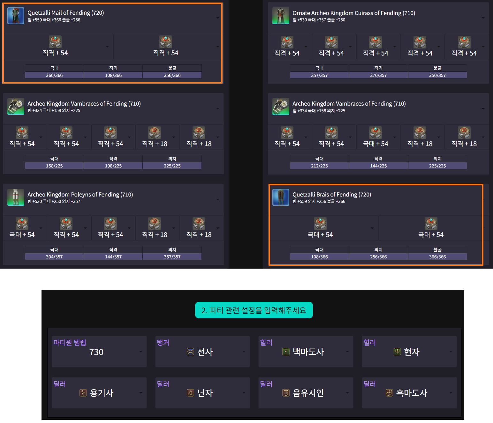

3) 결과를 확인합니다. **상의가 확정 5홈이라 하의를 바꾸는 게 더 좋은 선택인 것을 알 수 있습니다.**

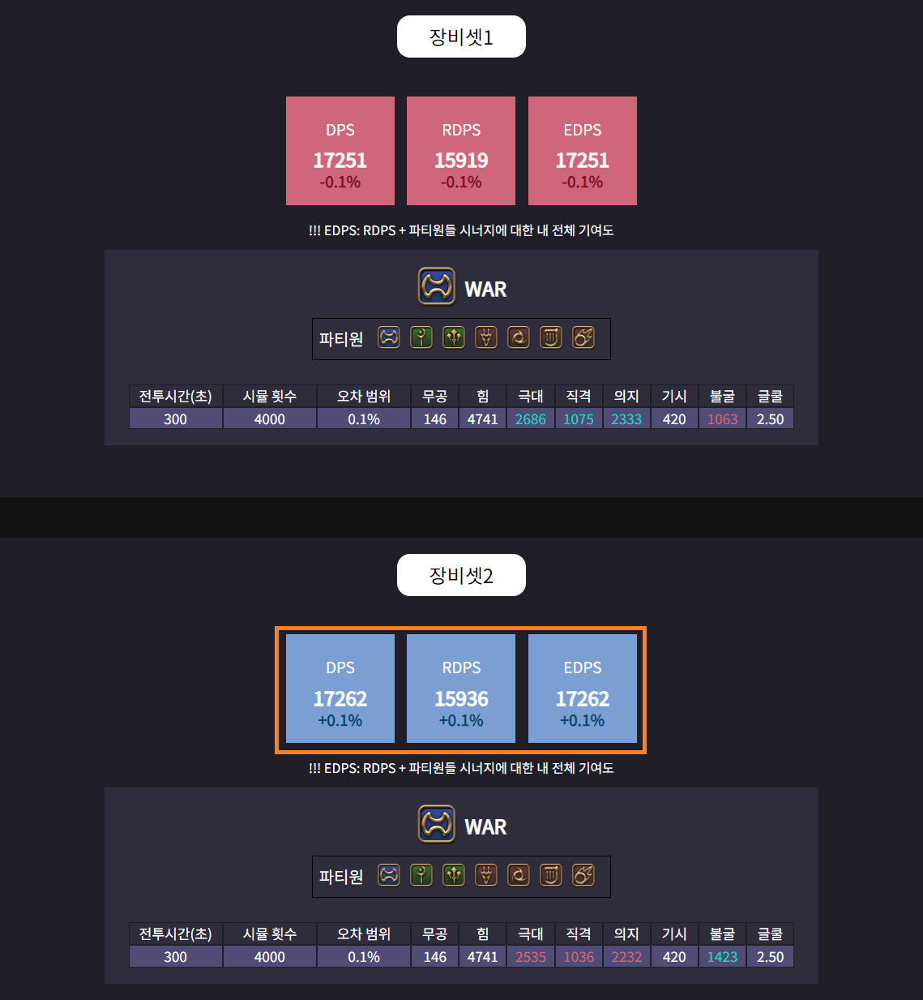

4) 하의를 샀는데 어떤 마테를 박는 게 좋을지 궁금합니다. 마테리아를 뺀 상태로 스탯 가중치 시뮬레이션을 돌려봅니다.

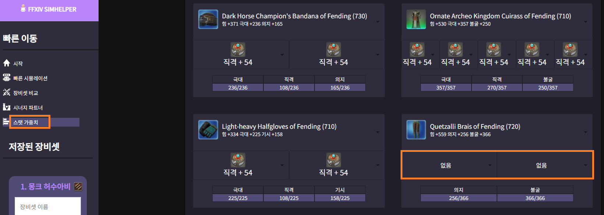

5) 스탯 가중치를 보니 극대가 제일 높습니다. 극대 2개를 넣어주는 게 제일 좋습니다. (극대 = 0.89라는 건 **극대 1포인트당 RDPS가 0.89 정도 증가한다는 것입니다.**)

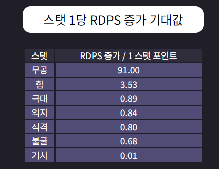

* !!! **스탯 가중치는 어느 정도 골격 세팅을 갖추고 하는 게 좋습니다**. 특히 극대는 스탯이 높을수록 효과가 좋아져서 극대가 실제보다 훨씬 낮은 상태에서 시뮬레이션 할 경우 극대 기대값이 매우 낮게 나옵니다.

# 사용 가이드 4. 갱신을 위한 조합 찾기
시너지 직업들은 생각보다 직업 조합에 많이 영향을 받습니다. FFXIV SimHelper를 통해 어느 정도 차이가 나는지를 볼 수 있습니다.

1) 시너지 파트너를 통해 내 갱신에 각 직업이 어느 정도 도움을 주는지 볼 수 있습니다:

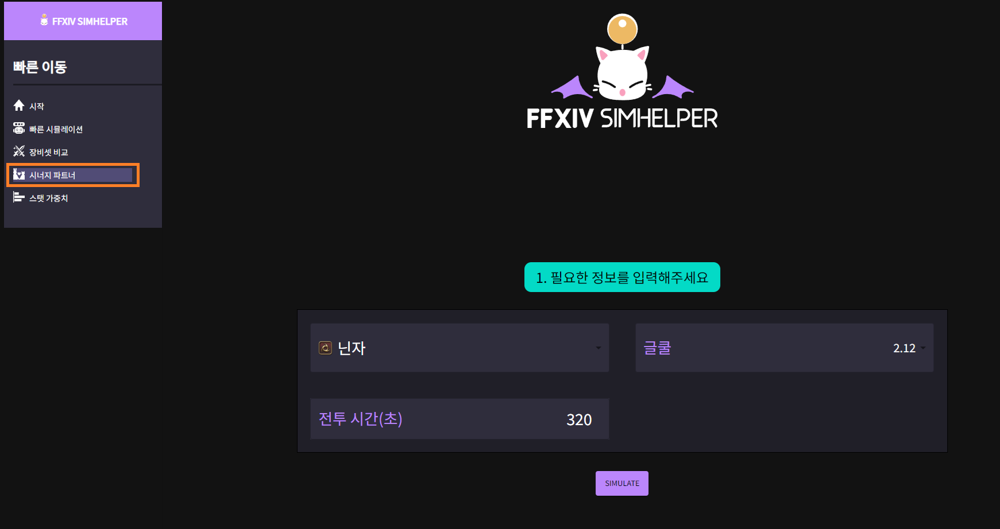

---

2) 이를 빠른 시뮬레이션에서 검증할 수 있습니다. 

* 상위권/하위권 조합으로 시뮬레이션을 해 보면 **닌자의 RDPS가 1.5% 정도 차이가 나는 걸 알 수 있습니다.**

