# 0. Brief Introduction of FFXIV SimHelper 
---

FFXIV SimHelper is an application to find out meta jobs and learn them quickly.

It was first designed for our One & Done raid members to prepare for the upcoming contents.

But we have decided to launch the program so that users can easily adapt to the environment of FFXIV,

By showing visualized combat data that was relayed only on the user's senses 

How?
---

* Individual Job Guide: 

It helps users **to adapt in various jobs.** 

* Compare Various Party Compositions: 

Quickly figures out which jobs is **the best fit** for our team.

* Compare all Gearsets: 

Even at the same item level, **priorities might change depending on gear combinations.**

Out of numerous mixtures, **Simhelper tells which suits best for the user.** 

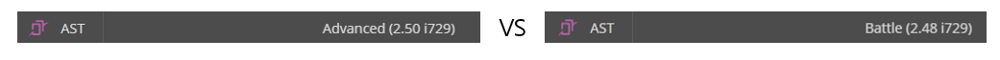

## Notice:

Simhelper mainly focuses on **improving the job proficiency of beginner & intermediate users**
   * Because Simhelper aims to make significant comparisons between similar equipment, **it is difficult to consider every variables of each job.**

   * Unlike other RPGs, cycle changes depending on each raid members, which requires an AI technology.

   * Due to practical issues, AI technology issues are left as a future task.

# 1. User Guide 
---

## Beginner-level: Learn Your Job Quickly using FFXIV SimHelper

As users hit max level, Simhelper provides **the average DPS for their current gearset and gives various data that helps them reach those goals.** 

These features makes it easy to directly compare performances with other players who wear simliar item levels.

## DPS Analysis 
---

1) Click on **Dps Analysis**

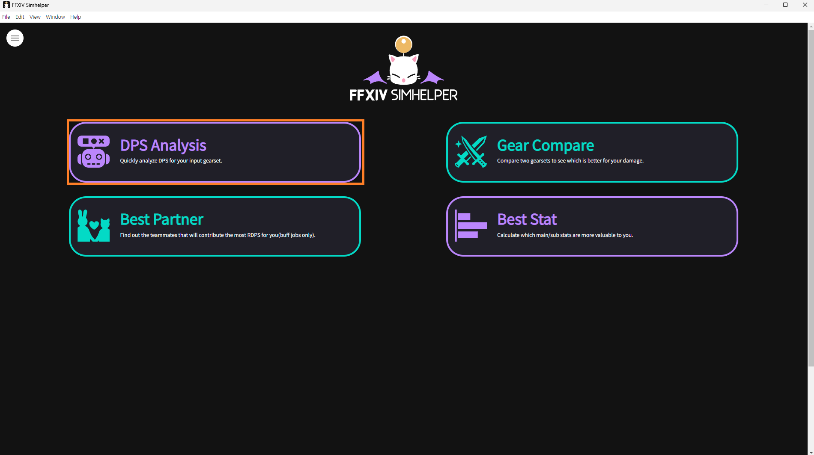

2) Find out the current gearset you are wearing. 

(**!!!** For jobs that have an optimal GCD range such as Monk, make sure you set your GCD is inside that range to be accurate.") 

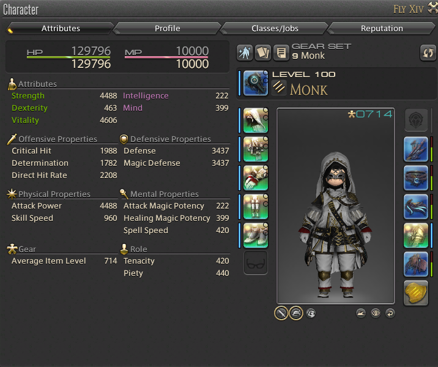

3) Input your gearset and other options into the application **and delete all party members**

**(To remove party composition buffs and raidbuff effects)**

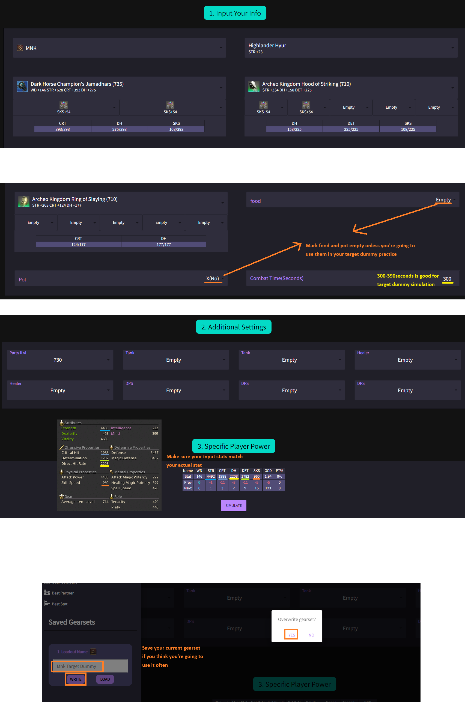

4) Compare the actual in-game DPS(using "ACTS") with the simulation results

**(Difference of 1-2% should not matter a lot, due to crit/dh and procs)**

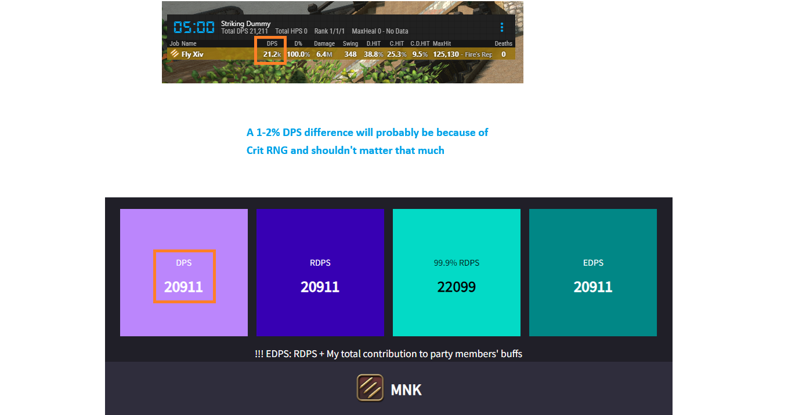

5) If your DPS isn't close to the simulation result, compare the damage log of the ACT. 

**(Ping and frame rates affect your GCD in the actual game, so check if simhelper is missing an important skill cast such as Phantom Rush, missing combo skills, etc)**

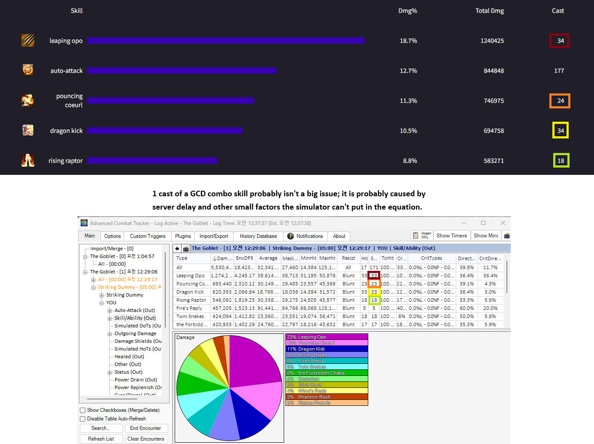

6) If you have any confusion about the job rotation, you can refer to the **"Rotation Sample"**.

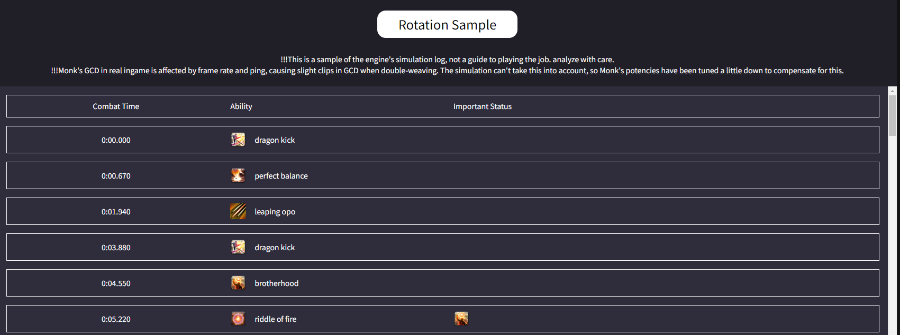

# User Guide 2. Intermediate-level: Analyze Raid Prog/Clears
---
* In the early weeks of Savage, there's a huge difference in gear progression between players, making it hard to directly compare with other players. 
  
  But Simhelper can help users by showing the expected DPS of their current gear sets.

* Ex) A 10-minute M2S Clear Log 

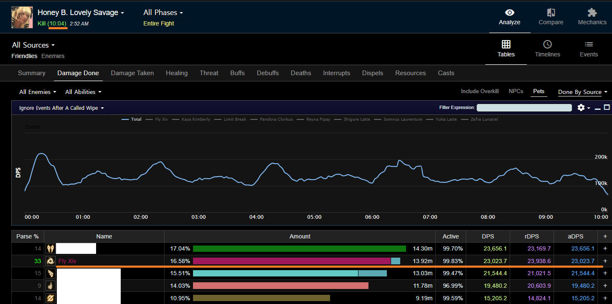

## Analyze My Fflog Encounter with SimHelper 

1) Click on **"DPS Analysis"**

2) Input your gearset, your party composition, and the estimated party ilvl.

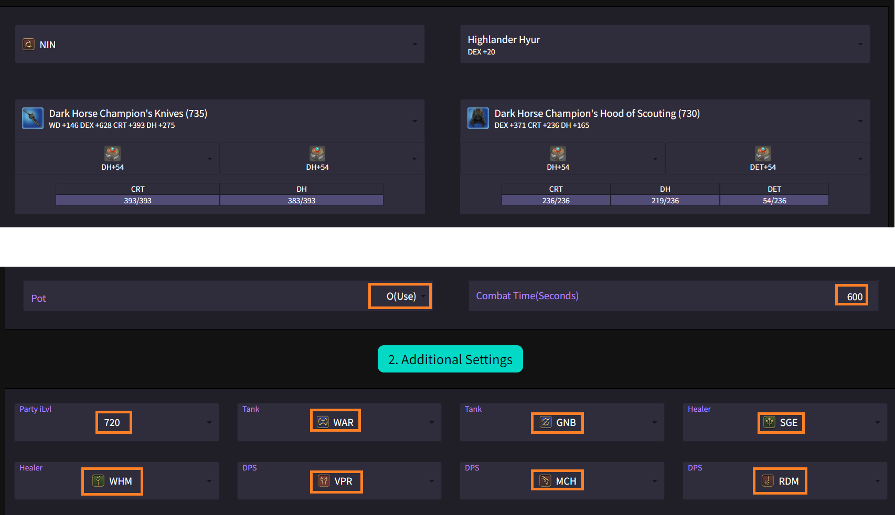

3) Compare SimHelper's DPS analysis with your log's DPS 

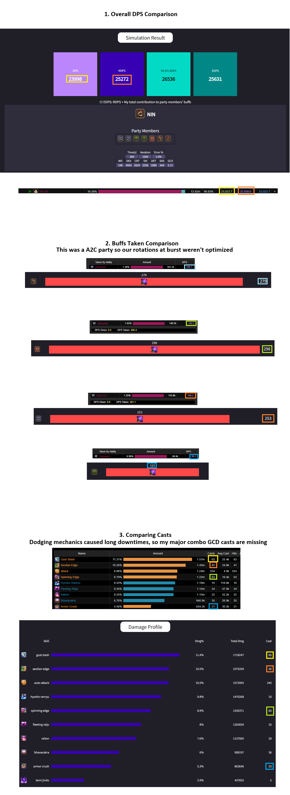

* !!! Since the simulation operates a standardized cycle, it is difficult to optimize burst skills according to the duration of the combat.

# User Guide 3. Optimize Your Current Gearset 
---

As mentioned above, in the early weeks of savage there is a huge difference in gear progression between players. 

Even in such situations, SimHelper can help find the best setting **for your current gear status.**

## Example for Optimizing Gearset
---
Let's say that a player collected 900 tomes in the second week of Savage - What should he buy with the tome? **Chest or legs?**

1) Go to **"Gear Compare"**

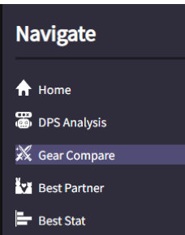

2) Input the gearset with the tome chest, and the other with the legs then simulate in any party combination.

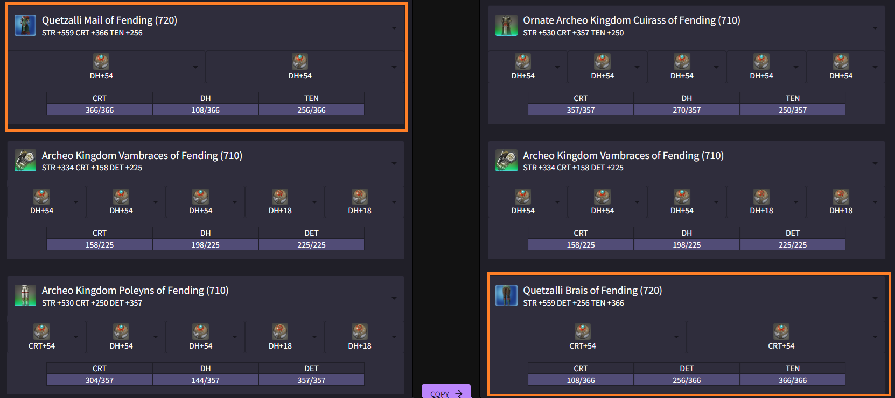

3) Check the results.

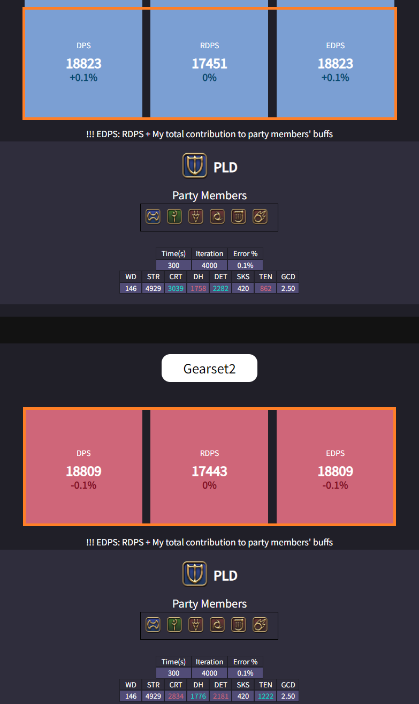

We can see that **changing the legs are better** since the chest was an ornate one with 5 54-materia slots

4) To find the best fit for the materia, go to **"Stat Weights"** and simulate your gearset without selecting any materias for the legs.

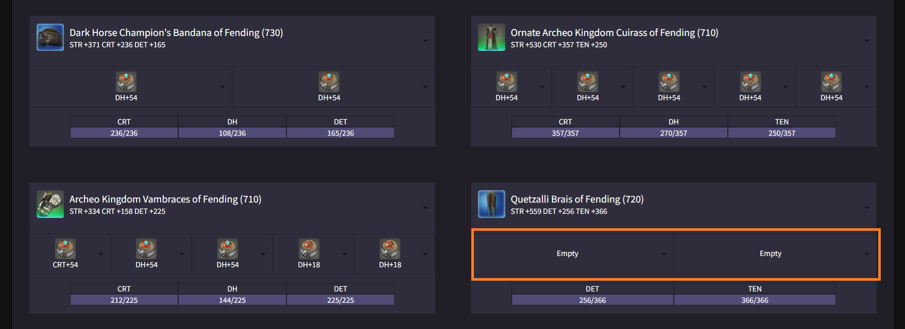

5) Stat Weights result says critical strike is the best option. Select both slot with Critical Strike. 

  (1.89 value of critical strike means **your RDPS is expected to increase by 1.89 for every Critical Strike stat point you obtain.**)

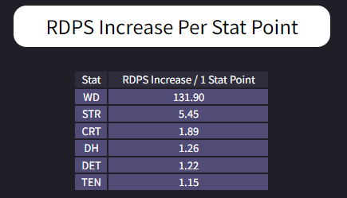

* !!! **It is recommended to have only few slots empty when running Stat Weights, since substat's efficiency changes depending on the amount of stat you have already.**

# User Guide 4. Find the Best Composition for Parsing
---

We all know buff jobs like DNC and Ninja's performance rely heavily on party composition. 

FFXIV SimHelper can help you visualize the exact difference of it. 

1) Click **"Best Partner"** to find jobs that contribute the most to your buffs. 

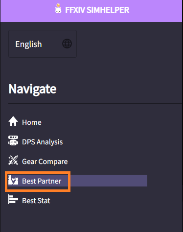

---

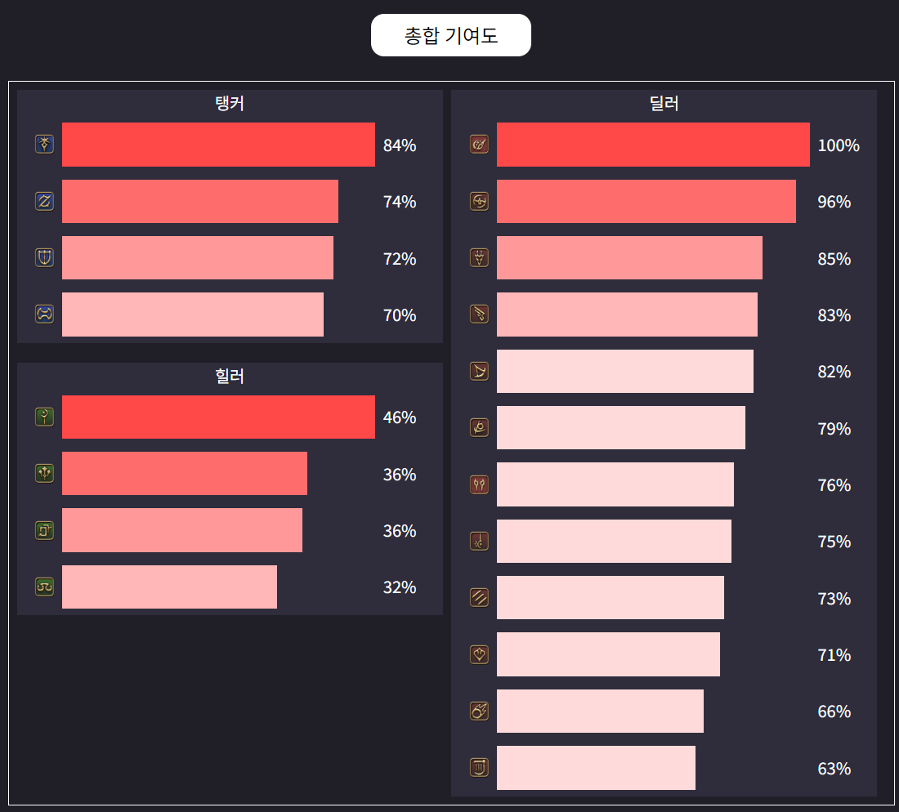

2) You can verify the exact difference between different parties by using Quick Sim. 

* When we simulate the two Highest/Lowest scoring parties, we can see that the **Ninja's RDPS is 1.5% higher compared to the lower one.**

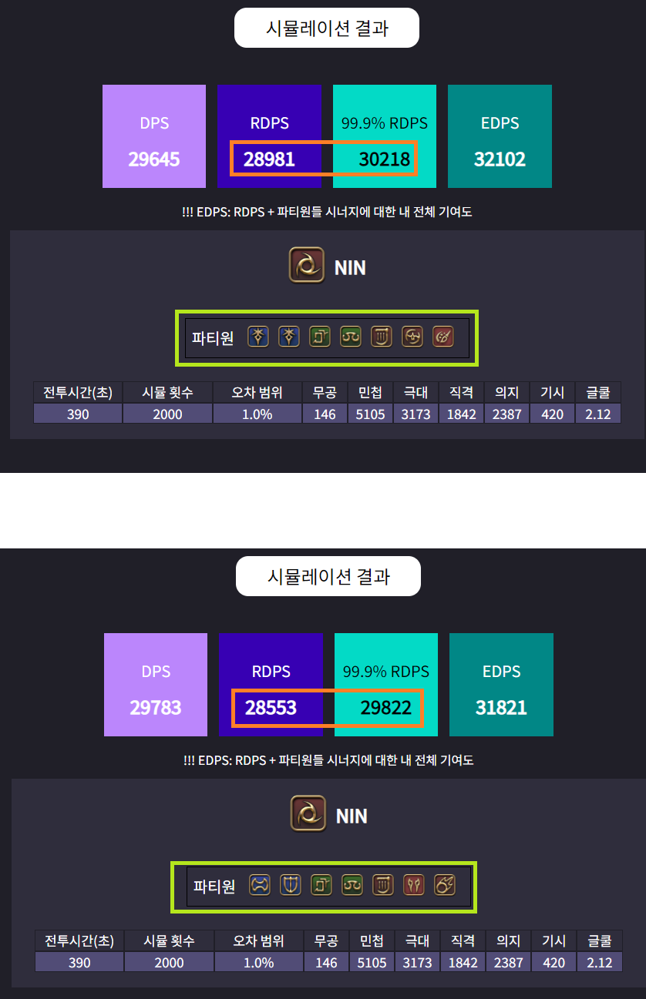

# User Guide 5. Other Uses - Solve Curiosities Using SimHelper 
---

There's many more uses for FFXIV SimHelper other than the general use cases mentioned above.

## How Much DPS Increase do Pots Give You?
---

* By running one trial without using pot, 

**We can see that using pots gives about 1.7%-2% damage increase for Ninja.**

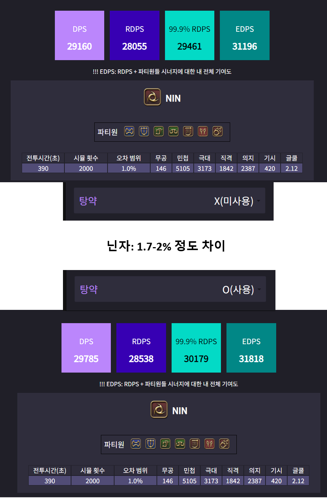

## How Much DPS Increase does Food Give You? 

* Simulate without the "food" input. 

**We can see that food gives about 1% damage increase for a Ninja.** 

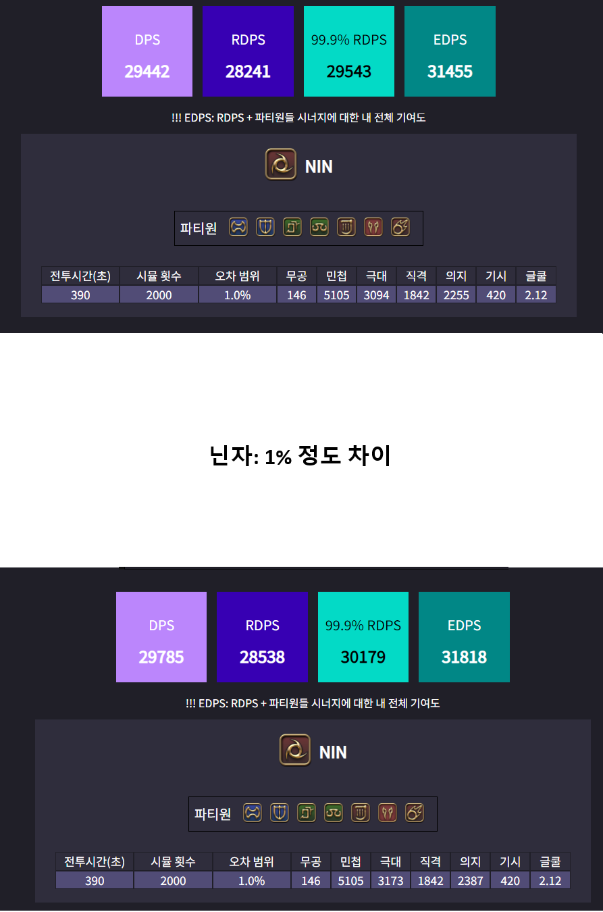

From only two simulations, we can conclude that pots give more DPS increase than food

Please feel free to use the Simhelper in whatever way you might be curious about!