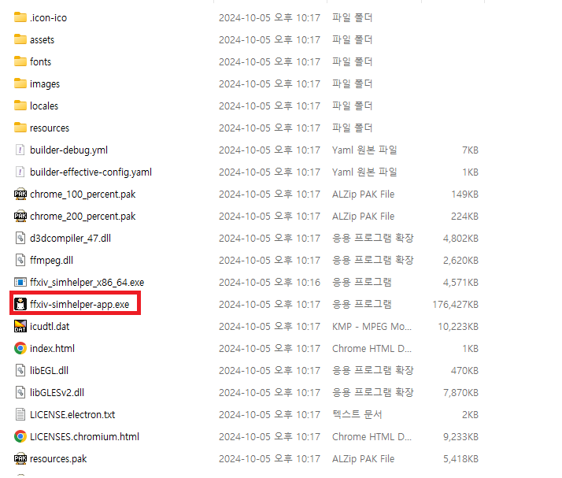
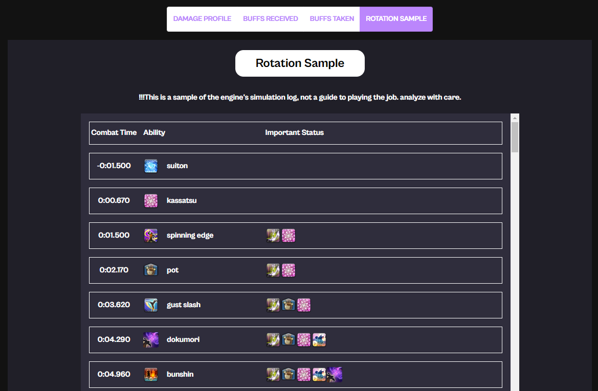
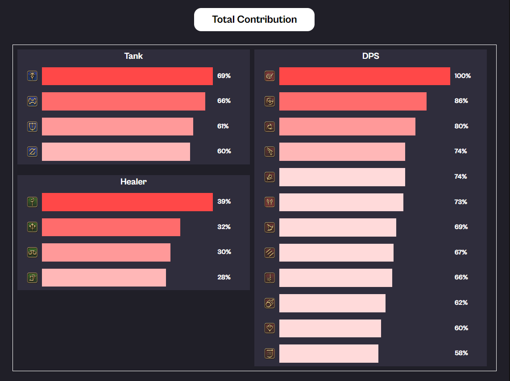
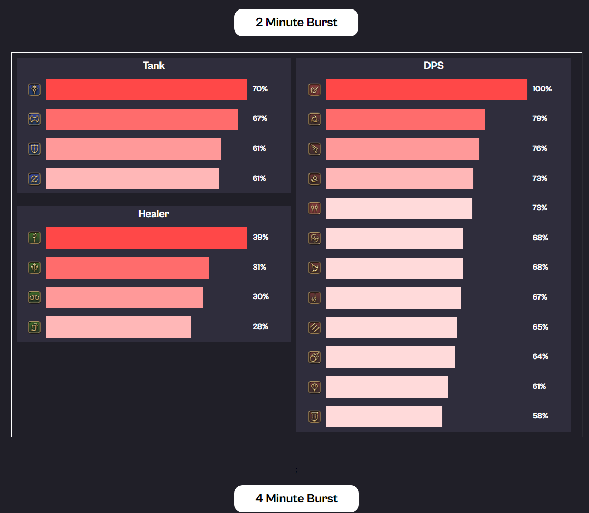

# FFXIV SimHelper 
FFXIV SimHelper 공식 문서

## Download
링크가서 다운로드받은 뒤 압축을 푼 다음 **"ffxiv-simhelper-app.exe"를 실행합니다.**

* [FFXIV Simhelper 7.0 패치](Window 64bit)(http://naver.me/I55fOPhb)

# FFXIV 전투를 위한 다용도 DPS 시뮬레이션 툴

분석하고 싶은 장비셋 및 파티 설정을 입력하시면 컴퓨터가 수 천번 시뮬레이션을 통해 다방면으로 DPS를 분석해줍니다.

---

### 1. 입력한 장비셋에 대한 자세한 DPS 분석

---

---

---

---

### 2. 두 장비셋간의 DPS 비교

---

## 3. 내 시너지 점수를 극대화해주는 조합 추천 

---

---

## 4. 현재 상태에서 가장 기대값 높은 부스탯 찾기

## 추가 가이드 문서들 
* [기본 사용 가이드(FFXIV 관련 툴을 처음 써보시는 분들을 위해)](../../download/FFXIV_SIMHELPER_사용설명서.pptx)
* [유저 가이드](./userguidekr.html)
* [자주 묻는 질문]()
* [FFXIV Simhelper 세부 설명](./indepthkr.html)

## 버그/수정 제안 연락처
* [공식 github issue 주소](https://github.com/flyxiv/ffxiv_simhelper_issues/issues)
* 여기에 이슈를 작성해주시거나 다음 항목에 있는 이메일/디스코드로 메시지 주셔도 됩니다.

## Creators
Fly Xiv/Fly Ninetynine@Aegis (email: ns090200@gmail.com, discord: Fly'xiv#5525) - Main Development

Essnah (essnah@naver.com) - Product QA, Marketing 

Kkoo Eat@Aegis - Design and Logo

