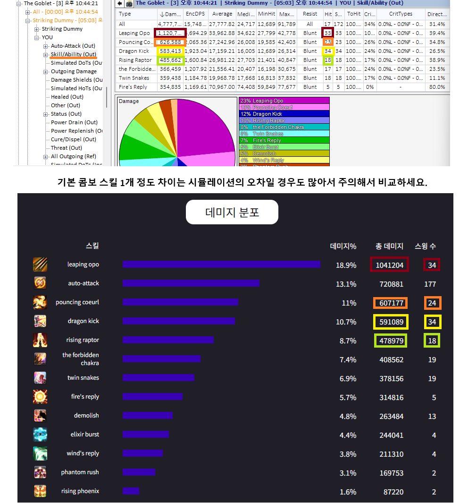
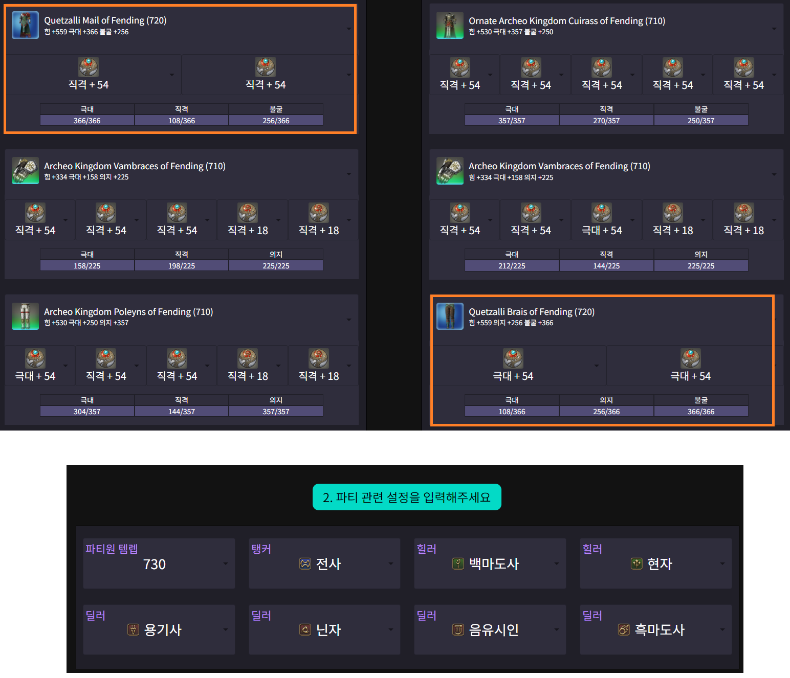

# 0. FFXIV SimHelper 툴의 니즈, 활용 목적

FFXIV SimHelper는 원래 저희 공대 (One & Done)내에서 직업 분석을 위해 사용하기 위해 만들려 했던 툴을 공개화하기로 결정하여 그에 맡게 UI를 개선한 툴입니다.

따라서 이 툴은 매 시즌 최적 조합을 연구하고, 빠르게 정한 직업을 학습해야하는 저희 공대의 니즈에 맞게 아래 같은 시나리오에 최적화되어있습니다:

* 직업 입문 가이드: **처음 접하는 직업을, 빠르게 준수한 수준으로 올리기 위해 도와줍니다.** 

* 같은 역할군 내 여러 직업 비교/분석: **어떤 직업이 현재 고정된 조합에 적합한지를 알아내기 위해 빠르게 조합을 변경/실험해볼 수 있습니다.**

* 영식 초기(1-4) 주차/풀파밍 후 매우 비슷한 장비셋 사이 비교: 파판은 장비에 스탯만 있고 특수효과를 아예 배제하기 때문에 같은 아이템레벨 장비셋들 중에는 **정말 0.1-0.2% 사이에서 애매하게 갈리는 장비셋들이 있습니다.** FFXIV SimHelper는 그러한 장비셋들 중 어떤 장비셋을 선택할지에 대한 가이드를 제공합니다.

이러한 니즈들은 저희 공대뿐만 아니라 일반 유저들의 파판 전투에 대한 궁금증과 교집합이 많을 것이라 생각합니다. 다만 이로 인해 주의해야 하실 부분이 있습니다:

**현재 툴은 이미 직업에 "충분히 익숙한" 유저를 "완벽하게" 만드는 게 목적이 아닌, "초급/중급" 수준 유저의 직업 숙련도를 빠르게 개선시키는 것에 더 포커스가 맞춰져 있습니다.** 
   * 여러 RPG의 엔드게임을 접한 유저로써, 엔드게임 파판14의 사이클 설계는 개인이 아닌 공대원 8명이 유기적으로 조정해야 하는 것이기 때문에 WOW 같은 다른 유사한 RPG와는 비교가 안 될 정도로 복잡합니다. 
   * 이러한 파판의 사이클을 완벽하게 다루기 위해선 강화학습 같은 고도화된 AI 기술이 들어가야 하고, 그러기 위해선 너무 큰 인력/준비가 되어야 해서 추후 과제로 남겨두었습니다.
   * 현재 사이클들은 "비슷한 장비끼리도 유의미한 비교를 할 수 있을 정도의 충분한" 사이클을 목표로 하고 있어서, **스윙 수, 버스트에 들어가는 주요 스킬 등의 핵심 포인트는 신경쓰지만 각 직업의 미세한 위력 이득까지 고려하기는 어렵습니다.**

그렇다고 상위 유저가 활용할 부분이 없는 건 아닙니다. 애초에 상위권을 목표로 하는 저희 공대를 위해 만든 툴이고, 감으로만 생각하고 계산하기 어려워 궁금하셨던 파판14 전투의 여러 부분을 수치화된 계산으로 보여줘 여러 인사이트를 줍니다.

# 사용 가이드 1. 초급 유저: FFXIV SimHelper를 이용해 빠르게 직업 익히기

처음 파판을 시작하시거나 새로운 직업을 드디어 만렙을 찍어 배우기 시작하실 땐 **잘 알려진 시작 세팅이나 비스 장비셋보다 훨씬 뒤떨어진 초기 장비셋으로 딜 사이클을 익히기 시작합니다.**

그렇게 되면 그 직업을 사용한 다른 유저들의 로그들은 자신과의 템렙 차이 때문에 100% 활용하기가 어렵게 됩니다. 허수아비 토벌전을 할 순 있지만 그 마저도 **"딜이 되느냐 안 되느냐"의 결과만 보여줄 뿐, 개선하기 위한 과정을 설명해주진 않습니다.**

**이럴 때 FFXIV SimHelper에 내 장비를 입력해 현재 내 장비에 맞는 1인분 DPS를 알아보고, 그 DPS를 하기 위한 여러 세분화된 데이터를 활용하실 수 있습니다.**

## 허수아비 시뮬레이션(ACT 필요)

1. 앱의 "빠른 시뮬레이션"을 시작합니다.

2. 장비창을 열어 현재 내 장비셋을 확인합니다. (!!! 연습하실거면 다른 스탯은 상관없지만 몽크처럼 적정 글쿨 속도가 있는 직업은 그걸 맞추고 하시는 게 좋습니다).

3. 내가 입고 있는 장비/마테리아 및 추가 설정을 앱에 입력해준 뒤, **파티원을 모두 없애줍니다(파티 주스탯 보너스 및 시너지 효과 없애기 위해)**

4. ACT로 설정한 시간만큼 허수아비를 친 걸 기록한 뒤 시뮬레이션 결과랑 비교해봅니다. **파판 딜사이클은 편차가 좀 있어서 1-2% 정도 차이는 크게 신경 안쓰셔도 됩니다.**

5. 원하는 만큼 DPS가 나오지 않으면 ACT의 데미지 로그를 비교하여 크게 잘못된 부분이 있나 확인합니다. 실제 게임에서는 핑차이 및 프레임 차이로 인해 글쿨이 조금씩 밀리게 되어서 콤보 스킬 시전 수가 시뮬레이션과 조금 차이나는 건 문제가 아닐 수 있습니다.

6. 사이클에 대해 헷갈리는 부분이 있으면 딜사이클 샘플을 참고하셔도 좋습니다:

# 사용 가이드 2. 중급 유저: 레이드 트라이/클리어 후 비교
* 트라이나 초기 주차에는 모두 아이템 상태가 달라 다른 플레이어와 1:1로 비교하기가 힘듭니다. 그럴 때 SimHelper를 사용해 내 대략적인 퍼포먼스를 점검할 수 있습니다.

* ex) 10분짜리 2층 로그

## 내 FFLogs 로그 점검

1. 앱의 "빠른 시뮬레이션"을 시작합니다.

2. 허수아비 시뮬레이션처럼 내 장비 옵션들을 앱에 입력하고, 로그의 파티원 조합과 대략적인 아이템레벨을 입력하고 시뮬레이션을 진행합니다.

3. 시뮬레이션 DPS와 내 로그의 DPS를 비교해봅니다.

* !!! 시뮬레이션 사이클은 가장 정석적인 사이클로 운영하기 때문에 **클타임에 따른 세밀한 최적화까지는 신경는 수는 없습니다**. 위 로그에서 뇌둔이 22개인 것은 10분 버스트가 안 올걸 알고 미리 9:20/9:40 뇌둔을 미리 써서 그런 것이고, 시뮬레이션은 일반적인 사이클처럼 버스트에 쓰기 위해 풀링하기 때문에 차이가 나는 것입니다.

# 사용 가이드 3. 장비 세팅 최적화

파밍이 완료된 시점에는 모두 비슷한 장비를 하고 있지만, **영식 초기 주차처럼 파밍을 해나가는 단계에서는 모든 캐릭터가 운에 따라 서로 다른 수준의 장비를 마련하게 됩니다.**
이럴 때 "일반적인 상황이 아닌 현재 내 상황"에서 최선의 세팅을 구하기 위해 SimHelper를 사용합니다.

## 시나리오
영식 2주차라 **석판 900개가 모였는데, 상의 석판을 먼저 살 지 하의 석판을 먼저 살 지 고민입니다.**

1. "장비셋 비교"로 갑니다.

2. 상의를 샀을 때의 세팅과 하의를 샀을 때의 세팅 + 파티원 조합을 입력하여 시뮬레이션 합니다.

3. 결과를 확인합니다. **상의가 확정 5홈이라 하의를 바꾸는 게 더 좋은 선택인 것을 알 수 있습니다.**

4. 하의를 샀는데 어떤 마테를 박는 게 좋을지 궁금합니다. 마테리아를 뺀 상태로 스탯 가중치 시뮬레이션을 돌려봅니다.

5. 스탯 가중치를 보니 극대가 제일 높습니다. 극대 2개를 넣어주는 게 제일 좋습니다. (극대 = 0.89라는 건 **극대 1포인트당 RDPS가 0.89 정도 증가한다는 것입니다.**)

* !!! **스탯 가중치는 어느 정도 골격 세팅을 갖추고 하는 게 좋습니다**. 특히 극대는 스탯이 높을수록 효과가 좋아져서 극대가 실제보다 훨씬 낮은 상태에서 시뮬레이션 할 경우 극대 기대값이 매우 낮게 나옵니다.

# 사용 가이드 4. 갱신을 위한 조합 찾기
시너지 직업들은 생각보다 직업 조합에 많이 영향을 받습니다. FFXIV SimHelper를 통해 어느 정도 차이가 나는지를 볼 수 있습니다.

1. 시너지 파트너를 통해 내 갱신에 각 직업이 어느 정도 도움을 주는지 볼 수 있습니다:

---

2. 이를 빠른 시뮬레이션에서 검증할 수 있습니다. 

* 상위권/하위권 조합으로 시뮬레이션을 해 보면 **닌자의 RDPS가 1.5% 정도 차이가 나는 걸 알 수 있습니다.**

