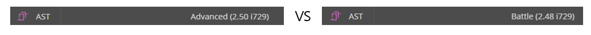
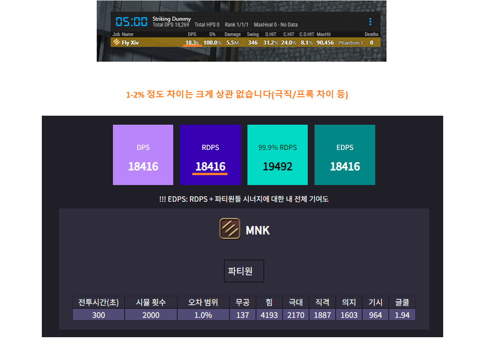
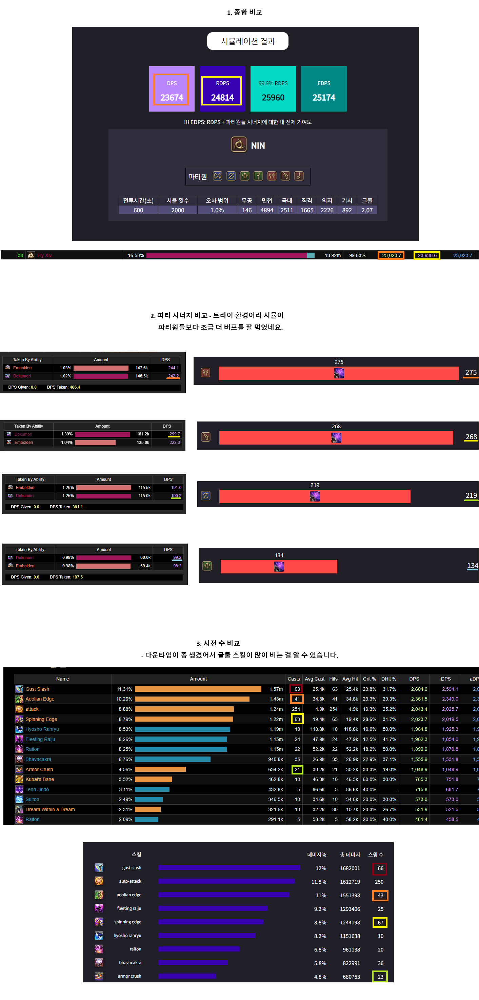
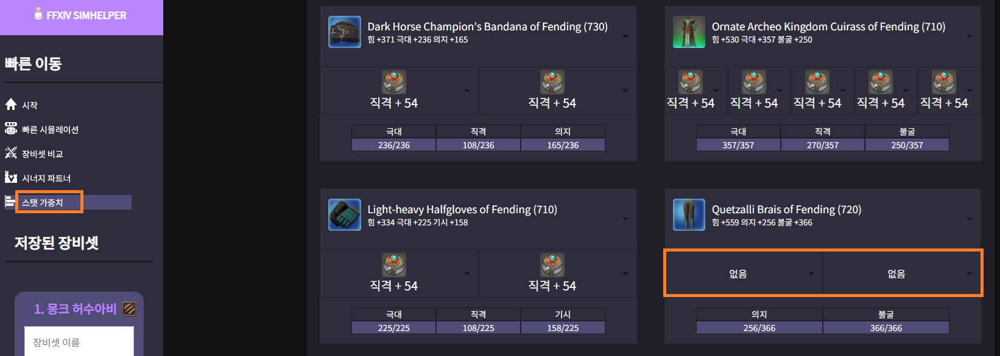
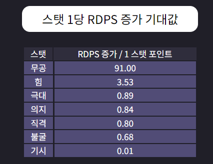
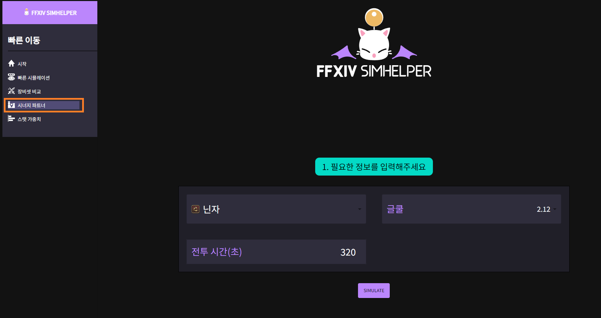

# 0. FFXIV SimHelper의 목적
---

**FFXIV SimHelper**(이하 Simhelper)는 

One & Done 공대에서 직업 분석을 위해 만든 시뮬레이션 앱입니다.

감각에만 의지했던 파판14의 전투를 수치화된 데이터로 보여줌으로써

많은 유저들이 더 쉽고 재밌게 파판을 즐길 수 있도록 공개하게 되었습니다.

## HOW?
---

1. 직업 입문 가이드: 

**처음 접하는 직업**을 쉽고 빠르게 알려줍니다.

2. 같은 역할군 내 여러 직업 비교/분석: 

공대 내 빈 자리에 **가장 적합한 직업군**을 알아내기 쉽습니다.

3. 파판 내 모든 장비를 비교/분석: 

같은 아이템 레벨이라도 **조합에 따라 우선순위가 바뀔 때가 있습니다.** 

SimHelper는 수많은 장비 조합 중 어떤 것이 더 좋은지 알려줍니다.

## 주의점:
---

Simhelper는 **초급/중급 유저**의 직업 숙련도를 빠르게 개선시키는 것에 집중합니다.

   * Simhelper는 비슷한 장비 간의 유의미한 비교를 목표로 하기 때문에 **각 직업의 미세한 위력 이득까지 고려하기는 어렵습니다.**

   * 타 RPG와 달리 공대원 8명에 따라 사이클이 유기적으로 변하기에 오차 없는 값은 AI가 필요할 정도로 복잡합니다. 

   * 현실적인 비용 문제로 인해 강화 학습이 들어간 AI 기술은 추후 과제로 남겨두었습니다.

 

# 사용 가이드 
---
## 초급 유저: FFXIV SimHelper를 이용해 빠르게 직업 익히기
처음 만렙 달성 시 **초기 장비셋**으로 딜 사이클을 수행하기 때문에 FFLog를 활용해도 

**최고 아이템 레벨의 DPS**만 보여줄 뿐, 초기 장비의 **결과값도 과정**도 설명해주지 않습니다.

하지만 Simhelper는 **현재 장비에 맞는 DPS와 사이클을 제공**하기에 **유저의 목표와 개선 방향**을 알려줍니다.

## 허수아비 시뮬레이션(ACT 필요)
---

1) 앱의 "**빠른 시뮬레이션**"을 시작합니다.

2) 장비창을 열어 현재 내 장비셋을 확인합니다. 

   (**주의!!**: 몽크와 같이 적정 글쿨 캡이 있는 직업은 해당 스탯을 맞추고 진행하시는 게 정확합니다).

3) 현재 장비/마테리아를 앱에 입력해준 뒤, **파티원을 모두 없애줍니다**

   **(파티 주스탯 보너스 및 시너지 효과 없애기 위함입니다)**

4) 게임 내 실제 DPS와 시뮬레이션 결과를 비교해봅니다. 

   **(1-2% 정도의 차이는 신경 안쓰셔도 됩니다.)**

5) 오차가 크게 발생 시 ACT의 데미지 로그를 확인합니다.

   **(핑과 프레임 차이로 인해 스킬 시전 수가 조금 차이날 수 있습니다)**

6) 사이클에 대해 헷갈리는 부분이 있을 시 샘플을 참고하셔도 좋습니다.

# 사용 가이드 2. 중급 유저: 레이드 트라이/클리어 후 비교
---
* 시즌 초기에는 각자 아이템 상태가 달라 다른 플레이어와 1:1로 비교하기 힘들기에

  SimHelper를 사용해 나의 딜 기대값을 확인할 수 있습니다.

* EX) 10분짜리 2층 로그

## FFLogs 로그 점검
---

1) 앱의 "**빠른 시뮬레이션**"을 시작합니다.

2) 장비를 입력하고 파티의 조합과 아이템 레벨을 입력하고 시뮬레이션을 실행합니다.

3) 시뮬레이션 DPS와 FFLogs에 기재된 DPS를 비교해봅니다.

**주의!!!:** 시뮬레이션은 표준화 된 사이클을 운영하기 때문에 **클리어 타임에 따른 주력기의 최적화까지는 신경쓸 수 없습니다**. 

# 사용 가이드 3. 장비 세팅 최적화
---

파밍이 완료된 시점에는 모두 비슷한 장비를 하고 있지만, **영식 초기 주차처럼 파밍을 해나가는 단계에서는 모든 캐릭터가 운에 따라 서로 다른 수준의 장비를 마련하게 됩니다.**
이럴 때 "일반적인 상황이 아닌 현재 내 상황"에서 최선의 세팅을 구하기 위해 SimHelper를 사용합니다.

## 시나리오
영식 2주차라 **석판 900개가 모였는데, 상의 석판을 먼저 살 지 하의 석판을 먼저 살 지 고민입니다.**

1) "장비셋 비교"로 갑니다.

2) 상의를 샀을 때의 세팅과 하의를 샀을 때의 세팅 + 파티원 조합을 입력하여 시뮬레이션 합니다.

3) 결과를 확인합니다. **상의가 확정 5홈이라 하의를 바꾸는 게 더 좋은 선택인 것을 알 수 있습니다.**

4) 하의를 샀는데 어떤 마테를 박는 게 좋을지 궁금합니다. 마테리아를 뺀 상태로 스탯 가중치 시뮬레이션을 돌려봅니다.

5) 스탯 가중치를 보니 극대가 제일 높습니다. 극대 2개를 넣어주는 게 제일 좋습니다. (극대 = 0.89라는 건 **극대 1포인트당 RDPS가 0.89 정도 증가한다는 것입니다.**)

* !!! **스탯 가중치는 어느 정도 골격 세팅을 갖추고 하는 게 좋습니다**. 특히 극대는 스탯이 높을수록 효과가 좋아져서 극대가 실제보다 훨씬 낮은 상태에서 시뮬레이션 할 경우 극대 기대값이 매우 낮게 나옵니다.

# 사용 가이드 4. 갱신을 위한 조합 찾기
시너지 직업들은 생각보다 직업 조합에 많이 영향을 받습니다. FFXIV SimHelper를 통해 어느 정도 차이가 나는지를 볼 수 있습니다.

1) 시너지 파트너를 통해 내 갱신에 각 직업이 어느 정도 도움을 주는지 볼 수 있습니다:

---

2) 이를 빠른 시뮬레이션에서 검증할 수 있습니다. 

* 상위권/하위권 조합으로 시뮬레이션을 해 보면 **닌자의 RDPS가 1.5% 정도 차이가 나는 걸 알 수 있습니다.**

# 사용 가이드 5. 그 외 다양한 용도들
이러한 일반적인 사용 외에도 평소에 궁금하던 여러 실험을 할 수 있습니다

## 탕약은 DPS에 어느 정도 영향을 줄까?

* "탕약 사용" 여부 옵션을 통해 실험을 해 볼 수 있습니다 - **닌자의 경우 1.7%-2% 정도 차이납니다.**

## 음식은 DPS에 어느 정도 영향을 줄까?

* 음식을 "없음"으로 돌려봤습니다. **닌자의 경우 평균 RDPS가 1% 정도 차이납니다.**. 이로써 음식보다 탕약이 조금 더 RDPS에 큰 영향을 주는 걸 알 수 있습니다.

그 외에도 평소에 궁금하던 것들을 시뮬레이션 해서 알아보세요!

