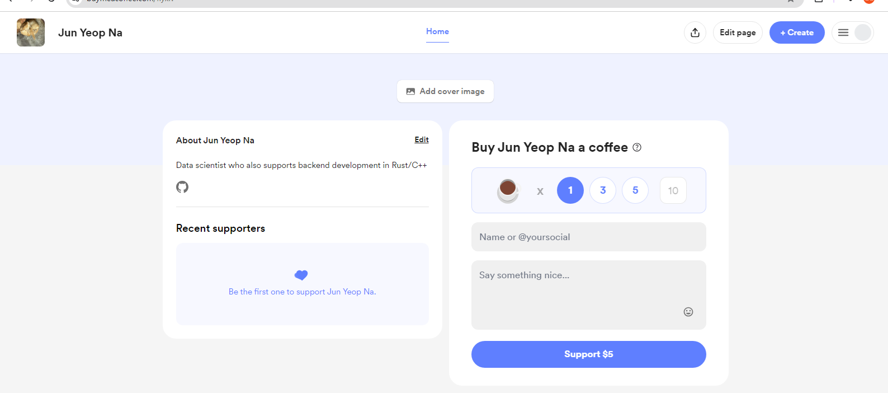
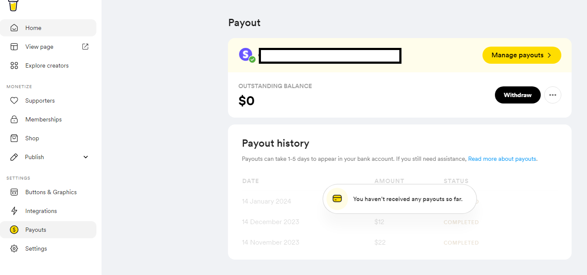
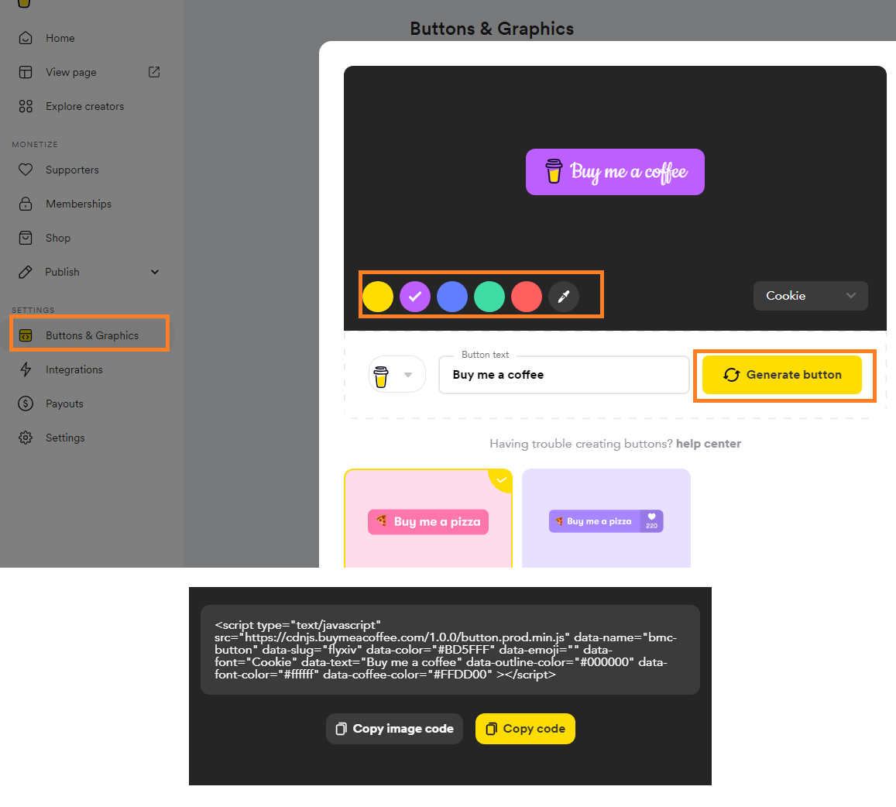
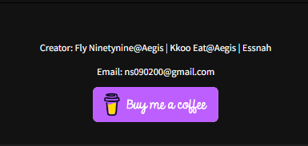

I need to raise money to buy a server. Developers use Buy Me a Coffee Service to do it.


# 1. Create Account in Buy Me a Coffee


* Then connect payout - set the account I want to get donation in



# 2. Add a Buy Me a Coffee Icon To My App

## 2-1. Generate Buy Me a Coffee Icon
* Dashboard -> Buttons & Graphics -> Generate button



## 2-2. Create React Component Using Icon
If the source code is written in Javascript the code can be copied immediately. I created a MUI Component to match my other UIs

```typescript
import { Box, Link } from "@mui/material";

export function BuyMeACoffee() {
    return (
        <Link href="https://buymeacoffee.com/flyxiv">
            <Box component="img" src="https://cdn.buymeacoffee.com/buttons/v2/default-violet.png" alt="Buy me a coffee" height={40} />
        </Link>
    );
}
```

Now we insert this component to the footer.

```typescript
import { Box, Typography } from "@mui/material";
import { AppConfigurations } from "../../Themes";
import { BuyMeACoffee } from "../../components/icon/BuyMeACoffeeIcon";

export function Footer() {
  return (
    <Box
      className="Footer"
      component="footer"
      sx={{
        width: "100%",
        border: "1px solid black",
        textAlign: "center",
        backgroundColor: AppConfigurations.backgroundOne,
      }}
      display="flex"
      justifyContent="center"
      flexDirection={"column"}
      color="white"
      height="20vh"
    >
      <Typography
        variant="caption"
        sx={{ fontSize: AppConfigurations.body2FontSize }}
      >
        <p>
          Creator: Fly Ninetynine@Aegis | Kkoo Eat@Aegis | Essnah{" "}
        </p>
        <p>Email: ns090200@gmail.com</p>
      </Typography>

      {BuyMeACoffee()}
    </Box>
  );
}
```

Now it shows up in our app

