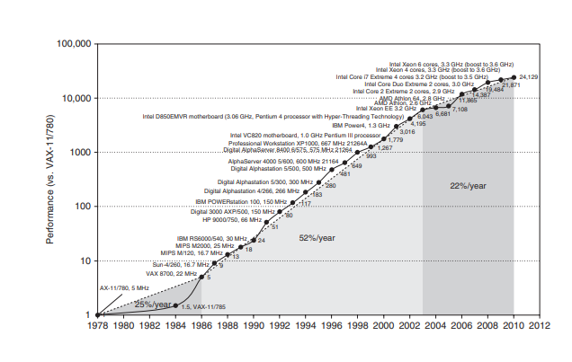

# History of Computer Architecture - 1980-Now
Development of computers are done in two factors: 1) **Improvement in computer building technology** and 2) **Improvement in Computer Design**

## 1. Early years - 25 yrs
* Both (technology + design) contributed well - performance increase of 25%/yr
* Invention of Microprocessors made **CPUs able to carry more transistors in smaller sizes, led to more transistor capacity and better architectures possible** -> 25%/yr to 35%/yr

## 2. RISC
* Virtual elimination of assembly programming: reduced object-code compatibility
* Standardized, vendor-independent OS(Unix, Linux) easier implementation of new architecture.

These two factors led to **development of RISC(Reduced Instruction Set Computer)**
1) Instruction level parallelism - pipelining & multiple instruction issue)
2) caches

RISC was so powerful that the former architectures had to adapt or disappear
**Intel adapted by internally transforming 80x86 instructions to RISC-like instructions** - hardware overload became negligible as transistor counts increase drastically
However, power-critical hardwares like cell phones needed a more efficient architecture - **ARM - a 100% RISC architecture**

## Productivity over performance
* 25000-fold performance improvement since 1978 meant **it was ok to sacrifice some performance for readability in most applications.**
* unmanaged(C++ and C) -> managed(Java, C#) and scripting languages(Python, Ruby)

## 3. End of Renaissance 2003
1) Maximum processor power dissipation of air-cooled chips
2) Reached max instruction-level parallelism to exploit

* **Uniprocessor days were over - time to put multiple processors in a chip**
this led to shift from **instruction level parallelism** to
1) DLP(data-level parallelism)
2) TLP(thread-level parallelism)
3) RLP(request-level parallelism)
which all are **explicitly parallel - it is the application's job to exploit it**

