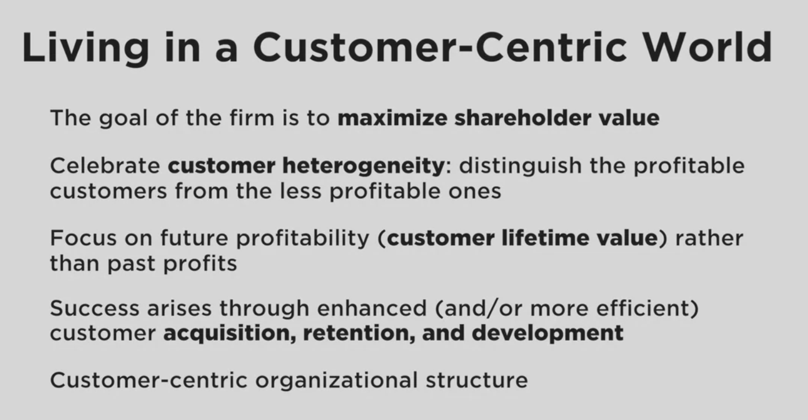
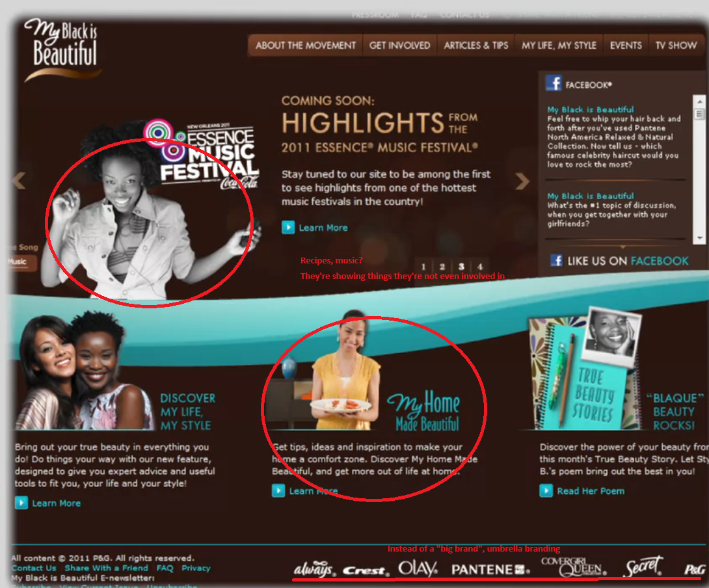

# 2. Customer Centricity

* Product Differentiation/Operational Excellence is easy to imagine
* Good functionality/Price Efficient
* What brands are "Customer Intimate?"

## Traditional Product-Centric Approach
* Most commercial enterprise's goal is **making money, maximizing value of whole corpo.** -> maximize shareholder value

how do companies achieve? the three goals described earlier

* Traditionally, **scaling so that high volumn, low cost is done was the good way.**

Measuring how well you were doing:
1) Costs of making product
2) Market share
3) Volume of product we're shipping

also mandated to have **growth**: they want more than you've delivered before.

what are the sources of major growth?
1) Taking product to new customers - new customer segments, geographies
2) Make new products based on technologies used to make current product.
-> extending product to different directions using current product expertise.

traditional companies: **product-expertise** - we're gonna be good at making our products, ship it to more people, improve our product

Not insightful - most of the ideas are standard to modern managers.

* New ways have different mental process.
## New Concept: Customer Centric

Fish swimming in water: while in water, doesn't realize it is in water until into new environment - I like how it was back in my day, I'm going to go back to water

Could work for some companies, but more companies are jumping out of the water for better results.

## Cracks in the Product-Centric Approach
Product-centric isn't bad at all today, it's just that **there are little cracks showing - little less success rate**

### Factors of Product-Centric Crach
1) Commoditization Back in the day, it was hard to make new products. - **Technology makes life cycle shorter, cost of making new products low**
   * When make something new, **a newer thing must be in process.**

2) **Customers are smarter** - much more informed, savvy, demanded - Internet - much more aware of options
3) Distribution technology improvement - **regional factor disappears.** 
4) Globalization
5) Deregulation(Reregulation) - regulations are gone - more competitors - more competitive
6) **Customers are more demanding** - not only one product/service at a time, bundled full product/services - **end-to-end**
   * IBM: was one of the best product-centric firms
   * 1990 revolution: Trusted solution advisor -> show customers what set of machines to buy
   * Now they're not making money out of hardware -> they are customer solution provider -> recommending which set of hardwares to buy

7) Data - **Customer level tracking**

## Data-Driven Business Models
Harras: Casino chain, Tesco: grocery retail chain in UK

they were both small compared to competitors, not doing well in the product-centric manner.

* They turned to data to draw insight and change business models to rise to the top of their field.

### Harras
* Turned to data and developed amazing loyalty program - truly understand at granular level what each customer is eating, what payment, not only gambling info, when they will get away from table etc.
* What can they do at each event to extract most value
* ex) When they spend about 150$, it's time to give them a meal etc to refresh their mood

### Tesco
* Developed loyalty program, understood in clever ways: which households buy their meals, which products light house family didn't buy -> sent coupon accordingly
* When walmart came to UK, they knew which customers were most vulnerable to Walmart -> send benefit accordingly.

## Three Cheers for Direct Marketing
The first data-driven customer-grained approach happened many many years ago in sector of **direct marketing - 1967 Lester Wonderman**
**Individual customer is the unit of analysis - Know who the customers are and what they buy**

## Customer-Centric Firms
NONE OF THESE FIRMS ARE HIGHLY CUSTOMER-CENTRIC
* they for different reasons are not really highly customer-centric
### 1) Walmart
Terrific firm - knows little about their customers - doesn't have loyalty 
they make great effort to understand **customers as a whole** - when storm comes prepare batteries etc. - that's not a bad thing
Walmart isn't targeting to be customer-centric - they're trying to bring great value to great customer volumn.
They're few firms in the great that are so good at product centricity - no problem in sticking to that

2) Apple
They were classic performance-superiority firm - don't need to do market research to figure out what customers wants.
Don't need segmentation to give need to each individual user.
* their strategy: **Leveraging product-expertise - classsic example of product-centricity**

It's not that They're not doing customer research: they're doing small things at margin to understand their customers better
   * ex) Walmart Scan & Go: app that lets people scan walmart products - **makes scanning process much faster + used as user data**
   * ex) Itunes music preference, Apple regional store activities

They're making infrastructure for customer-centric, so that when they're not product-centric in the future they can switch to that.

3) Starbucks
Coffee shops are usualy very customer centric - bartender do casual conversation, understand what each user wants. - advice user
to try new coffee based on their knowledge of the customer

however, **while they are customer-centric locally, they are not customer-centric nationally**

bring starbucks card to another region starbucks, they don't have any idea about you.

**it's not enough to be customer-centric some time - you need to always provide customer-centricity**

Starbucks recognizes this - developing new ideas to record user data.

4) Nordstrom
They're high end department store - sell clothing, shoes, etc.. but not tires

One day someone came to refund tires - no way they bought it here
But they still gave the money back since they're so custom centric?

Give money back for product they couldn't have made? - **No that's a bad idea to do that almost always**

When would this make sense?
   * **if that customer is incredibly valuable to you** - they're whales.
   * all depends on the lifetime value of the customer
   * Nordstrom doesn't know that, yet they're being nice.

Nordstrom **treat everybody so equally well, that they fail to focus on figuring out the future value of each customer.**

## What is Customer Centricity?
Very **radically different from product-centric**: you're gonna be fired if you do this is product-centric

1) **Select Set of Customers:** you're not doing that product-centric: not cost-effective
2) Maximize long-term financial values - traditional: short-term oriented(gotta hit quarterly numbers)
   * ex) IBM: they actually recommended products from other company, because their trust is better for long run.
3) **Aligning research/development around customer**: 
   * product-centric: just come up with the next big thing.
   * these customers are going to need this and that, come up with something for them.
   * Not quite as radical as it sounds, but it's the mindset - customers center

### Forward looking than backward looking 
Best employee based on sold "last quarter or year"?
   * employee focus on current sales that was going to happen anyway

Instead, calculate lifetime value of each and every customer - **compute how much we elevated their lifetime value**
   * even if we didn't make the sale, we got closer to making the sale - lengthened and deepened relationship.
   * encourage to **build relationships rather than build sales.**

Incentivising to long-term relationship instead of sales made good changes
   * employees where happier
   * customers used more from company

Ex) Wharton Students: When they were working, they were using airplanes. For 2years, they're not going to use airline,
but after 2years they will

if airports are really smart: When they are accepted **we will give you 5 year Presidents Gold meda Chairman's Red Carpet Club** - b/c their "future value" has gone up - they will be using more airlines in the future.

## Living in Customer-Centric Enterprise

What is the overarching objective for the commercial enterprise? 
   * **it is still maximizing shareholder value in the short run and the long run**
   * Maximizing profit is the goal for all companies - money-making isn't only a product-centric thing, it's all company thing

We're trying to achieve the same goal in different manner

* Celebrate customer heterogeneity: **some customers are more valuable than others.** - in product-centric it's a cost - they have to change their process for different customers.

Customer-centric: This difference exist, and **it's a good thing.**

**The customer's values are "future values" not "past values"** - they somewhat correlate but are not 100% equal.
Most of the value we're trying to extract is for the future.

1) Customer acquisition
2) Customer retention
3) Customer development

Well, companies were doing that forever... these are treated low-level in marketing organization - they're **block-buster level oriented - "the message"**

**To make really customer-centric organization, these 3 functions should be elevated - should be treated as important as branding**
Which "kinds" of customers should we be acquiring? How much should we be spending to acquire them? How can we make a customer better value than before

### Ex) Proctor and Gamble
Currently blockbuster, but trying out new things to go customer-centric

1) My Black is Beautiful: Targeted for African American Woman.
   * Lists of P&G brands being advertised together - umbrella branding
   * Music, recipes - things they're not even involved in, but thinks their customer is interested in

**Process of moving to Solution Advisor position.**
**This is how customer-centricity should be done**
   * Find out which customer group is valuable and you want to focus on
   * Bring "whatever resource and products in the P&G family that will make the customer group as valuable as possible".

**product expertise -> relationship expertise**
   * easier to stay ahead than product-centric
   * understand customers more generically
   * When you collect data and build relationship with customers, **it is way easier to maintain.**

Divergent -> Convergent thinking.

Doesn't mean to **ONLY focus on the most valuable ones - what if we're wrong? - Eggs in one basket**
   * stable mix of less valuable but predictable + more valuable
   * High risk stocks for growths + Low risk ones for stable balance.

It's not realistic to be Pure 100% customer-centric
If you have millions of customers, it's about finding right balance between **customer-centric for most valued groups, but product-centric for less valued ones.**

