# Basic of Marketing - Building Strong Brands
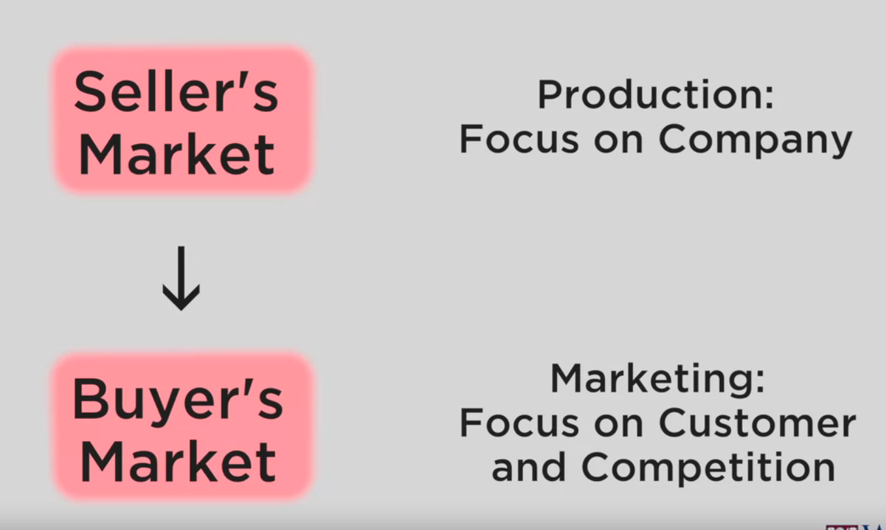

* Seller's Market: **Product Focused Market - Develop that product as best as possible.**
   * business focus: sell as much as you can - **profit = volume(market share)**
   * key consideration: **How to get growth? - new products based on experience? new markets?** 
   * inside-out

* Customer's Market: **How to make customers buy to me rather than competitors** - look at what "the customer wants"
   * outside-in
   * **Which Customer? - We can't satisfy everyone - PICK AND CHOOSE.** - Pick the target customer group and deliver exactly what that group wants.
   * **profit = value creation** - Not one transaction, we need to create value time after time after time - customer loyalty, constantly delivering value over time


## Market vs Customer Share
* Market share: try to get a little bit from everybody
* Customer share: A more narrow market - try to get more from each of those target customer's markets - loyalty

### Loyalty is profitable
* It is a cumulative result of delivering a group of user's needs consecutively
* First time figuring out needs and delivering is hard, but after that the iterations get easier.
* **Easier to retain customers than to add new ones**
* Not only sell one product, **cross sell around the already going-well product. - **Increasing customer share.**
```
ex) GAP or Jeans Shop: Also sell belt
```

## Globalization Changes the Market Place
* Not a 1-1 conversation(customer-producer) anymore - internet, social media, ... - customers can talk to customers
* Good and bad - they propagate good and the bad.
* Not only value, but **top-notch customer experience.**

### Customer Experience
* starts before the transaction, ends after the transaction
* ex) finding location, parking, buy, and then leaving - the entire process
* Marketer has to be **transparent, authentic, and think of all the customer experience.**

## Changes after the Recession
* People stopped trusting market
* Build trust based on authentic, trust, discipline genuine customer value. 
* Not only deliver customer value over time/experiential way,  -> **Cut costs and deliver value in discipline manner , flexible to change**


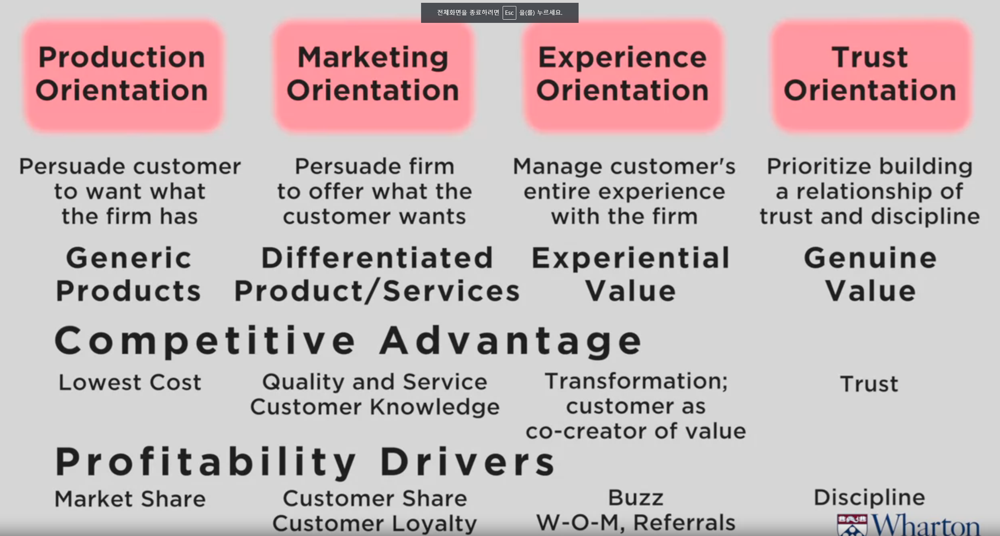


## 3 Principles of Marketing
1) Principle of Customer Value - Provide real, genuine customer value
2) Principle of Differentiation - Provide what the customer wants, but **better than your competition**
3) Principle of Segmentation, Targeting, and Positioning - **Select specific group you want to satisfy**

## 4 P's of Marketing
1) Product - Seller puts in exchange
2) Place - Method of distribution.
3) Promotion - Way Seller communicates the benefits of product
4) Price - Buyer puts in exchange

* Also can be used in non-market ex) American Red Cross
1) Product: Little sticker 
2) Place: Blood mobile
3) Promotion: Missing class
4) Price: Blood


# Strategic Marketing
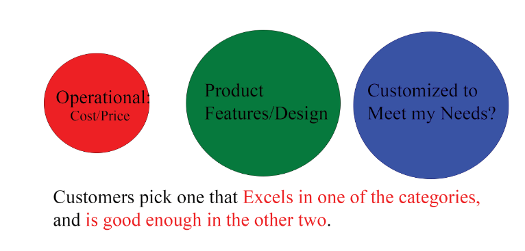
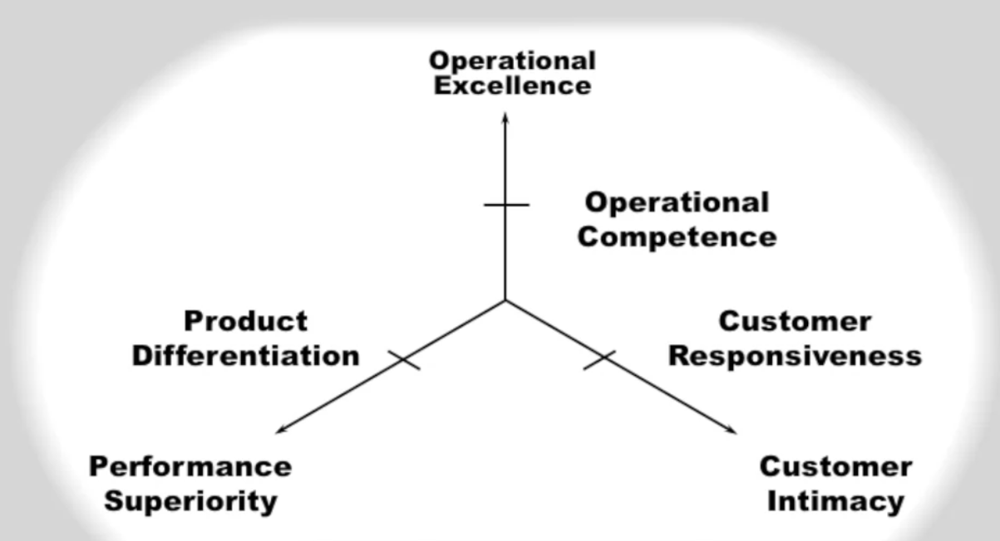


* Choose which of the three categories we will excel at and **be the first in the market to deliver that goal.**
* Depending on which category we chose, our hiring/resource/and other implications change greatly.
1) Figure out **how much of each category our market is able to differentiate**
2) Figure out **fair value of each category in our market. - market research**
   * In mature markets, many products are above fair value in all categories - hard to search
3) Where the competitors are in each axis.

Short term != Long term
* long term: excel Customer intimacy 
* short term: our Operational excellence is not fair value, so first prioritize in improving that.

## fair value
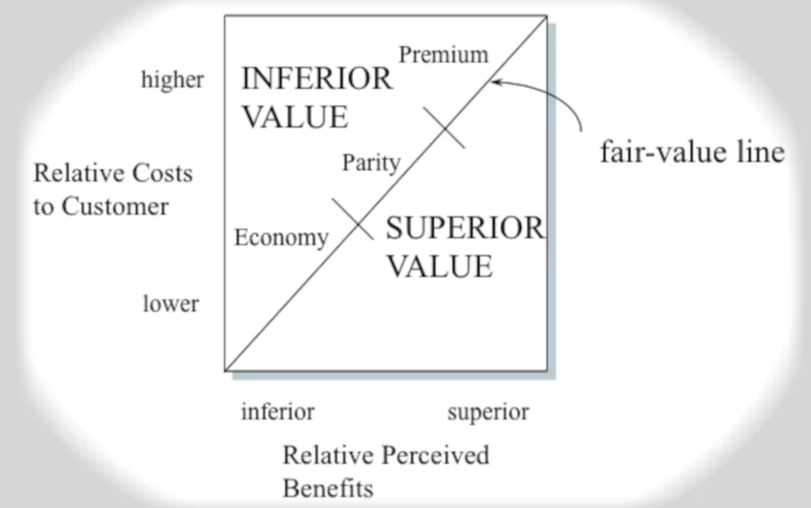
* If you offer more benefits, customers are willing to pay higher price
* If you offer lower price, customers will expect fewer benefits, as long as what you offer **appears to be fair(it still has the key superior values)**
* We need to offer **fair value in two of these offers, but something better than fair value in one of the categories**

but of course, **competitors keeps advancing, so the cut for fair value and better than fair value keeps going up**


# Positioning Process
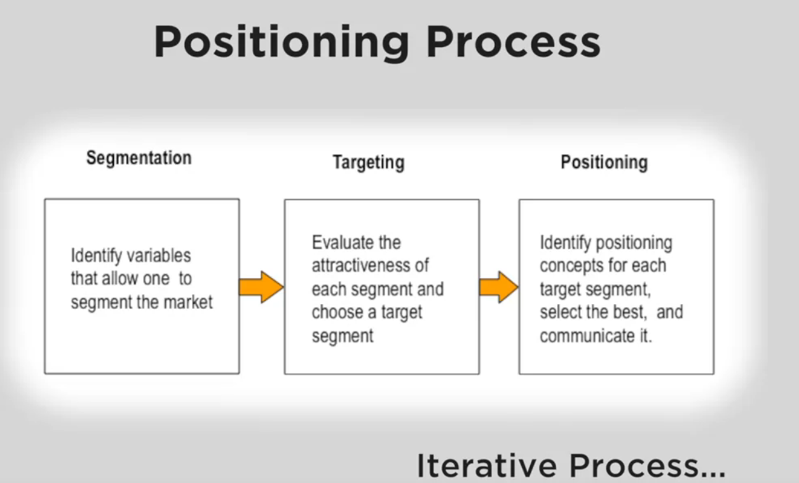

* If you don't segment and meet specific need, you **tend to cut cost and go for the average value, not satisfying anyone.**

## How to Divide?
1) Characteristic of Customer - Demographic ex) man/woman, rich/poor
2) Benefits Sought -> ex) running shoes -> comfort/aesthetics/technology
3) How do people purchase -> Ex) Online, Physical stores, Phone, loyal, once a month

### Cohort Analysis: Life experience of the same generation
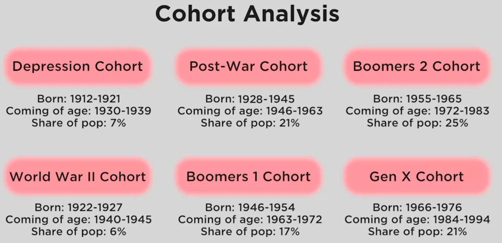

why interested in millenials? -> when a generation is coming of age, **their purchases are likely to make them loyal.**

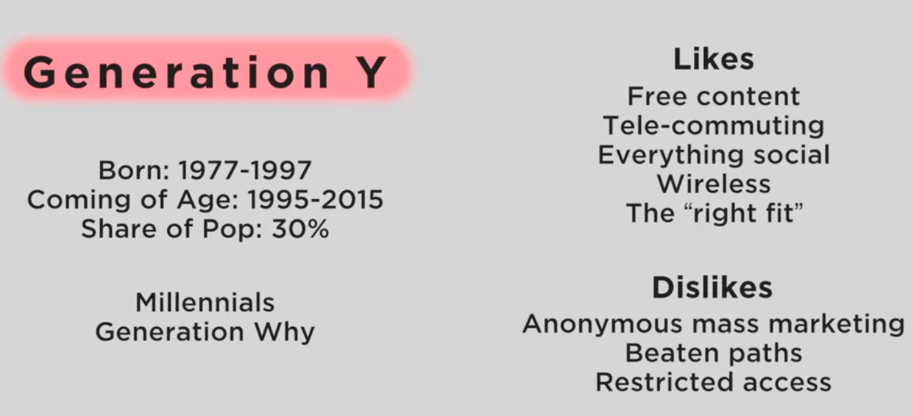
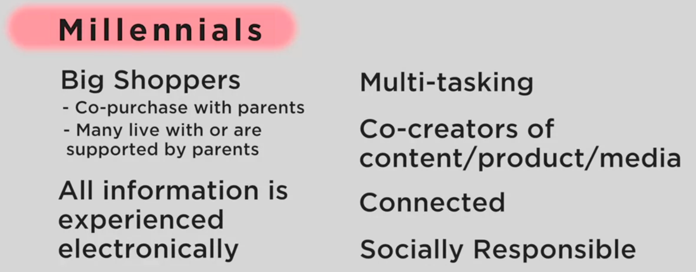

### Geographic Segmentation(Clustering) - PRIZM
* People who live are similar near tend live near each other - **not by where they are - ex) California cluster can have people that live in Europe**
* Zip clustering: Zip code

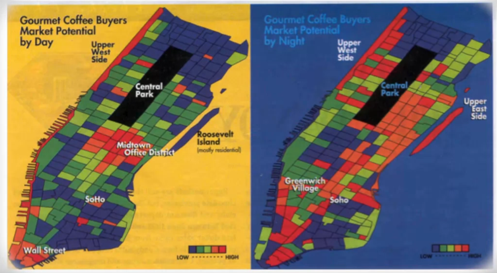

### Segment Selection Criteria
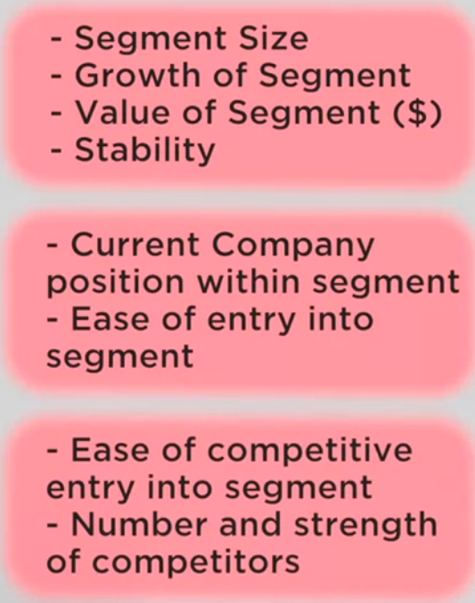
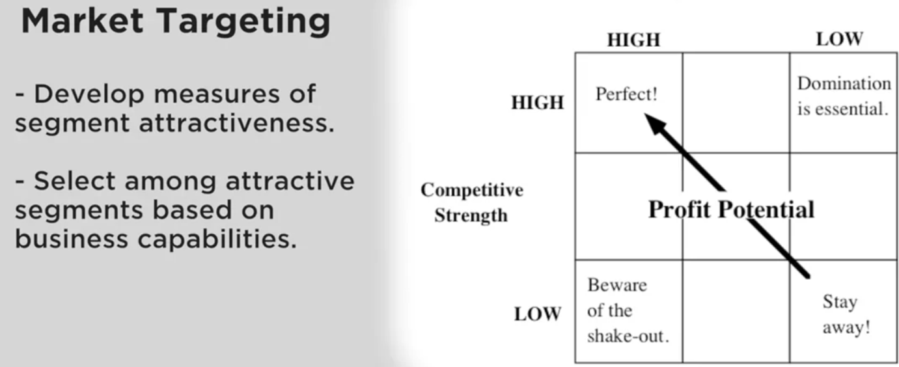


# Brand Positioning
Essence of the brand (P of STP)

## What is a Brand?
**whatever the customer think the brand is**

strong branding message ex) Disney -> then hopefully your desired message = customer message
if message isn't strong, and customer image != your desired image, **customer wins - their image is your brand**


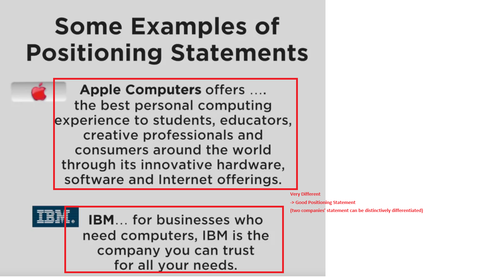

## Positioning Statement
* Target Segmenting
* Point of Difference
* Frame of Reference: Other competitors they are comparing themselves to.

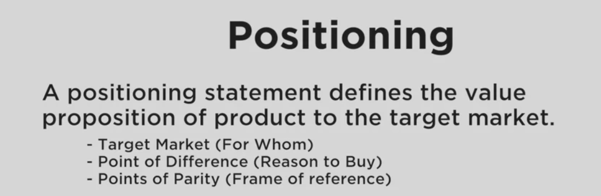

* Frame of Reference changes based on which competitor you compare to(ex) PS5 as a hardware spec vs available games)
* defensive: you own and can't copy easily

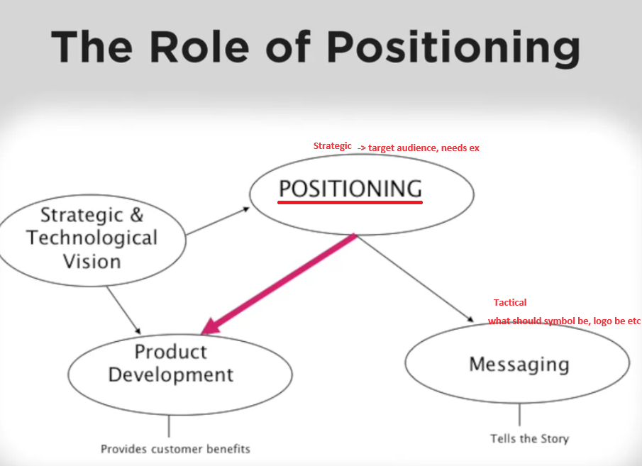


## Point of Parity
1) Category POPs: Something you must have to be considered fit for this frame of reference.
ex) grocery store: must have certain fresh products(egg, milk, etc).

2) Competitive POPs: negate competitor's point of difference
ex) Mac has 8 cores, when others have 4 cores? -> We make 8core CPU, their point of difference is gone.

SCA: Sustainable Competitive Advantage


ex) Apple computer -> Mac: **Frame of reference => computer to consumer electronics**

## POD criteria
* Desirable to customer?
* Can you deliver to customer?

# Brand Mantra
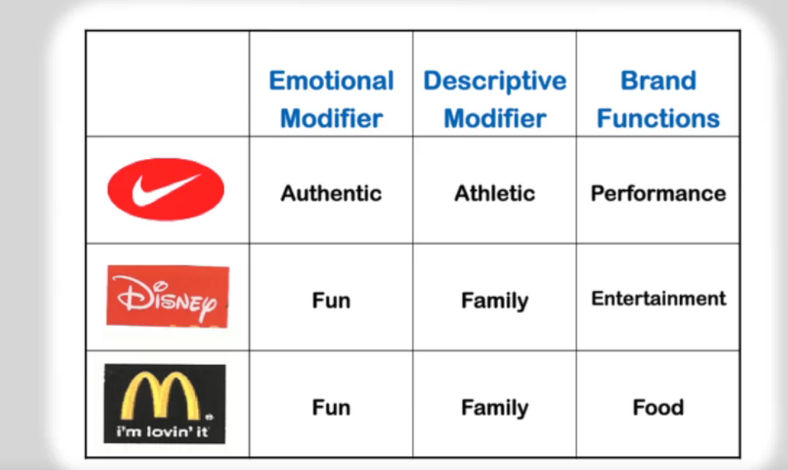
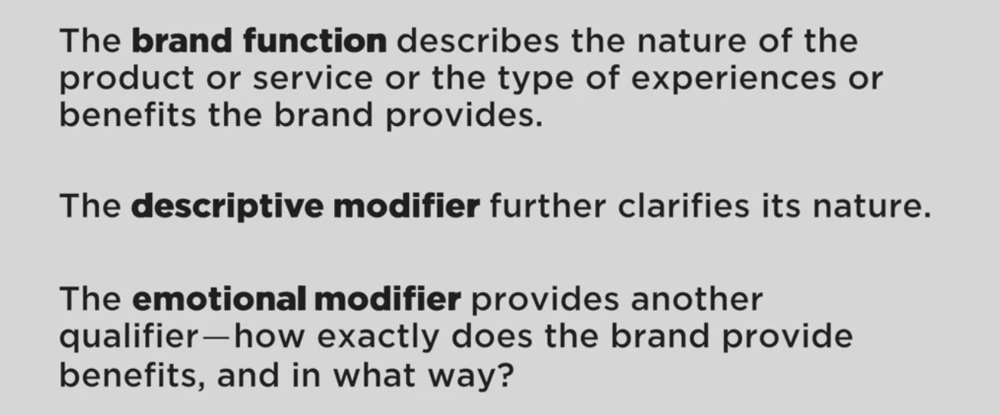

* Very sharp, needs to be in 30 seconds


# Experiential Branding
Brand notion is not enough. **Define all the experience related to the brand.**
notions are **Very emotional**

Today's rich brand are not just differentiated; they are **experientially differentiated** -> not a single promise, but a relationship.

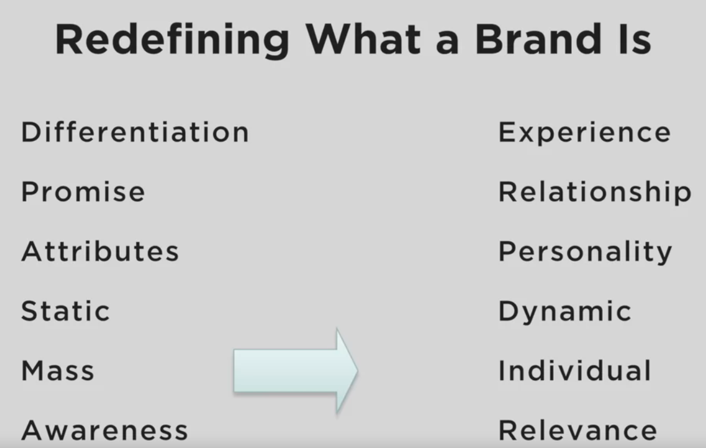

* Multisensoral Positioning - smell? feel? - distinct from anybody else
* Experientail Brand Value Promise: specific **experiences the brand gives to customers** - sense, feel(happy? tragic?), think, act, relate

