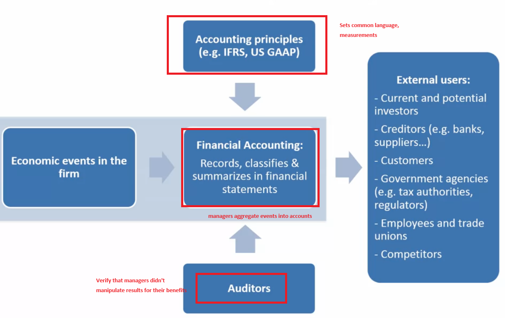
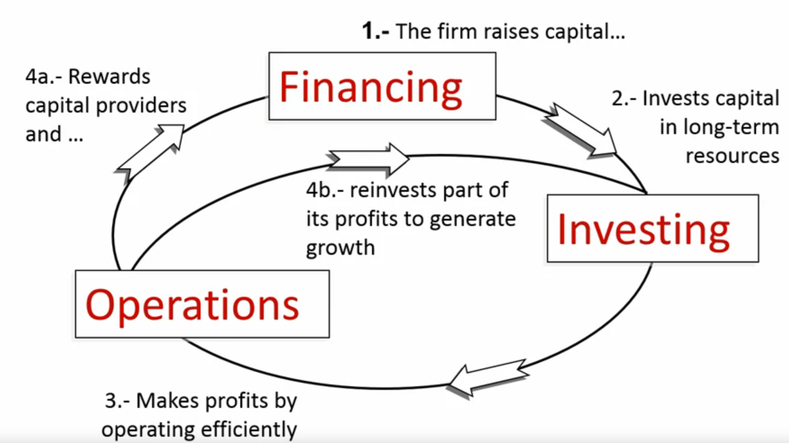
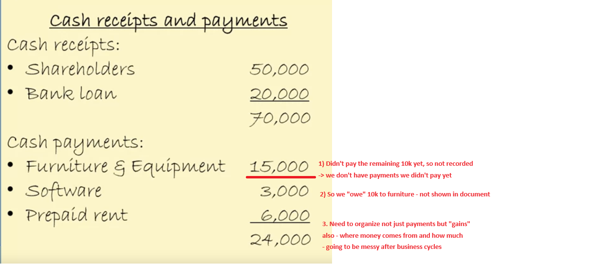
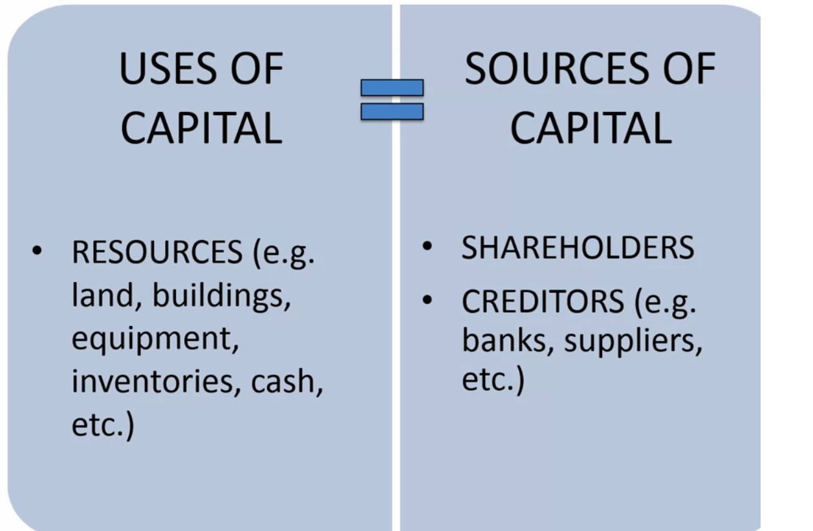
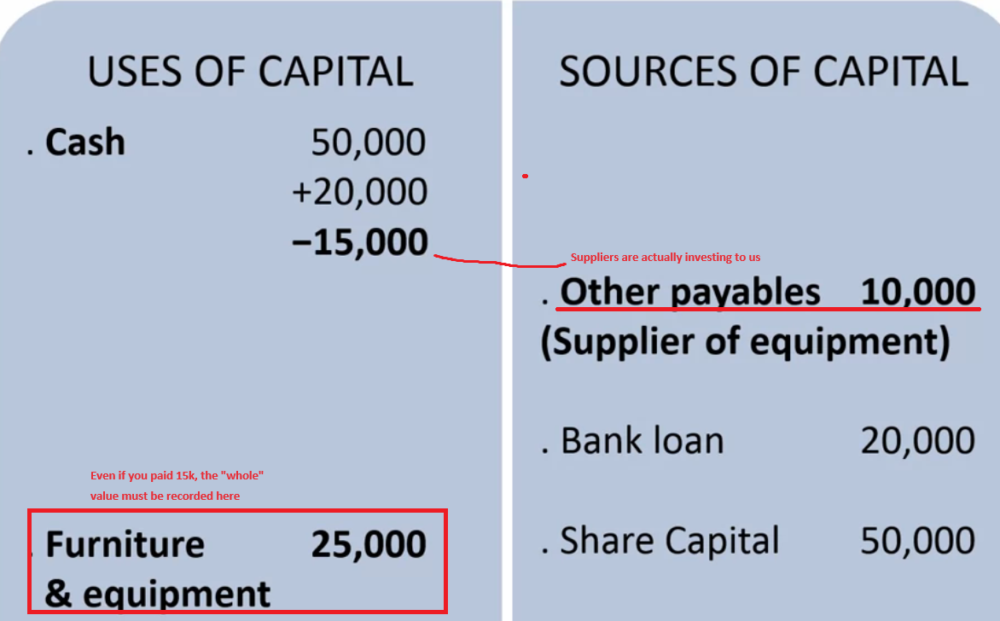
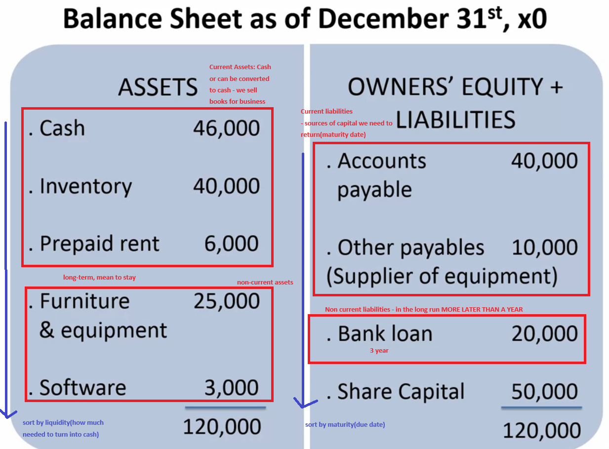

# Financial Accounting



## Business Cycle



## Types of Accounting
* Cash accounting: keeping records of payments and purchases ex) receipts 
* Problem: No record about the capital outside of cash(loan, invest, etc)



* We need to keep track of uses of capital and the source those capital came from


* **Double entry of accounting: Sum(Uses of capital) = Sum(Source of capital) - very good for double checking**

* a loan is an investment!



## Balance Sheet
* Most important financial sheet.


* Assets: Will item change to money or not(current/noncurrent)
* Liability: Due **within one year(current) / more than one year(non current) / not due(owners' equity)**

### Working Capital
* Can current cash flow outperform current loans
* ```current assets - current liabilites```


## Asset
1) **Resource owned or controlled by the firm - whether you paid 100% for it or not**
2) expected to generate **future economic benefits**
3) arise from an event of **past transaction**

ex) Machines bought for 1M? Yes
1) We own it
2) It's going to generate future benefit for us(gonna make us products)
3) Bought it from past event

ex2) Coke's Diet Cola brand? No
1) Coke made it - they own it
2) It's going to generate future benefit? of course
3) Made from transaction of past event? No 
**Negative - they developed in over time, not a specific past event**
-> this brand won't be recorded in balance sheet -> which is a limitation of balance sheet

ex3) Lottery Tickets? No
1) They own it
2) Going to generate future benefit? No(very low)
3) Result of transactions of past event? Yes

ex4) Employees? No
1) No -> Not owned by company

special ex5) Sports Players -> Transfer Rights -> Players "need" to play in that team for given year
when trade happens, team gives the trading team trade fee to get this transfer right.
then,

#### Trade right is asset (Ex) Suarez from Liverpool -> Barca)
1) They own player's service for certain amount of time -> Yes
2) They will bring value(the player will play for their team) -> Yes
3) Result of past trade transaction -> Yes

#### But self grown player is not asset (Messi - Not transacted, he is grown from Barca Youth)
this is the special case where employee is an asset!


## Liability
1) **Present obligation** of the firm to "transfer" economic benefits in the future to another party(ex) loan) - need to reliably estimate the amount
2) That arise from a past event or transaction

ex) Campus bookstore purchase inventory but doesn't pay in cash - Yes.
1) obligation to pay in future + can estimate amount
2) from past event

ex2) Lawsuit - No
1) Even though we might not need to pay, it is still a **present obligation** - but we cannot estimate the amount (X)
so disclose on footnotes, but cannot put on liability

ex3) Sells car with 3 year warranty contract? - Yes
1) obligation is there + **we can reliably estimate amount by past examples - provisions**
2) result of past transaction