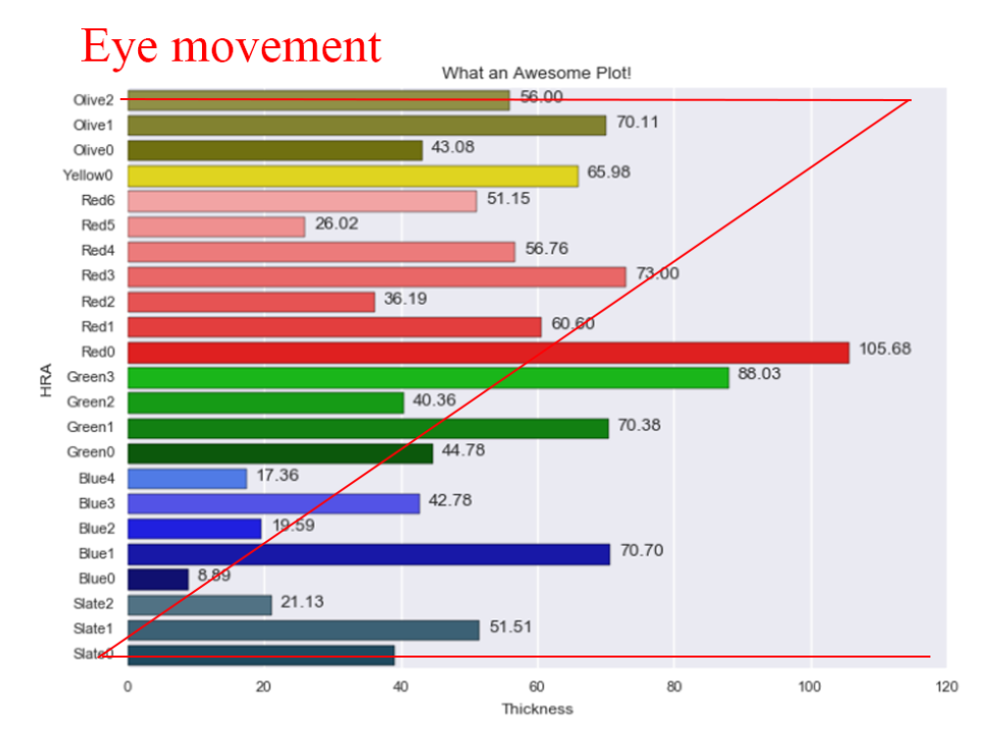
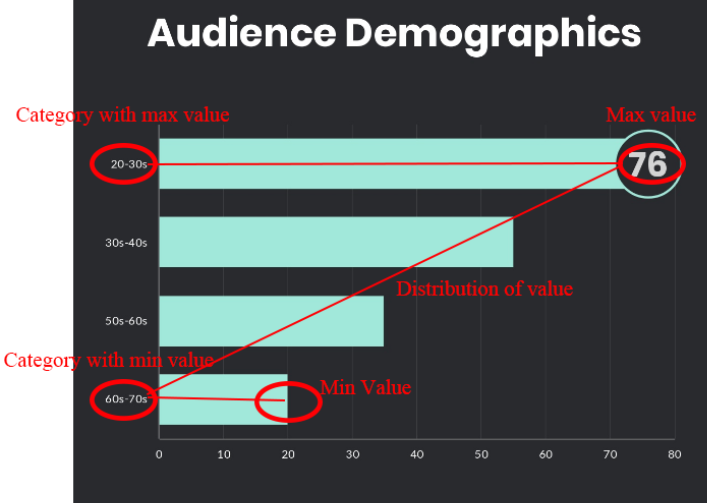
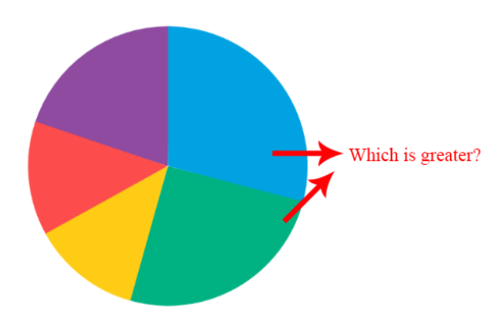
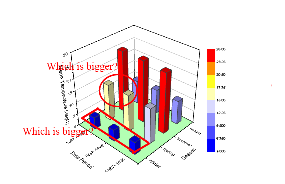

# Best Practices for Data Visualization

## 1. Horizontal Bar >>> Vertical Bar
### 1-1. Understand the Z-Line
Users usually read a visualization from **left-to-right, up-to-down**

### 1-2. Sort the Horizontal Bar By x value
* By using a horizontal bar plot AND sorting by x-value, we can put **the most important informations in the eye's z movement.**

* Because of horizontal plot's great sync with the eye's z-movement, this makes horizontal bar plot **one of the most effective visualizations**
* Label only when specific value is important - otherwise it's noise
* If doing stack plots, normalize the total sum to 100%

## 2. NO PIE CHART/3D
* Human eye **cannot effectively distinguish size of high dimesional polgons** - pie chart and 3d chart

* 2D area graph is also mostly bad, only good use is when comparing **data that greatly vary in size**

## 3. Simple is Better - Power of Text
* If there is only a few important numbers that you want to show, **simple text could be better any complex graph**

