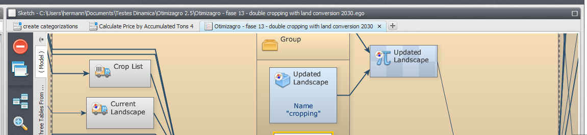
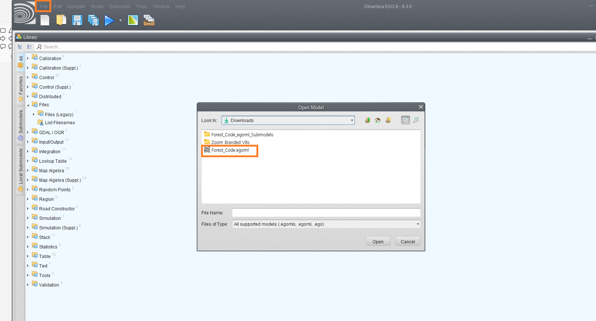
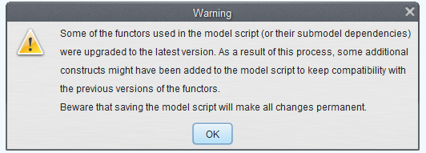
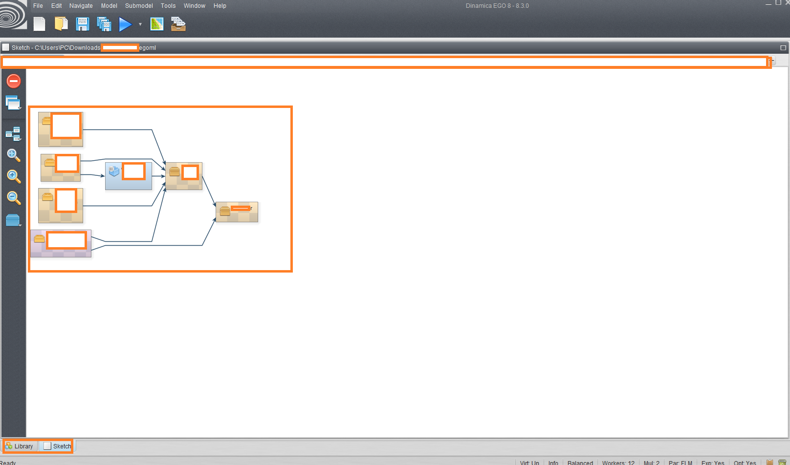
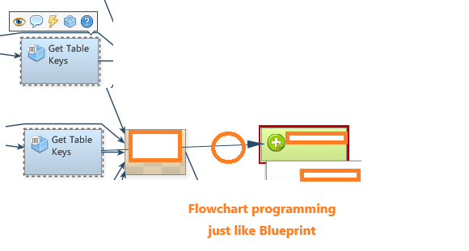
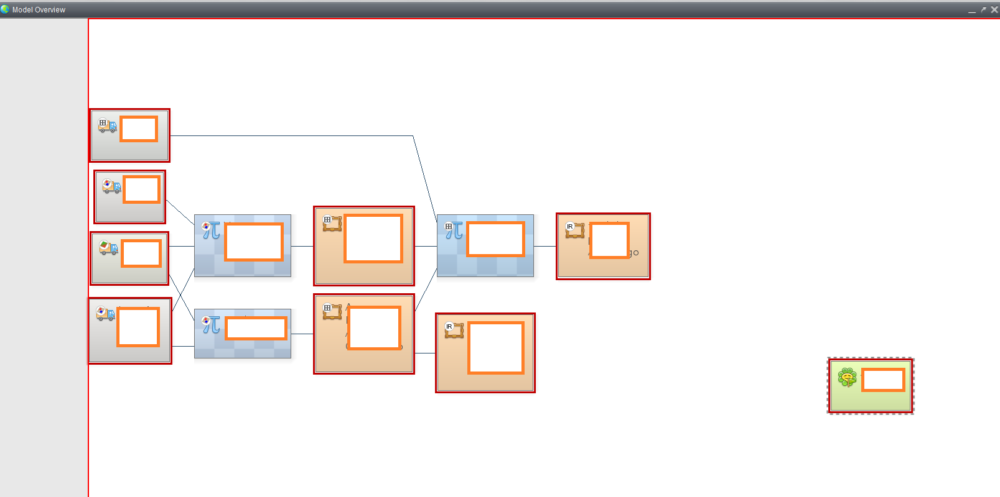
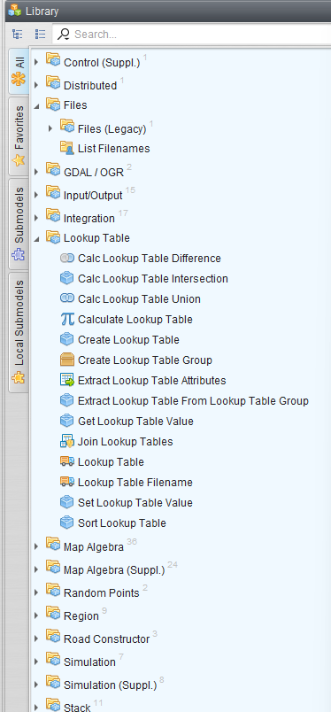

- Free software for environmental modeling without code

- Files are saved as .egoml format, and models can be divided in to different parts called submodels (like modules in programming)

# How to use

- File -> Open Model -> Open the model we want to see
- We will probably need to update the submodels that the model requires

- When we load the model, nothing appears in the screen so it might be confusing. **Windows menu has all the UI that we want to see**

- Sketch gives us the basic model diagram, and we can modify the model using different options

- Model Overview Gives us the total view of model

- Library gives us all the basic components we loaded for the model

