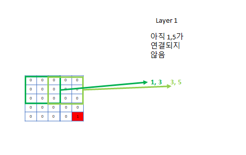

# 실용적 CNN

## 1. CNN이란?
    전체 data를 작은 영역들로 나눠 서로 인접한 data들 사이의 국부적 관계를 포착하고, 이를 종합하여 전체적인 정보를 얻는 신경망

* 보통 이미지 분류에 주로 쓰이기 때문에 2D 이미지를 분류하기 위한 2D Matrix CNN이 많이 유명하지만, **3D, 4D등 고차원 데이터에 대해서도 적용 가능하고, 심지어 1D 데이터에 대해서도 가능하다.**

## 2. 이론적 기반
* 결국 AI는 **인간의 지능을 컴퓨터로 "모방"하는 학문 - 모든 영감은 인체의 뇌에서 온다**
* 1981년 데이비드 허블과 토르스텐 비셀의 노벨 생리의학상 연구 - **시각 피질 안 대부분 뉴런은 일부 범위 안의 시각 자극에만 반응**


* 시각 피질의 고위 뉴런들은 시각 자극 대신 일부 범위 안의 하위 뉴런들이 반응한 시각 자극에만 반응 - **계속 위계적 구조로 자극을 종합해 맨 위에서 최종 감식**


* 이러한 **시각 자극의 국지적(local) 특징 - 위계적 구성을 모방한 것이 Convolutional Neural Network**

## 3. CNN의 기본
1) 작동 방식:
   * 컴퓨터가 인식하기 쉽게 **image는 한 개로 오지 않고 이를 컴퓨터가 인식하기 쉽게 어떤 특성을 기준으로 나눈 여러 개의 channel로 주어진다.**
      * ex) RGB: R, G, B하나당 채널 한 개씩. 흑백같은 간단한 사진이면 한 개의 channel을 주기도 한다.
      * 아래 예제에서는 그림의 간략화를 위해 빨간색 채널, 회색 채널로만 정리했고 파란색 문도 생략했다.
   * 눈에 대응되는 부분이 아래 그림의 "필터"들로, 각 channel에 대해 다른 weight를 가지고 있고 이 weight들은 학습된다. 이들 또한 input image를 어떤 특정한 기준으로 filtering하여 각 필터는 자신이 정한 특성에 대한 값들을 추출하려 노력한다.
      * 예제의 1번 필터는 빨간색 채널용 필터가 전부 1이므로 **3*3 빨간색 정사각형 특성을 찾는데 특화된 필터다.**
      * 예제의 2번 필터는 회색용 필터가 + 모양으로 1이므로 **회색 십자 모양 특성을 찾는데 특화된 필터다.** - 이보다는 회색 네모를 찾는게 더 회색 벽을 찾는데 도움이 될 것이므로 회색 필터의 0인 weight들은 학습을 진행하면서 1에 가까워질 것이다.
      * 예제의 3번 필터는 아래쪽은 회색이다가 위는 빨간색인, **회색 벽과 빨간색 지붕 사이 boundary가 되는 영역을 찾는데 특화된 필터다**
      * 이렇게 **각각 빨간색 지붕, 회색 벽, 지붕과 벽의 boundary를 포착하는 3개의 channel로 image의 특징을 잘 잡을 것이라고 기대하는 것. 채널이 더 필요하다 생각되면 더 지정해주면 된다.**
   * 이렇게 필터로 합성곱을 하면서 각 필터 집합마다 그 필터가 주로 보는 특성 위주로 채널이 한 개씩 생긴다.


1) CNN의 Hyperparameter: **channel, kernel size, stride, padding**
   


* padding: same/valid
   * valid 를 사용하면 CNN을 적용할 때마다 image의 크기가 줄어들게 된다
   * 이를 방지하기 위해 **data 주위를 0 padding으로 둘러싸서 output shape이 input shape과 같게 하는 방법이 same padding**


1) CNN의 변형인 Pool Layer: CNN의 변형으로 **filter 내에서 합성곱 대신 최대/평균 값을 구한다.**
   


## 4. CNN의 정석
1) CNN 구조의 정석: **CNN-Pool-Flatten-Dense**


   * CNN-Pool을 통해 image의 feature을 추출한 뒤, Dense layer에서 이를 종합하여 정답 추론.
   * 이 때 CNN이 너무 작으면 Pool Layer은 건너뛰어도 됨.

1) Hyperparameter의 정석
   * **kernel size의 최적값은 3, 큰 kernel대신 작은 kernel을 가진 layer 여러개가 대부분 좋다.**
      * ex) (5, 5) 크기의 kernel layer 한 개 대신 (3, 3)크기의 kernel layer 2개 사용
   * **Channel은 하위(앞, input에 가까운) layer는 작게, 상위(뒤, output에 가까운) layer로 갈수록 크게 설정**
      * 하위 layer일수록 image의 크기가 커서 channel까지 많게 하면 메모리 부하 큼. 반면 상위 layer면 size가 작아져서 더 많은 channel 사용해도 괜찮게 됨.
      * 상위 layer는 하위 layer보다 훨씬 복잡한 특징을 포착하게 됨(ex) 얼굴 인식이면 하위 layer는 눈, 코, 입같은 기본적인 feature를 분석하지만, 상위 layer는 얼굴 전체의 feature를 담아야 함) - 따라서 더 많은 channel을 사용하여 이를 도움.
   * **stride는 1 또는 2를 사용하고, stride가 아니면 절대로 image크기가 바뀌지 않도록 same padding을 사용한다.**  
      * 이래야만 image크기가 layer이 지나도 유지되므로 Residual Block, Inception등 CNN의 여러 심화 기법들을 사용할 수 있다.
      * 최근 모델들에서 **image의 크기는 stride 2 padding으로만 축소 시키고 나머지 layer들은 모두 same padding을 써서 image크기를 일정하게 유지함.**
   * **stride < kernel size - 절대 stride를 filter 크기 이상으로 설정하지 않는다.**
      * stride가 더 크게 되면 건너뛰는 feature들이 생기게 됨
  
2) CNN의 크기 및 깊이 설정
   * **최소 연결 조건: 맨 앞의 feature과 맨 뒤의 feature가 연결될 수 있게 구성하라** - 조금 더 깊어도 상관 X
      * ex) 크기가 5 * 5의 image: 
      kernel size (3, 3)으로 구성하면 첫 번째 pixel은 최대 세 번째 pixel하고만 연결되고, 세 번째 pixel은 최대 마지막 pixel인 다섯번째 pixel까지 연결된다. 
      따라서 **한 layer을 더 추가하면 1 pixel과 5 pixel이 연결되므로 올바른 CNN구조의 최소 조건이 만족된다.**

      

      

      * 이미지가 너무 크면 (ex) 224 * 224) kernel 3짜리 필터를 222개 써야 처음부터 끝까지 연결이 된다 - **너무 깊어지므로 stride 1 CNN사이사이에 stride를 2로 설정하여 이미지를 2배 축소 시킨다**
         *  이러면 kernel 3개 짜리 CNN 2개를 사용했을 때 앞으로 220개의 layer가 필요하지만, 바로 다음에 stride 2 layer을 설정해주면 이미지는 112 * 112로 축소되어 110개의 layer만 필요하게 되어 필요 depth가 2배 줄어든다.
  
## 5. 정석의 예시: Context Layer
* Data의 형태: (7, 38) = 7개의 neighbor, 각각에 대한 38개의 feature
* 한쪽 변이 4배나 긴 직사각형 layer 
* 마지막 CNN layer의 Channel은 Feature개수인 38과 비슷한 16-32정도로 설정 - 아래 layer들은 이보다 2배씩 큰 channel값 할당.
* 크기가 7인 x축 feature는 크기가 3인 filter 3개를 사용하면 맞춰줄 수 있다.
* 여기에 **y축은 x축보다 5배가 크므로 stride가 2인 CNN을 2번 사용해줘서 맞춘다.**
   * 그래도 38 / 4 = 9.5 로 7보다 조금 크다. 이를 메꾸기 위해 stride 2인 layer들의 kernel_size를 3으로 설정해줘서 조금 부족한 부분을 채워준다. 또는 stride 2 filter다음마다 stride 1 layer을 넣어줘도 된다.
* 이러면 최소 연결 조건을 만족하므로 Flatten 후 Dense를 통해 결과를 얻는다.
  
```python
   ContextLayer = {
      #layer1: 1, 3 연결됨
      CNN2D(channel_size=32, kernel_size=(3, 3))
      CNN2D(channel_size=32, kernel_size=(1, 3), stride=(1, 2)) # 긴 y축 data를 2배로 축소

      #layer2: 1, 5 연결됨
      CNN2D(channel_size=64, kernel_size=(3, 3))
      CNN2D(channel_size=64, kernel_size=(1, 3), stride=(1, 2)) # 긴 y축 data를 2배로 축소

      #layer3: 1, 7 연결됨
      CNN2D(channel_size=128, kernel_size=(3, 3)) 

      #크기가 (7, 7)이라 너무 작아서 Pool은 생략
      Flatten()

      # Dense Layer
      Dense(32)
   }
```

## 6. CNN의 수많은 심화 변형
* CNN에 대한 가장 많은 연구가 이루어지는 곳은 매년 열리는 AI 이미지 다중 분류 대회인 ImageNet
* 매년 다양한 변형들이 소개되고 1등을 차지함으로서 유행됨.
  

### 트렌드를 바꾼 몇가지 수상작들
* GoogLeNet - Inception Layer, size 1 kernel (2012)
* ResNet - Residual Layer (2014)
* Xception - Depthwise Separable Convolutional Layer (2016)
* SENet - SE Block (2017)
  
이러한 변형들도 매우 흥미롭고 CNN을 마스터하기에 필수 사항들이라, 다음 기회에 따로 정리하기로 한다.

<script src="https://utteranc.es/client.js"
        repo="flyxiv/flyxiv.github.io"
        issue-term="pathname"
        theme="github-light"
        crossorigin="anonymous"
        async>
</script>