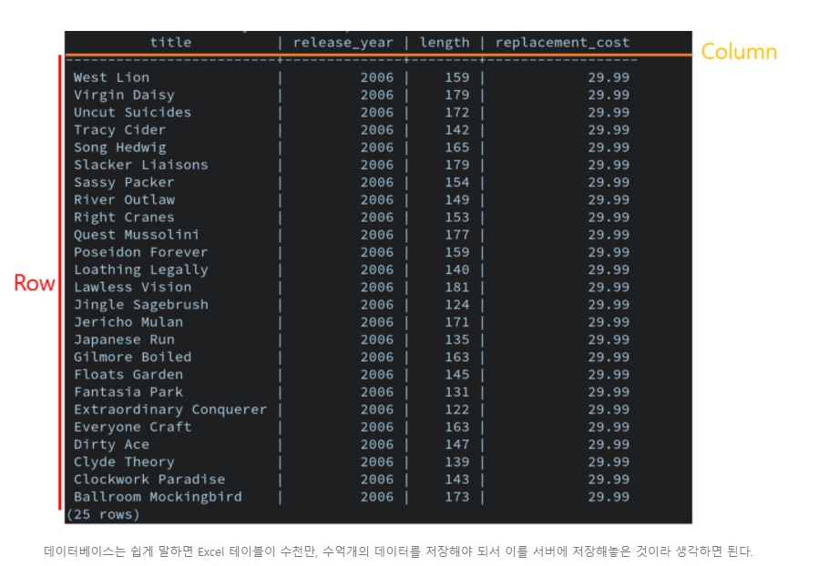

# SQL 문법 복습/정리


## 1. SQL?

*  데이터베이스에서 원하는 데이터를 가져오기 위해 사용하는 query 언어.



*  데이터베이스의 데이터는 너무 커서 그 데이터 전체를 가져오기도 힘들 뿐더러, 전체를 가져온다 하더라도 대부분 경우 그 중 자신이 사용하려는 데이터는 극히 일부이기 때문에 굉장히 효율이 떨어진다.
*  따라서 데이터베이스를 사용할 때는 **자신의 의도에 맞는 데이터들을 찾아서 그 데이터들만 뽑아오는 것이 속도 그리고 효율성 측면에서 훨씬 좋다.** 
* 이 때 프로그래머의 의도를 담는 명령을 "Query"라고 한다.

#### Query: 사용자의 의도를 담아 그에 맡는 데이터를 뽑아오도록 데이터베이스에게 하는 명령.

### SQL: Structured Query Language -> Query를 만드는 방법을 정의한 언어이고, 현재 데이터베이스와 커뮤니케이션할 때 가장 많이 사용하는 언어다.


## 2. SQL 문법

* 1) 테이블 데이터 조작 SQL 문법:
```sql
SELECT [ALL | DISTINCT] {column_names}
FROM table_name
[WHERE {conditionals [AND | OR | NOT]}]
[GROUP BY {column_names2}]
[HAVING {search_conditionals}]
[ORDER BY {column_names} [ASC | DESC]]
```

* SQL 명령어들은 **대문자로 나타내주는게 표준적인 코딩 스타일**


### 1) SELECT
* 가장 먼저 데이터베이스에서 하고 싶은 것은 **가져오길 원하는 컬럼들을 선택하는 것.

```sql  
   SELECT * FROM TABLE_NAME -- 테이블의 전체 Column을 다 가져옴
   SELECT {column_names} FROM table_name -- 테이블의 선택한 Column들만 가져옴.
```


### 2) WHERE
* Select는 Column을 선택/필터링하는 가장 기본적인 방법이고, Where는 row를 선택/필터링하는 가장 기본적인 방법.

```sql
   SELECT {column_names} FROM table_name WHERE {conditions} -- 조건문에 맞는 row만 가져옴.
```


### 3) WHERE - LIKE
* 여기서 Where는 Conditional을 나타내지 않고, 문자열 타입의 Column을 의미한다.

```sql
    SELECT {column_names} FROM table_name WHERE string_column_name LIKE regex
```

### 4) GROUP BY
* **특정 Column들이 같은 값을 row들을 묶는다.**

### 5) HAVING
* 집계 함수(aggregate function)에 대한 filtering
* **항상 GROUP BY 절이랑 같이 사용된다.**

```sql
   SELECT {column_names} 
   FROM table_name 
   GROUP BY {column_name}
   HAVING {agg_conditional}

   # agg_conditional을 만족하는 group만 filtering
```

### 6) ORDER BY
* 어떤 Column들을 기준으로 row들을 오름/내림 차순 정렬
* **row가 여러개면 앞에 있는 column 우선으로 정렬. 앞의 column값이 같을 때만 이후 column들 사용.**

```sql
   SELECT {column_names}
   FROM table_name
   ORDER BY ({column_names2})
```

### 7) AS
* SELECT 문의 column들에 같이 사용되며 여러 역할 지님
1) **column이름 alias가능**
2) **column의 type 변환 가능**

```sql 
   SELECT {column_name AS column_name2} FROM table_name # column_name을 column_name2로 바꿔서 가져옴
```

### 8) Aggregate Functions

0) 공통 Option: 
   * ALL conditional: **조건문 만족하는 행만 agg(중복 O)**
   * DISTINCT conditional: **조건문 만족하는 행만 agg(중복 X)**
  
1)  COUNT( [ALL cond | DISTINCT cond | *] ): row 개수를 세는 함수
      * COUNT(*): **모든 행 개수**
2) AVG: 행들의 평균
3) STDEV: 행들의 표본 표준편차
4) STDEVP: 행들의 전체 표준편차 (Population)
5) SUM: 행들의 총합
6) MIN: 행들의 최솟값
7) MAX: 행들의 최댓값
8) VAR: 행들의 표본 분산
9) VARP: 행들의 전체 분산 (Population)


### 9) CONDITIONALS

* AND | OR | NOT: 기본적 논리 연산자들
  
* IN: column이 어떤 값들의 집합에 포함되는지 확인
  
* ANY: 집합안의 값 중 하나라도 조건을 만족하면 True
  
* BETWEEN: column이 어떤 값들 사이에 있는지 확인 - inclusive
  
* IFNULL: Null이면 expr1, 아니면 expr2

* NULLIF(val1, val2): val1=val2면 NULL, 아니면 val1 

### 10) 그 외 사용할만한 Feature들

* CASE: procedure없이도 if-then-else 사용하게 해줌

```sql

   CASE expr WHEN cond1 THEN return1
             WHEN cond2 THEN return2
             ...
             ELSE return_else

```

* DECODE: CASE 문의 축약 version. = 만 지원
  
```sql
   DECODE(column, val1, ret1, val2, ret2, ...) 
   #column == val1 => ret1, column==val2 => ret2
```

* COALESCE: col이 NULL이면 다른 값 채워넣음
* GREATEST, LEAST: 값들 중 max/min값 가져옴
