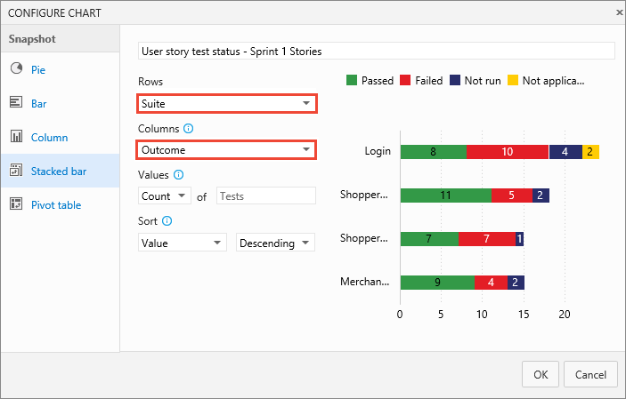
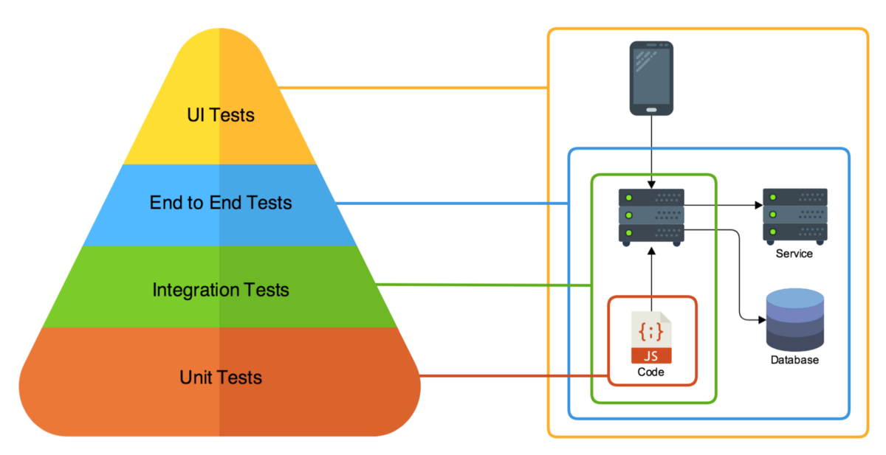
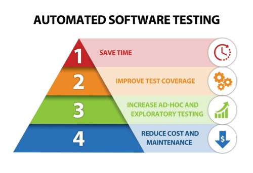
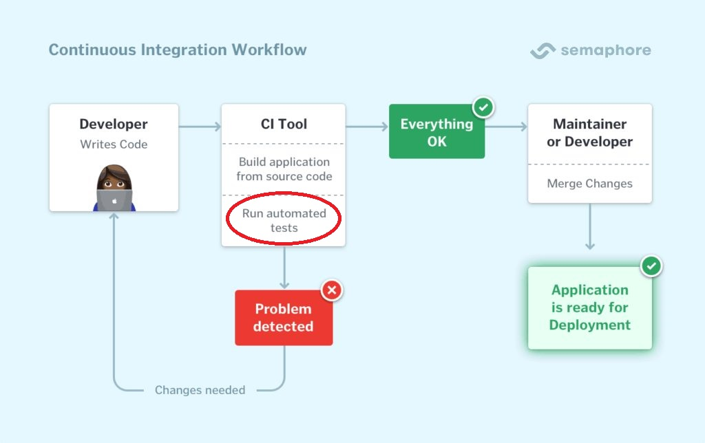
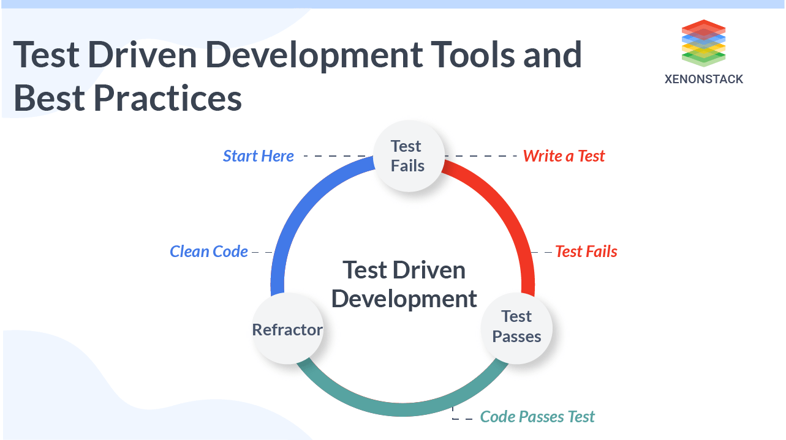

# Test Driven Development(TDD)

## 1. Test는 왜 중요한가?

### 1) "완벽함"은 존재하지 않는다.

     소프트웨어는 수학처럼 완벽한 논리로 전개하기엔 너무 복잡하고, 굉장히 변화 속도가 빨라서 그렇게 완벽한 논리를 짤 만큼의 시간을 주지도 않는다.

* 또한 소프트웨어는 그 소프트웨어 자체의 논리뿐만 아니라 수많은 사용자들이 각각 가지고 있을 가지각색인 실행환경, 셀 수도 없이 많은 가능한 예외 action 등등이 모두 변수로 작용하기 때문에, 이 무한한 변수들을 다 처리할 수 있도록 소프트웨어를 구현하는 것은 불가능하다. 

* **"완벽한 소프트웨어" 라는 환상에서 벗어나 "훌륭한, 돌아가는 소프트웨어"를 최대한 빠른 주기로 만드는 생산적인 프로그래머를 양성하는 게 Pragmatic Programmer의 핵심 목표.**

### 2) "완벽함"은 증명할 수 없지만, "훌륭함"은 견고한 테스트로 증명 가능하다.
* "완벽함"은 무한히 많은 상황에 대해 잘 동작해야 하므로, 아무리 많은 상황에 대해 제대로 작동함을 증명해도 "완벽"이란 품질을 증명하는데 전혀 도움이 될 수 없다.
  
* 하지만 **품질의 기준을 "훌륭한"으로 바꾸면 "일반적인 상황에서 예상되는 모든 행동과 예외들에 대해 제대로 동작한다"는 관찰은 굉장히 강력한 근거가 된다.**

* 소프트웨어에서는 **이러한 정상 동작에 대한 관찰은 대부분 "테스트"를 통해 이루어진다.**

### 3) Test란 무엇인가?

    소프트웨어 코드의 일부분이 정확히 동작하는지를 확인하는 평가하는 소규모 프로그램으로, 주어진 입력에 대해 정상적으로 작동했을 때 출력해야 하는 정답셋이 실제 출력과 일치하는지 여부를 사용하여 평가를 진행함.

* 우주의 원리가 인간이 사고할 수 있는 논리보다 훨씬 더 복잡하여 과학이 우주의 다양한 현상의 관찰을 바탕으로 지식을 조금씩 넓혀가듯, **관찰할 수 있는 현상들을 종합하여 판단의 근거로 사용하는 소프트웨어의 귀납적/실험과학적인 방법이 바로 테스트이고, 이는 실용적 프로그래머가 프로그램을 점검/평가하는 가장 기본적인 방법이다.**
* 갈수록 소프트웨어의 규모가 커지고 복잡도가 증가함에 따라 이러한 테스트를 통한 프로그램의 검증은 거의 필수화되고 있다.

## 2. Test의 자동화

* 소프트웨어가 커져감에 따라 프로그래머들이 작성해야 하는 테스트 또한 증가했고, 어느새 테스트 시스템은 사람이 수동으로 관리하기엔 너무 큰 규모가 되어 있었다.
* 이에 따라 **테스트 시스템을 자동화시키려는 노력이 진행되었고, 테스트가 자동화되면서 소프트웨어 개발에도 많은 변화가 있었다.**

### 1) 결과의 부호화

* 테스트를 기계가 실행하고 처리하기 쉽도록 **테스트의 결과는 Category화되어 항상 그 정해진 범주 안의 결과만 출력할 수 있게 하였다**
   * ex) 잘 돌아가면 O, 실패하면 X, 도중에 멈췄으면 STOP등등

### 2) 자동화 테스트 유형 다양화

커진 시스템을 더 체계적으로 테스트 하기 위해 테스트도 유형화/구조화되어 정리되었다.
    * Unit Test: 프로그램의 특정 클래스나 메서드 단위가 독립적으로 제대로 동작하는지에 대한 테스트.
    * Integration Test: 단위 테스트가 끝난 소프트웨어를 결합했을 때 제대로 동작하는지에 대한 테스트.
    * End to End(System) Test: 시스템 전체가 구축됐을 때 제대로 동작하는지에 대한 테스트
    * UI Test: UI가 제대로 동작하는지 확인하는 테스트

### 3) Test 자동화로 인한 개발 프로세스에서의 지속적인 활용

* Test가 자동화됨에 따라서 **Test를 작동시켜 그 결과를 확인하는 시간이 굉장히 짧아지게 되었고, 아무때나 테스트를 실행해볼 수 있게 되었다.**
* 이렇게 테스트가 accessible하게 되자 소프트웨어 엔지니어들은 **자동화된 테스트를 개발한 결과물의 검증에만 사용하는 것을 넘어 아예 개발 프로세스의 일부로써 포함시키게 되었다.**
    * 이를 통해 개발 과정에서 변경이 있을 때마다 빠르게 테스트를 통해 문제점을 피드백받을 수 있어 디버깅 시간이 크게 줄었고, 결과적으로 소프트웨어 개발 주기가 가속화되었다.

* Continuous Integration 같은 최근 소프트웨어 개발 트렌드에는 항상 소프트웨어에 변경사항이 생길 때마다 자동으로 테스트를 구동시킨다는 자동화 테스트 개념이 기본으로 깔려있을 정도로 자동화 테스트는 이제 소프트웨어 개발 프로세스에 빠져서는 안되는 핵심 요소다.

## 3. Test Driven Development: Test를 "부수적 요소"가 아닌 "주 요소"로

* **테스트를 개발 프로세스의 일부를 넘어서, 아예 개발 프로세스의 핵심으로 사용하는 개발 원리**
* **테스트가 핵심이고, 개발은 그저 테스트를 통과시키기 위해 진행하는 작업.**

### TDD의 3원칙
  * 제품 코드는 **테스트를 통과하기 위함이 아니라면 그 어떠한 이유로도 추가로 작성 불가하다.**
  * Unit Test는 **Fail하기 충분한 정도로만 최소한으로 작성** + Compilation Failure 또한 Fail이다.
  * 제품 코드는 **딱 테스트를 통과할 만큼만 작성하고 절대로 추가로 개발하지 않는다.**

* 이 원칙들에 따라 개발을 하기도 전에 테스트부터 작성을 하고, 그 테스트를 통과시키기 위해 개발을 하는 방식이다.
* 이러한 과정을 통해 TDD는 
   * **테스트를 먼저 만듬으로써 개발 전에 시스템의 동작에 대한 이해를 갖게 하고**
   * **테스트 작성 = 개발 이후 프로세스 가 아니라 테스트 작성 = 개발임을 강조** - 개발이 끝났을 때 이미 테스트 코드도 만들어져 있으므로 프로그래머가 개발 후 테스트 코드를 만드는 데 따로 시간을 쓰는 느낌이 들지 않는다.
   * **프로그램을 딱 시스템이 필요한 만큼만, minimalistic하게 작성하도록 유도** - 생산성 향상

### TDD의 개발 프로세스

1) RED: 테스트를 작성하고, 그 테스트가 실패한다.
2) GREEN: RED인 테스트들을 **통과시킬 만큼만** 제품 코드를 작성한다.
3) REFACTOR: GREEN이 된 제품 코드들의 구조를 리팩토링하여 보기 좋게 만든다.

## TDD의 함정 - "절대 내부 구현을 테스트 하지 마라"
* TDD는 **테스트를 꼼꼼하게 작성하면서도, 유지보수가 쉬워 기존 개발 방법만큼이나 빠른 개발 프로세스를 갖춘것이 최대 장점.**
* 그런데 Ian Cooper의 "TDD, Where Did It All Go Wrong(https://www.youtube.com/watch?v=EZ05e7EMOLM)" 에 따르면 수년동안 TDD를 실행한 개발자들은 실무에서 TDD를 적용했을 때 그러한 장점이 나오지 않는다는 것을 발견한다
* Test를 미리 작성하고 개발을 진행했음에도 새로운 Feature을 추가한다던가 리팩토링을 위해 코드의 구조를 바꿀 때 작성했던 Unit Test들이 깨지는 것을 발견했다.
* 너무 많은 Test를 만들어놨는데 다 Fragile함 -> **Test 유지보수에 비용이 없어야 진정한 TDD의 의미가 있는 것 아닌가?**
* 이들이 범한 문제는 **TDD의 테스트를 내부 구현에 대한 Unit Test로 만들었다는 점**

Ian이 TDD의 역사를 되짚어보면서 이런 회의론에 대해 찾은 정답은 다음과 같다:

### 1. TDD Test는 절대로 어떤 특정 Class 나 Method같은 내부 구현을 테스트 대상으로 삼으면 안되고, "핵심 비즈니스 로직만 테스트 해야 한다"
ex) 지도 앱에서 **"출발지-목적지를 찍었을 때(Input)" "Dijkstra 알고리즘으로 나온 경로를 찾는지(Output)"를 테스트해야지, 경로 탐색 클래스가 (출발지, 목적지)를 제대로 입력 받았는지같은 세부 구현 사항을 테스트하면 안된다.**

* 그래야만 테스트는 내부 구현의 변화에 독립적이게 되고, TDD가 추구하는 진정한 유지보수가 편리한 코드를 작성할 수 있게 된다.

### 2. TDD에서 가장 우선시되야 되는건 "RED에서 GREEN으로 넘어가는 과정이다". 무슨 수를 써서라도 최대한 빠르게 GREEN으로 넘어가라
* **리팩토링과 문제 해결은 동시에 하는 게 아닌, 문제 해결부터 한 후에 리팩토링을 하는 것이다.**
* 따라서 처음에는 절대로 코드의 구조따위 생각하지 않고 일단 생각나는 모든 방법을 총동원해서 GREEN으로 바꿔놓는 것에만 집중한다.
* 최대한 빠르게 정답을 만들어낸 다음 남은 시간에 리팩토링을 해야 **일정이 촉박할 때는 빠르게 결과물을 내고, 일정이 충분할 때는 양질의 코드를 생산하는 유능한 개발자가 될 수 있다.**
