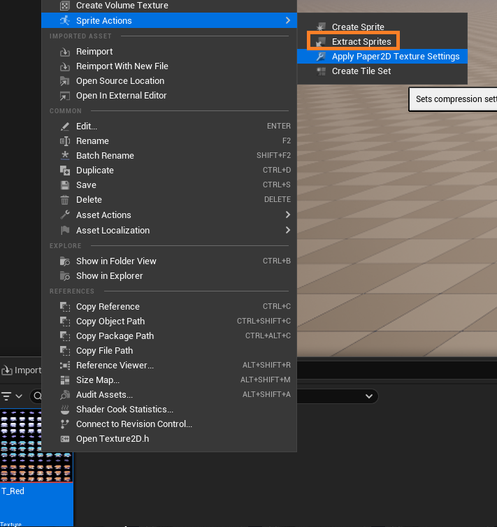

# Creating 2D Games With Unreal5

Starting With Unreal - Empty Project - C++ + Scalable + Mobile

## Requirements: Install PaperZD

https://www.fab.com/listings/6664e3b5-e376-47aa-a0dd-f7bbbd5b93c0

## Import Character Sprite

- https://axulart.itch.io/small-8-direction-characters
- import the .png file to Content/Character(new directory)
- rename to T_Red to make it easier to work with
- right click png file -> sprite actions -> Extract Sprites
  

- right click + drag to move viewport -> **the sprites have spaces between them, so we can't use it immediately**

- change sprite extract material to grid

- We divide evenly. There's 8/12 sprites per col/row, so adjust grid width/height accordingly

- Extract, there's 8 directions so create directory for each direction and move all corresponding sprite to the folders

- Find the Idle sprite, and right click -> create flipbook(FB_Red_Idle_Down)

- Select the two other sprites -> create flipbook(FB_Red_Walk_Down)

- Do the same for all directions

- Animations are too fast, so we'll adjust frame rate in bulk. Filter to paper flipbook

- Select all sprites and bulk edit

- Select all in the bulk edit window -> edit fps to 7 -> save all (ctrl+s)

- Create new directory Sprites and move all directories inside

- Create New Blueprint Class -> PaperZDCharacter

- Open Blueprint Editor -> Sprite -> Source Flipbook -> IdleDown

- Sprite is too small

- Bulk edit all sprites' pixel per unit from 1 -> 0.2

- Change sprite rotation X to -90 and capsule component half height to 50

- When we drag to character to the level, the character floats

- Change sprite z to -49.5 (doing 50 will position sprite below the surface, making it unmovable)

- Add Spring Arm and attack a camera to the spring arm

- Rotate Camera -90 Yaw, and then up to make top down camera.

- Exit Blueprint Editor. Now we can see how it shows on the camera.

- right click -> paperzd -> animationsource

- add new -> animation sequence -> name idle

- Since we have 8 directions, check "multi-directional sequence", N = 8. Set idle direction flipbook for all 8 directions.

- Create Walk animation sequence doing the same thing

- Now create PaperZD -> PaperZD AnimBP using our AS

- In the AnimBP Blueprint Editor, open AnimGraph and add Play Walk Node.

- Open TopDownCharacter BP, click Animation Component -> set Anim Instance Class to ABP_TopDownChar

- Go back to ABP_TopDownChar and set directionality

- Create an Input folder, go in and create Input Action

- Open the IA, Set Value Type Axis2D

- Now creater Input Mapping Component

- Add Input Action to mapping

- Add "Swizzle Input Axis Values" to modifier to change w's axis to Y for W and S, and "Negate" Modifier for A and D

- Add the controller and map the IA_move to world axis in Character Blueprint

- Now to map events. go to ABP_TopDownchar and save BP_TopDownChar as variable

- Set Animation Blueprint to run when pressing button + depending on direction

