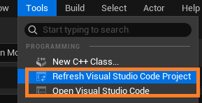

# C++ For Unreal

## Create C++ Class


- Compile c++: Refresh VS Code -> Open VS Code



- configure c_cpp_properties.json
  

```json
{
  "configurations": [
    {
      "name": "NExtEditor Editor Win64 Development (NExt)",
      "compilerPath": "C:\\Program Files\\Microsoft Visual Studio\\2022\\Community\\VC\\Tools\\MSVC\\14.38.33130\\bin\\Hostx64\\x64\\cl.exe",
      "cStandard": "c17",
      "cppStandard": "c++20",
      "intelliSenseMode": "msvc-x64",
      "compileCommands": "E:\\UnrealProjects\\NExt\\.vscode\\compileCommands_NExt.json",
      "includePath": [
        "${workspaceFolder}\\Intermediate\\**",
        "${workspaceFolder}\\Plugins\\**",
        "${workspaceFolder}\\Source\\**"
      ],
      "defines": [
        "UNICODE",
        "_UNICODE",
        "__UNREAL__",
        "UBT_COMPILED_PLATFORM=Windows",
        "WITH_ENGINE=1",
        "WITH_UNREAL_DEVELOPER_TOOLS=1",
        "WITH_APPLICATION_CORE=1",
        "WITH_COREUOBJECT=1"
      ]
    },
    {
      "name": "Win32",
      "compilerPath": "C:\\Program Files\\Microsoft Visual Studio\\2022\\Community\\VC\\Tools\\MSVC\\14.38.33130\\bin\\Hostx64\\x64\\cl.exe",
      "cStandard": "c17",
      "cppStandard": "c++20",
      "intelliSenseMode": "msvc-x64",
      "compileCommands": "E:\\UnrealProjects\\NExt\\.vscode\\compileCommands_Default.json"
    }
  ]
}
```

- Terminal -> Run build task -> "~Editor Win64 Development Build"


- disable live coding to enable the builds


- If it succeeds, terminal shows message similar to this:


## Live Coding Problems

1. Doesn't save editor changes

- Add new uproperty MyInt2, set it to 300, compile using live coding


- Save and quit, **doesn't have My Int 2**


- Even if we rebuild and get My Int 2, **it doesn't assign the value 300 we gave earlier**


- To recover, close the editor without saving anything -> go to vscode and build there.

## Uproperty

- Add a int32 member to default Actor child class:

````cpp
// Fill out your copyright notice in the Description page of Project Settings.

#pragma once

#include "CoreMinimal.h"
#include "GameFramework/Actor.h"
#include "MovingPlatform.generated.h"

UCLASS()
class NEXT_API AMovingPlatform : public AActor
{
	GENERATED_BODY()

public:
	// Sets default values for this actor's properties
	AMovingPlatform();

protected:
	// Called when the game starts or when spawned
	virtual void BeginPlay() override;

public:
	// Called every frame
	virtual void Tick(float DeltaTime) override;

	int32 MyInt = 99;
};

- to make MyInt show in Blueprint Editor, use UPROPERTY macro

```cpp
UPROPERTY(EditAnywhere)
int32 MyInt = 99;
````
