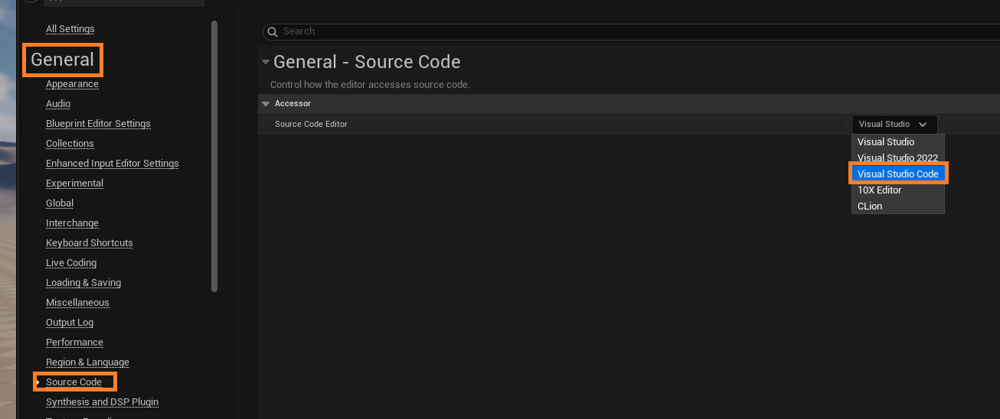

# Learning Unreal Engine + C++

# 1. Basic Settings

## Camera Navigating

- Hold Mouse Right Click and WASD, QE to move up and down

## Graphic Settings

If the editor feels to sluggish, modify the graphic quality

# 2. Actors

## Moving and Placing Actors

- Scene is made of objects called "Actors"

- Place actors quickly by using "Quickly add to the project"
  

- You can move actors in selected axis using the 3-diretional gizmo

- You can create other rotate(e)/scale(r) gizmos using the menu at the top-right of the editor

- **alt + dragging an object automatically copies the object**

# 3. Blueprint vs C++

| Blueprint                              | C++                      |
| -------------------------------------- | ------------------------ |
| Quick to Change                        | More concise             |
| Easy to Discover                       | Industry Standard        |
| Beginner Friendly                      | High Speed               |
| Tailor-made for Unreal(but has limits) | Access All Area          |
| Designer/Artist Friendly               | Good for bigger projects |

Both have advantages, so **you have to use them together**

# 4. Setting VS Code to Default Editor in Unreal Engine 5

1. Edit -> Editor Preferences

# 5. Pawn vs Character?

- Character inherits Pawn

