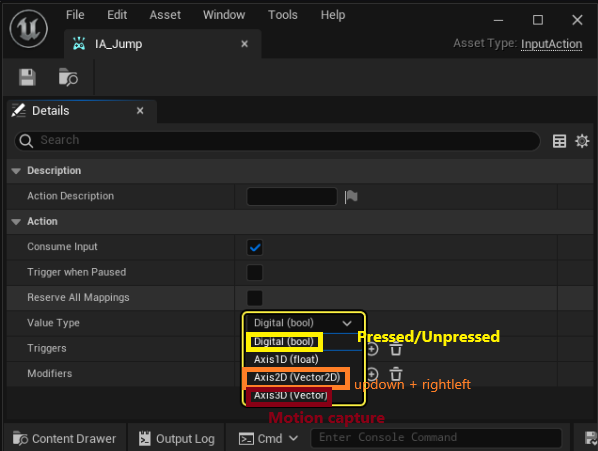

# Player Input

## SetupPlayerInputComponent

- Protected method by Pawn classes
- can bind actions or axis using `BindAxis` and `BindAction`

```cpp
void ATank::SetupPlayerInputComponent(UInputComponent* PlayerInputComponent)
{
    Super::SetupPlayerInputComponent(PlayerInputComponent);

    PlayerInputComponent->BindAxis(TEXT("MoveForward"), this, &ATank::Move);
    PlayerInputComponent->BindAxis(TEXT("Turn"), this, &ATank::Turn);

    PlayerInputComponent->BindAction(TEXT("Fire"), IE_Pressed, this, &ATank::Fire);
}
```

- The text names needs to be first declared in project settings engine inputs


## APlayerController

- Player controller that handles inputs the player receives.
- ex) GetHitResultUnderCursor

```cpp
void ATank::Tick(float DeltaTime)
{
    Super::Tick(DeltaTime);

    if (PlayerController)
    {
        FHitResult hit_result;
        PlayerController->GetHitResultUnderCursor(ECC_Visibility, false, hit_result);

        RotateTurret(hit_result.ImpactPoint);
    }
}
```

# EnhancedInputLocalPlayerSubsystem

https://dev.epicgames.com/documentation/ko-kr/unreal-engine/enhanced-input-in-unreal-engine

- UE5's advanced input handling option
- Has 4 parts:
  1.  Input Actions
  2.  Input Mapping Contexts
  3.  Input Modifiers
  4.  Input Triggers

## 1. Input Actions

1. Does basic input handling such as **Getting movement input and even its relative direction**



so we don't need to map the input to a value. It just connects the input and a reasonable value.

## 2. Input Mapping Contexts

Maps controller inputs and does transforms(inverse, move axis from X to Y) to match user's needs

## 3. Input Modifiers

The inputs give value 1 to X when pressed. However, we want to diversify the input's effect by

- Moving it to Y/Z axis
- Give negative value for A and S

These are called Modifiers.

## 4. Input Triggers

A button pressed event doesn't get calculated in a single event. When it's pressed, "Start" event pops, then "Trigger", and then "Complete" after releasing.

# Always Bind Actions in PlayerController

- Adds more flexibility
- Can work in any class that supports the types of the Player Controller
- Doesn't have to do pointer timings, trying to locate the Player in SetupInputComponent and BeginPlay()

```cpp

#include "MainPlayerController.h"

#include "Basic2DCharacter.h"
#include "EnhancedInputSubsystems.h"
#include "EnhancedInputComponent.h"

void AMainPlayerController::BeginPlay()
{
	Super::BeginPlay();
}


void AMainPlayerController::SetupInputComponent()
{
	Super::SetupInputComponent();
	if (UEnhancedInputComponent* EnhancedInputComponent = Cast<UEnhancedInputComponent>(InputComponent))
	{
		if (ULocalPlayer* LocalPlayer = Cast<ULocalPlayer>(Player))
		{
			if (UEnhancedInputLocalPlayerSubsystem* InputSystem = LocalPlayer->GetSubsystem<UEnhancedInputLocalPlayerSubsystem>())
			{
				if (!DefaultMappingContext.IsNull())
				{
					InputSystem->AddMappingContext(DefaultMappingContext.LoadSynchronous(), 0);
				}
			}
		}

		if (!MoveInput.IsNull())
		{
			EnhancedInputComponent-> BindAction(MoveInput.LoadSynchronous(), ETriggerEvent::Triggered, this, &AMainPlayerController::Move);
			EnhancedInputComponent -> BindAction(MoveInput.LoadSynchronous(), ETriggerEvent::Started, this, &AMainPlayerController::SetIsHoldingTrue);
			EnhancedInputComponent -> BindAction(MoveInput.LoadSynchronous(), ETriggerEvent::Completed, this, &AMainPlayerController::SetIsHoldingFalse);
		}
	}
}

void AMainPlayerController::Move(const FInputActionValue& Value)
{
	const FVector2d MovementVector = Value.Get<FVector2d>();

	if (ABasic2DCharacter* MainPlayer = Cast<ABasic2DCharacter>(GetPawn()))
	{
		MainPlayer->AddMovementInput(FVector(MovementVector.X, MovementVector.Y, 0), MoveSpeed);
    	Directionality = FVector2D(MovementVector.X, MovementVector.Y);
	}
}

void AMainPlayerController::SetIsHoldingTrue(const FInputActionValue& Value)
{
	IsHoldingMove = true;
}

void AMainPlayerController::SetIsHoldingFalse(const FInputActionValue& Value)
{
	IsHoldingMove = false;
}

```
