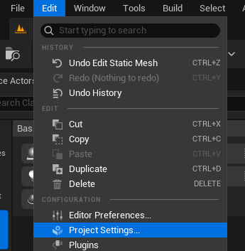
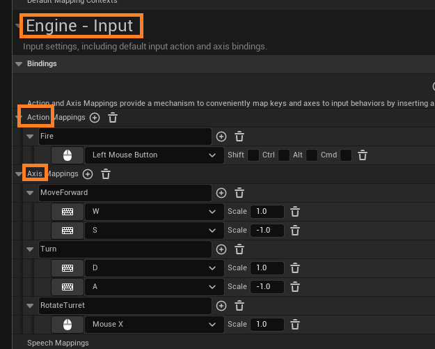

# Player Input

## SetupPlayerInputComponent

- Protected method by Pawn classes
- can bind actions or axis using `BindAxis` and `BindAction`

```cpp
void ATank::SetupPlayerInputComponent(UInputComponent* PlayerInputComponent)
{
    Super::SetupPlayerInputComponent(PlayerInputComponent);

    PlayerInputComponent->BindAxis(TEXT("MoveForward"), this, &ATank::Move);
    PlayerInputComponent->BindAxis(TEXT("Turn"), this, &ATank::Turn);

    PlayerInputComponent->BindAction(TEXT("Fire"), IE_Pressed, this, &ATank::Fire);
}
```

- The text names needs to be first declared in project settings engine inputs





## APlayerController

- Player controller that handles inputs the player receives.
- ex) GetHitResultUnderCursor

```cpp
void ATank::Tick(float DeltaTime)
{
    Super::Tick(DeltaTime);

    if (PlayerController)
    {
        FHitResult hit_result;
        PlayerController->GetHitResultUnderCursor(ECC_Visibility, false, hit_result);

        RotateTurret(hit_result.ImpactPoint);
    }
}
```
