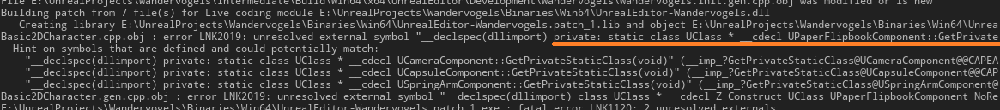
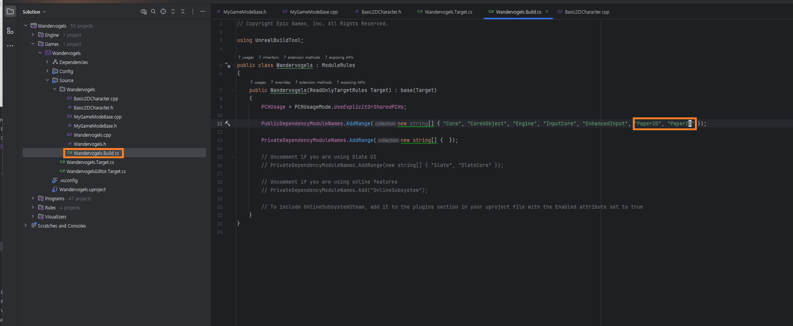
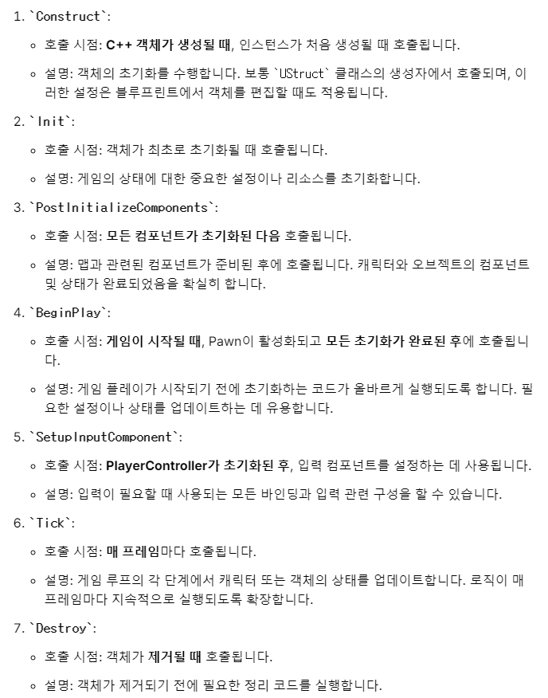

# UE5 Troubleshooting

## 1. Link Error when calling UPaperFlipbookComponent

```cpp

#pragma once

#include "CoreMinimal.h"
#include "PaperZDCharacter.h"
#include "Camera/CameraComponent.h"
#include "GameFramework/SpringArmComponent.h"
#include "Paper2D/Classes/PaperFlipbookComponent.h"
#include "Basic2DCharacter.generated.h"

/**
 *
 */
UCLASS()
class WANDERVOGELS_API ABasic2DCharacter : public APaperZDCharacter
{
	GENERATED_BODY()

public:
	ABasic2DCharacter();

	UPROPERTY(VisibleAnywhere, BlueprintReadOnly)
	UCapsuleComponent* Capsule;

	UPROPERTY(EditAnywhere, BlueprintReadWrite, Category = Camera)
	USpringArmComponent* SpringArm;

	UPROPERTY(EditAnywhere, BlueprintReadWrite, Category = Camera)
	UCameraComponent* Camera;

	UPROPERTY(EditAnywhere, BlueprintReadWrite, Category = Sprite)
	UPaperFlipbookComponent* SpriteFlipbook;

private:
	bool IsHoldingMove = false;
	FVector2D Directionality = FVector2D(0, 0);
};

```

- Error Message:



- Solve: **Add Paper2D/ZD into Build.cs dependency**



## 3. SetupPlayerInputComponent doesn't Happen Before BeginPlay()

- SetupPlayerInputComponent can happen before BeginPlay, so objects that get binded at BeginPlay() can be null at SetupPlayerInputComponent.




